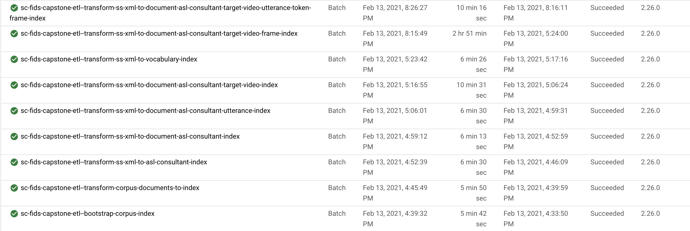

## Introduction

Welcome to my first "Big Data"(ish) project on GCP Dataflow.

This was a Deep Learning project wherein I tackled attempting to train a DNN (a Convolutional Neural Network followed by a Recurrant Neural Network, an LSTM specifically).

The datasets were extracted from more than 2600 videos produced by the research conducted by Boston and Rutgers Universities, jointly under the [National Center for Sign Language and Gesture Resources project](http://www.bu.edu/asllrp/ncslgr.html).

Each video has up to three camera perspectives synchronized from obviously three independent video cameras.

The researchers produced corpus documents in the form of XML and linked metadata therein to corresponding videos.  Videos were processed with the OpenCV Python library.

After all data was extracted, this resulted in 3,314 distinct "tokens".  One distinct ASL sign = one lingustic token or "word", which is the rough equivalent of an English word plus other ASL-specific linguistic aspects.  There may not always be a direct translation since an ASL utterance is comprised of much more than a simple English word.  I am not a linguist so I will just stop right there.

But the focus of the FIRST part of my project - captured by the source code in this repo and this summary - focuses on the "Big Data" aspect.  I will start with how I end.

When I began this summary, I had no idea what I was in for.  In the end, there are more than 2600 videos to process, which amount to more than 561,000 frames, assuming a frame-rate of 30 FPS, which is only half the frame-rate at which the videos were originally recorded.

After frame extraction, data needed to be related to each and every one of those 561,000+ frames, which was NOT done by the researchers.  This, I had to do myself.

So this part of my project focuses on making that pipeline doable.  It had to be done using cloud storage and a parallel data processing framework.  I chose Apache Beam using GCP Dataflow as the runner in the end - Apache Beam since its "raison d'etre" is portability to other runners, including local and interactive (Jupyter Notebooks).

I will leave the report of my initial failures for the end.  

This write-up is more concerned with my eventual success using Apache Beam on GCP Dataflow.

So, without further ado, let me dive right in!


## Preliminaries

This notebook assumes that all setup steps from [GCP-readme.md](./GCP-readme.md) have been followed.

This notebook does not demonstrate the full ETL pipeline used in production (executed on GCP Dataflow).

We only investigate the first couple of major steps of the *production* pipeline (which is executed in Dataflow on the Google Cloud Platform) in order to demonstrate the general idea of the process.  Note that the *production* pipeline is really a sequence of (sub) pipelines that are daisychained together in a particular order, since latter pipelines depend on former pipelines.

In this notebook, we demonstrate the first two pipelines, which accomplish the following:

### 1. Boostrap the video index

Substeps are:

    1. Download the video index (archive)
    2. Extract it.
    3. Write it to the destination directory as a CSV

The video index drives the entire full-blown *production* pipeline.

It tells us the filenames of the target videos.

<p><br>

### 2. Download each video segment comprising final target videos. (The video index contains the URLs).

Target videos are comprised of video segments since some of the final target videos can be rather large.

Altgether, **the *production* pipeline (executed on GCP Dataflow) retrieves more than 2600 videos** produced by the research conducted by Boston and Rutgers Universities, jointly under the [National Center for Sign Language and Gesture Resources project](http://www.bu.edu/asllrp/ncslgr.html).

This notebook will demonstrate retrieving 50 of those.

The implementation of the download shall leverage Apache Beam's parallelism in order to avoid the amount of time it would take to accomplish doing it sequentially.  Note that when executed locally, the Apache Beam SDK uses Docker containers for worker node clusters.  A cluster in this case consists of 8 workers nodes since my local machine has 8 cores.

In *production*, on GCP Dataflow, this can be scheduled to your heart's content (but this, of course, costs more money to do so).

<p><br>

### 3. Use the `OpenCV` library to extract all frames (from each segment) for each target video.

This step leverages Apache Beam's parallelism as well.

But we MUST take care to ensure that a single worker extracts the frames of each segment associated with the target video.

This is because frames are ordered/sequenced.  

Allowing two different workers to extract frames of different segments associated with the same final target video would likely result in frames being extracted out of order (due to parallelism).

Therefore, we partition the extraction task by final target video in order to ensure a single worker handles all segments associated with a single target video.

But we do want parallelism to occurr at the final target video level.

In the end, **in production, the pipeline extracts more than 561,000 frames (images) from the source target videos**!

Of course in this demonstration we will be extracting much less - only 50 out of the more than 2600 videos available will be downloaded and processed (frames extracted).  Still, extracting from 50 videos will amount to thousands of frames.


```python
%load_ext autoreload

%autoreload 2

from __future__ import absolute_import

import apache_beam as beam
import apache_beam.runners.interactive.interactive_beam as ib

from api import beam__common, fileio, fidscs_globals
from api.fidscs_globals import disp_source
from api import data_extractor__beam

from apache_beam.options.pipeline_options import PipelineOptions
```

## Constants to be used in this notebook


```python
WORK_DIR = '/tmp'
MAX_TARGET_VIDEOS = 50  # set to -1 for all in production but not in this interactive notebook! That will result in extracting more than 561,000 images from more than 2600 videos! (onto your local machine)
PIPELINE_BASE_JOB_NAME = 'sc-fids-capstone-etl-demo'
```

## Use Apache Beam PipelineOptions for any global settings

We MUST do this since the point of Apache Beam is to enable parallelism (in processing).

How this is accomplished is beyond the scope of this notebook.

But suffice it to say that any notion of a global variable cannot be implemented in the manner one is normally implemented - e.g. with Python global variables.

However, a PipelineOptions object IS passed to each and every worker node by Apache Beam.

Therefore, we accomplish global settings to be shared by all workers - e.g. the working directory and the final destination filepaths to be output by the pipeline - by passing would-be global settings to PipelineOptions, which are required to bootstrap each worker node by Apache Beam.

### Custom Apache Beam Pipeline options

The `beam__common.FIDSCapstonePipelineOptions` class was written to do just that and allows us to create and use our own custom options in Apache Beam pipelines.

Without it, attempting to set custom options on the Pipeline will fail since Apache Beam's PipelineOptions class will reject any options it doesn't recognize.


```python
disp_source(beam__common.FIDSCapstonePipelineOptions)
```


<!DOCTYPE html PUBLIC "-//W3C//DTD HTML 4.01//EN"
   "http://www.w3.org/TR/html4/strict.dtd">
<!--
generated by Pygments <https://pygments.org/>
Copyright 2006-2019 by the Pygments team.
Licensed under the BSD license, see LICENSE for details.
-->
<html>
<head>
  <title></title>
  <meta http-equiv="content-type" content="text/html; charset=None">
  <style type="text/css">
/*
generated by Pygments <https://pygments.org/>
Copyright 2006-2019 by the Pygments team.
Licensed under the BSD license, see LICENSE for details.
*/
td.linenos { background-color: #f0f0f0; padding-right: 10px; }
span.lineno { background-color: #f0f0f0; padding: 0 5px 0 5px; }
pre { line-height: 125%; }
body .hll { background-color: #ffffcc }
body  { background: #f8f8f8; }
body .c { color: #408080; font-style: italic } /* Comment */
body .err { border: 1px solid #FF0000 } /* Error */
body .k { color: #008000; font-weight: bold } /* Keyword */
body .o { color: #666666 } /* Operator */
body .ch { color: #408080; font-style: italic } /* Comment.Hashbang */
body .cm { color: #408080; font-style: italic } /* Comment.Multiline */
body .cp { color: #BC7A00 } /* Comment.Preproc */
body .cpf { color: #408080; font-style: italic } /* Comment.PreprocFile */
body .c1 { color: #408080; font-style: italic } /* Comment.Single */
body .cs { color: #408080; font-style: italic } /* Comment.Special */
body .gd { color: #A00000 } /* Generic.Deleted */
body .ge { font-style: italic } /* Generic.Emph */
body .gr { color: #FF0000 } /* Generic.Error */
body .gh { color: #000080; font-weight: bold } /* Generic.Heading */
body .gi { color: #00A000 } /* Generic.Inserted */
body .go { color: #888888 } /* Generic.Output */
body .gp { color: #000080; font-weight: bold } /* Generic.Prompt */
body .gs { font-weight: bold } /* Generic.Strong */
body .gu { color: #800080; font-weight: bold } /* Generic.Subheading */
body .gt { color: #0044DD } /* Generic.Traceback */
body .kc { color: #008000; font-weight: bold } /* Keyword.Constant */
body .kd { color: #008000; font-weight: bold } /* Keyword.Declaration */
body .kn { color: #008000; font-weight: bold } /* Keyword.Namespace */
body .kp { color: #008000 } /* Keyword.Pseudo */
body .kr { color: #008000; font-weight: bold } /* Keyword.Reserved */
body .kt { color: #B00040 } /* Keyword.Type */
body .m { color: #666666 } /* Literal.Number */
body .s { color: #BA2121 } /* Literal.String */
body .na { color: #7D9029 } /* Name.Attribute */
body .nb { color: #008000 } /* Name.Builtin */
body .nc { color: #0000FF; font-weight: bold } /* Name.Class */
body .no { color: #880000 } /* Name.Constant */
body .nd { color: #AA22FF } /* Name.Decorator */
body .ni { color: #999999; font-weight: bold } /* Name.Entity */
body .ne { color: #D2413A; font-weight: bold } /* Name.Exception */
body .nf { color: #0000FF } /* Name.Function */
body .nl { color: #A0A000 } /* Name.Label */
body .nn { color: #0000FF; font-weight: bold } /* Name.Namespace */
body .nt { color: #008000; font-weight: bold } /* Name.Tag */
body .nv { color: #19177C } /* Name.Variable */
body .ow { color: #AA22FF; font-weight: bold } /* Operator.Word */
body .w { color: #bbbbbb } /* Text.Whitespace */
body .mb { color: #666666 } /* Literal.Number.Bin */
body .mf { color: #666666 } /* Literal.Number.Float */
body .mh { color: #666666 } /* Literal.Number.Hex */
body .mi { color: #666666 } /* Literal.Number.Integer */
body .mo { color: #666666 } /* Literal.Number.Oct */
body .sa { color: #BA2121 } /* Literal.String.Affix */
body .sb { color: #BA2121 } /* Literal.String.Backtick */
body .sc { color: #BA2121 } /* Literal.String.Char */
body .dl { color: #BA2121 } /* Literal.String.Delimiter */
body .sd { color: #BA2121; font-style: italic } /* Literal.String.Doc */
body .s2 { color: #BA2121 } /* Literal.String.Double */
body .se { color: #BB6622; font-weight: bold } /* Literal.String.Escape */
body .sh { color: #BA2121 } /* Literal.String.Heredoc */
body .si { color: #BB6688; font-weight: bold } /* Literal.String.Interpol */
body .sx { color: #008000 } /* Literal.String.Other */
body .sr { color: #BB6688 } /* Literal.String.Regex */
body .s1 { color: #BA2121 } /* Literal.String.Single */
body .ss { color: #19177C } /* Literal.String.Symbol */
body .bp { color: #008000 } /* Name.Builtin.Pseudo */
body .fm { color: #0000FF } /* Name.Function.Magic */
body .vc { color: #19177C } /* Name.Variable.Class */
body .vg { color: #19177C } /* Name.Variable.Global */
body .vi { color: #19177C } /* Name.Variable.Instance */
body .vm { color: #19177C } /* Name.Variable.Magic */
body .il { color: #666666 } /* Literal.Number.Integer.Long */

  </style>
</head>
<body>
<h2></h2>

<div class="highlight" style="background: #f8f8f8"><pre style="line-height: 125%"><span></span><span style="color: #008000; font-weight: bold">class</span> <span style="color: #0000FF; font-weight: bold">FIDSCapstonePipelineOptions</span>(PipelineOptions):<br>  <span style="color: #AA22FF">@classmethod</span><br>  <span style="color: #008000; font-weight: bold">def</span> <span style="color: #0000FF">_add_argparse_args</span>(<span style="color: #008000">cls</span>, parser):<br>    parser<span style="color: #666666">.</span>add_argument(<br>      <span style="color: #BA2121">f&#39;--</span><span style="color: #BB6688; font-weight: bold">{</span>opt_name_to_command_line_opt(fidscs_globals<span style="color: #666666">.</span>OPT_NAME_MAX_TARGET_VIDEOS)<span style="color: #BB6688; font-weight: bold">}</span><span style="color: #BA2121">&#39;</span>,<br>      default<span style="color: #666666">=</span><span style="color: #008000; font-weight: bold">None</span><br>    )<br>    parser<span style="color: #666666">.</span>add_argument(<br>      <span style="color: #BA2121">f&#39;--</span><span style="color: #BB6688; font-weight: bold">{</span>opt_name_to_command_line_opt(fidscs_globals<span style="color: #666666">.</span>OPT_NAME_WORK_DIR)<span style="color: #BB6688; font-weight: bold">}</span><span style="color: #BA2121">&#39;</span>,<br>      default<span style="color: #666666">=</span><span style="color: #008000; font-weight: bold">None</span>,<br>    )<br>    parser<span style="color: #666666">.</span>add_argument(<br>      <span style="color: #BA2121">f&#39;--</span><span style="color: #BB6688; font-weight: bold">{</span>opt_name_to_command_line_opt(fidscs_globals<span style="color: #666666">.</span>OPT_NAME_DATA_DIR)<span style="color: #BB6688; font-weight: bold">}</span><span style="color: #BA2121">&#39;</span>,<br>      default<span style="color: #666666">=</span><span style="color: #008000; font-weight: bold">None</span>,<br>    )<br>    parser<span style="color: #666666">.</span>add_argument(<br>      <span style="color: #BA2121">f&#39;--</span><span style="color: #BB6688; font-weight: bold">{</span>opt_name_to_command_line_opt(fidscs_globals<span style="color: #666666">.</span>OPT_NAME_TMP_DIR)<span style="color: #BB6688; font-weight: bold">}</span><span style="color: #BA2121">&#39;</span>,<br>      default<span style="color: #666666">=</span><span style="color: #008000; font-weight: bold">None</span>,<br>    )<br>    parser<span style="color: #666666">.</span>add_argument(<br>      <span style="color: #BA2121">f&#39;--</span><span style="color: #BB6688; font-weight: bold">{</span>opt_name_to_command_line_opt(fidscs_globals<span style="color: #666666">.</span>OPT_NAME_VIDEO_DIR)<span style="color: #BB6688; font-weight: bold">}</span><span style="color: #BA2121">&#39;</span>,<br>      default<span style="color: #666666">=</span><span style="color: #008000; font-weight: bold">None</span>,<br>    )<br>    parser<span style="color: #666666">.</span>add_argument(<br>      <span style="color: #BA2121">f&#39;--</span><span style="color: #BB6688; font-weight: bold">{</span>opt_name_to_command_line_opt(fidscs_globals<span style="color: #666666">.</span>OPT_NAME_STITCHED_VIDEO_FRAMES_DIR)<span style="color: #BB6688; font-weight: bold">}</span><span style="color: #BA2121">&#39;</span>,<br>      default<span style="color: #666666">=</span><span style="color: #008000; font-weight: bold">None</span>,<br>    )<br>    parser<span style="color: #666666">.</span>add_argument(<br>      <span style="color: #BA2121">f&#39;--</span><span style="color: #BB6688; font-weight: bold">{</span>opt_name_to_command_line_opt(fidscs_globals<span style="color: #666666">.</span>OPT_NAME_CORPUS_DIR)<span style="color: #BB6688; font-weight: bold">}</span><span style="color: #BA2121">&#39;</span>,<br>      default<span style="color: #666666">=</span><span style="color: #008000; font-weight: bold">None</span>,<br>    )<br>    parser<span style="color: #666666">.</span>add_argument(<br>      <span style="color: #BA2121">f&#39;--</span><span style="color: #BB6688; font-weight: bold">{</span>opt_name_to_command_line_opt(fidscs_globals<span style="color: #666666">.</span>OPT_NAME_CORPUS_DS_PATH)<span style="color: #BB6688; font-weight: bold">}</span><span style="color: #BA2121">&#39;</span>,<br>      default<span style="color: #666666">=</span><span style="color: #008000; font-weight: bold">None</span>,<br>    )<br>    parser<span style="color: #666666">.</span>add_argument(<br>      <span style="color: #BA2121">f&#39;--</span><span style="color: #BB6688; font-weight: bold">{</span>opt_name_to_command_line_opt(fidscs_globals<span style="color: #666666">.</span>OPT_NAME_DOCUMENT_ASL_CONSULTANT_DS_PATH)<span style="color: #BB6688; font-weight: bold">}</span><span style="color: #BA2121">&#39;</span>,<br>      default<span style="color: #666666">=</span><span style="color: #008000; font-weight: bold">None</span>,<br>    )<br>    parser<span style="color: #666666">.</span>add_argument(<br>      <span style="color: #BA2121">f&#39;--</span><span style="color: #BB6688; font-weight: bold">{</span>opt_name_to_command_line_opt(fidscs_globals<span style="color: #666666">.</span>OPT_NAME_ASL_CONSULTANT_DS_PATH)<span style="color: #BB6688; font-weight: bold">}</span><span style="color: #BA2121">&#39;</span>,<br>      default<span style="color: #666666">=</span><span style="color: #008000; font-weight: bold">None</span>,<br>    )<br>    parser<span style="color: #666666">.</span>add_argument(<br>      <span style="color: #BA2121">f&#39;--</span><span style="color: #BB6688; font-weight: bold">{</span>opt_name_to_command_line_opt(fidscs_globals<span style="color: #666666">.</span>OPT_NAME_VIDEO_INDEXES_DIR)<span style="color: #BB6688; font-weight: bold">}</span><span style="color: #BA2121">&#39;</span>,<br>      default<span style="color: #666666">=</span><span style="color: #008000; font-weight: bold">None</span>,<br>    )<br>    parser<span style="color: #666666">.</span>add_argument(<br>      <span style="color: #BA2121">f&#39;--</span><span style="color: #BB6688; font-weight: bold">{</span>opt_name_to_command_line_opt(fidscs_globals<span style="color: #666666">.</span>OPT_NAME_SELECTED_VIDEO_INDEX_PATH)<span style="color: #BB6688; font-weight: bold">}</span><span style="color: #BA2121">&#39;</span>,<br>      default<span style="color: #666666">=</span><span style="color: #008000; font-weight: bold">None</span>,<br>    )<br>    parser<span style="color: #666666">.</span>add_argument(<br>      <span style="color: #BA2121">f&#39;--</span><span style="color: #BB6688; font-weight: bold">{</span>opt_name_to_command_line_opt(fidscs_globals<span style="color: #666666">.</span>OPT_NAME_VIDEO_DS_PATH)<span style="color: #BB6688; font-weight: bold">}</span><span style="color: #BA2121">&#39;</span>,<br>      default<span style="color: #666666">=</span><span style="color: #008000; font-weight: bold">None</span>,<br>    )<br>    parser<span style="color: #666666">.</span>add_argument(<br>      <span style="color: #BA2121">f&#39;--</span><span style="color: #BB6688; font-weight: bold">{</span>opt_name_to_command_line_opt(fidscs_globals<span style="color: #666666">.</span>OPT_NAME_VIDEO_SEGMENT_DS_PATH)<span style="color: #BB6688; font-weight: bold">}</span><span style="color: #BA2121">&#39;</span>,<br>      default<span style="color: #666666">=</span><span style="color: #008000; font-weight: bold">None</span>,<br>    )<br>    parser<span style="color: #666666">.</span>add_argument(<br>      <span style="color: #BA2121">f&#39;--</span><span style="color: #BB6688; font-weight: bold">{</span>opt_name_to_command_line_opt(fidscs_globals<span style="color: #666666">.</span>OPT_NAME_VIDEO_FRAME_DS_PATH)<span style="color: #BB6688; font-weight: bold">}</span><span style="color: #BA2121">&#39;</span>,<br>      default<span style="color: #666666">=</span><span style="color: #008000; font-weight: bold">None</span>,<br>    )<br>    parser<span style="color: #666666">.</span>add_argument(<br>      <span style="color: #BA2121">f&#39;--</span><span style="color: #BB6688; font-weight: bold">{</span>opt_name_to_command_line_opt(fidscs_globals<span style="color: #666666">.</span>OPT_NAME_UTTERANCE_DS_PATH)<span style="color: #BB6688; font-weight: bold">}</span><span style="color: #BA2121">&#39;</span>,<br>      default<span style="color: #666666">=</span><span style="color: #008000; font-weight: bold">None</span>,<br>    )<br>    parser<span style="color: #666666">.</span>add_argument(<br>      <span style="color: #BA2121">f&#39;--</span><span style="color: #BB6688; font-weight: bold">{</span>opt_name_to_command_line_opt(fidscs_globals<span style="color: #666666">.</span>OPT_NAME_UTTERANCE_VIDEO_DS_PATH)<span style="color: #BB6688; font-weight: bold">}</span><span style="color: #BA2121">&#39;</span>,<br>      default<span style="color: #666666">=</span><span style="color: #008000; font-weight: bold">None</span>,<br>    )<br>    parser<span style="color: #666666">.</span>add_argument(<br>      <span style="color: #BA2121">f&#39;--</span><span style="color: #BB6688; font-weight: bold">{</span>opt_name_to_command_line_opt(fidscs_globals<span style="color: #666666">.</span>OPT_NAME_UTTERANCE_TOKEN_DS_PATH)<span style="color: #BB6688; font-weight: bold">}</span><span style="color: #BA2121">&#39;</span>,<br>      default<span style="color: #666666">=</span><span style="color: #008000; font-weight: bold">None</span>,<br>    )<br>    parser<span style="color: #666666">.</span>add_argument(<br>      <span style="color: #BA2121">f&#39;--</span><span style="color: #BB6688; font-weight: bold">{</span>opt_name_to_command_line_opt(fidscs_globals<span style="color: #666666">.</span>OPT_NAME_UTTERANCE_TOKEN_FRAME_DS_PATH)<span style="color: #BB6688; font-weight: bold">}</span><span style="color: #BA2121">&#39;</span>,<br>      default<span style="color: #666666">=</span><span style="color: #008000; font-weight: bold">None</span>,<br>    )<br>    parser<span style="color: #666666">.</span>add_argument(<br>      <span style="color: #BA2121">f&#39;--</span><span style="color: #BB6688; font-weight: bold">{</span>opt_name_to_command_line_opt(fidscs_globals<span style="color: #666666">.</span>OPT_NAME_VOCABULARY_DS_PATH)<span style="color: #BB6688; font-weight: bold">}</span><span style="color: #BA2121">&#39;</span>,<br>      default<span style="color: #666666">=</span><span style="color: #008000; font-weight: bold">None</span>,<br>    )<br></pre></div>
</body>
</html>


### PipelineOptions Initialization

For this notebook, we execute locally (vs. GCP Dataflow) - that is, we use the Apache Beam's `DirectRunner`.  Actually, we use a variant of - the `InteractiveRunner` - geared specifically for running in notebooks.  But it is still run locally.  Some `PipelineOptions` options differ (or are not needed), relative to the `DataflowRunner`.

To see the full implementation on how this differs from using the `Dataflow` runner, start by inspecting [run_cloud__etl.py](./run_cloud__etl.py) and follow the code.

Initializing the `dict` upon which `PipelineOptions` are based has been wrapped up within the `beam__common.make_fids_options_dict` function.


```python
disp_source(beam__common.make_fids_options_dict)
```


<!DOCTYPE html PUBLIC "-//W3C//DTD HTML 4.01//EN"
   "http://www.w3.org/TR/html4/strict.dtd">
<!--
generated by Pygments <https://pygments.org/>
Copyright 2006-2019 by the Pygments team.
Licensed under the BSD license, see LICENSE for details.
-->
<html>
<head>
  <title></title>
  <meta http-equiv="content-type" content="text/html; charset=None">
  <style type="text/css">
/*
generated by Pygments <https://pygments.org/>
Copyright 2006-2019 by the Pygments team.
Licensed under the BSD license, see LICENSE for details.
*/
td.linenos { background-color: #f0f0f0; padding-right: 10px; }
span.lineno { background-color: #f0f0f0; padding: 0 5px 0 5px; }
pre { line-height: 125%; }
body .hll { background-color: #ffffcc }
body  { background: #f8f8f8; }
body .c { color: #408080; font-style: italic } /* Comment */
body .err { border: 1px solid #FF0000 } /* Error */
body .k { color: #008000; font-weight: bold } /* Keyword */
body .o { color: #666666 } /* Operator */
body .ch { color: #408080; font-style: italic } /* Comment.Hashbang */
body .cm { color: #408080; font-style: italic } /* Comment.Multiline */
body .cp { color: #BC7A00 } /* Comment.Preproc */
body .cpf { color: #408080; font-style: italic } /* Comment.PreprocFile */
body .c1 { color: #408080; font-style: italic } /* Comment.Single */
body .cs { color: #408080; font-style: italic } /* Comment.Special */
body .gd { color: #A00000 } /* Generic.Deleted */
body .ge { font-style: italic } /* Generic.Emph */
body .gr { color: #FF0000 } /* Generic.Error */
body .gh { color: #000080; font-weight: bold } /* Generic.Heading */
body .gi { color: #00A000 } /* Generic.Inserted */
body .go { color: #888888 } /* Generic.Output */
body .gp { color: #000080; font-weight: bold } /* Generic.Prompt */
body .gs { font-weight: bold } /* Generic.Strong */
body .gu { color: #800080; font-weight: bold } /* Generic.Subheading */
body .gt { color: #0044DD } /* Generic.Traceback */
body .kc { color: #008000; font-weight: bold } /* Keyword.Constant */
body .kd { color: #008000; font-weight: bold } /* Keyword.Declaration */
body .kn { color: #008000; font-weight: bold } /* Keyword.Namespace */
body .kp { color: #008000 } /* Keyword.Pseudo */
body .kr { color: #008000; font-weight: bold } /* Keyword.Reserved */
body .kt { color: #B00040 } /* Keyword.Type */
body .m { color: #666666 } /* Literal.Number */
body .s { color: #BA2121 } /* Literal.String */
body .na { color: #7D9029 } /* Name.Attribute */
body .nb { color: #008000 } /* Name.Builtin */
body .nc { color: #0000FF; font-weight: bold } /* Name.Class */
body .no { color: #880000 } /* Name.Constant */
body .nd { color: #AA22FF } /* Name.Decorator */
body .ni { color: #999999; font-weight: bold } /* Name.Entity */
body .ne { color: #D2413A; font-weight: bold } /* Name.Exception */
body .nf { color: #0000FF } /* Name.Function */
body .nl { color: #A0A000 } /* Name.Label */
body .nn { color: #0000FF; font-weight: bold } /* Name.Namespace */
body .nt { color: #008000; font-weight: bold } /* Name.Tag */
body .nv { color: #19177C } /* Name.Variable */
body .ow { color: #AA22FF; font-weight: bold } /* Operator.Word */
body .w { color: #bbbbbb } /* Text.Whitespace */
body .mb { color: #666666 } /* Literal.Number.Bin */
body .mf { color: #666666 } /* Literal.Number.Float */
body .mh { color: #666666 } /* Literal.Number.Hex */
body .mi { color: #666666 } /* Literal.Number.Integer */
body .mo { color: #666666 } /* Literal.Number.Oct */
body .sa { color: #BA2121 } /* Literal.String.Affix */
body .sb { color: #BA2121 } /* Literal.String.Backtick */
body .sc { color: #BA2121 } /* Literal.String.Char */
body .dl { color: #BA2121 } /* Literal.String.Delimiter */
body .sd { color: #BA2121; font-style: italic } /* Literal.String.Doc */
body .s2 { color: #BA2121 } /* Literal.String.Double */
body .se { color: #BB6622; font-weight: bold } /* Literal.String.Escape */
body .sh { color: #BA2121 } /* Literal.String.Heredoc */
body .si { color: #BB6688; font-weight: bold } /* Literal.String.Interpol */
body .sx { color: #008000 } /* Literal.String.Other */
body .sr { color: #BB6688 } /* Literal.String.Regex */
body .s1 { color: #BA2121 } /* Literal.String.Single */
body .ss { color: #19177C } /* Literal.String.Symbol */
body .bp { color: #008000 } /* Name.Builtin.Pseudo */
body .fm { color: #0000FF } /* Name.Function.Magic */
body .vc { color: #19177C } /* Name.Variable.Class */
body .vg { color: #19177C } /* Name.Variable.Global */
body .vi { color: #19177C } /* Name.Variable.Instance */
body .vm { color: #19177C } /* Name.Variable.Magic */
body .il { color: #666666 } /* Literal.Number.Integer.Long */

  </style>
</head>
<body>
<h2></h2>

<div class="highlight" style="background: #f8f8f8"><pre style="line-height: 125%"><span></span><span style="color: #008000; font-weight: bold">def</span> <span style="color: #0000FF">make_fids_options_dict</span>(work_dir, max_target_videos<span style="color: #666666">=-1</span>, beam_gcp_project<span style="color: #666666">=</span>fidscs_globals<span style="color: #666666">.</span>GCP_PROJECT):<br>  data_dir <span style="color: #666666">=</span> fileio<span style="color: #666666">.</span>path_join(work_dir, fidscs_globals<span style="color: #666666">.</span>DATA_DIR_NAME)<br>  tmp_dir <span style="color: #666666">=</span> fileio<span style="color: #666666">.</span>path_join(data_dir, fidscs_globals<span style="color: #666666">.</span>TMP_DIR_NAME)<br>  videos_dir <span style="color: #666666">=</span> fileio<span style="color: #666666">.</span>path_join(data_dir, fidscs_globals<span style="color: #666666">.</span>VIDEO_DIR_NAME)<br>  stitched_video_frames_dir <span style="color: #666666">=</span> fileio<span style="color: #666666">.</span>path_join(data_dir, fidscs_globals<span style="color: #666666">.</span>STICHED_VIDEO_FRAMES_DIR_NAME)<br>  corpus_dir <span style="color: #666666">=</span> fileio<span style="color: #666666">.</span>path_join(tmp_dir, fidscs_globals<span style="color: #666666">.</span>CORPUS_BASE)<br>  corpus_ds_path <span style="color: #666666">=</span> fileio<span style="color: #666666">.</span>path_join(data_dir, fidscs_globals<span style="color: #666666">.</span>CORPUS_DS_FNAME)<br>  document_asl_cconsultant_ds_path <span style="color: #666666">=</span> fileio<span style="color: #666666">.</span>path_join(data_dir, fidscs_globals<span style="color: #666666">.</span>DOCUMENT_ASL_CONSULTANT_DS_FNAME)<br>  asl_consultant_ds_path <span style="color: #666666">=</span> fileio<span style="color: #666666">.</span>path_join(data_dir, fidscs_globals<span style="color: #666666">.</span>ASL_CONSULTANT_DS_FNAME)<br>  video_indexes_dir <span style="color: #666666">=</span> fileio<span style="color: #666666">.</span>path_join(tmp_dir, fidscs_globals<span style="color: #666666">.</span>VIDEO_INDEX_BASE)<br>  selected_video_index_path <span style="color: #666666">=</span> fileio<span style="color: #666666">.</span>path_join(video_indexes_dir, fidscs_globals<span style="color: #666666">.</span>SELECTED_VIDEO_INDEX)<br>  video_ds_path <span style="color: #666666">=</span> fileio<span style="color: #666666">.</span>path_join(data_dir, fidscs_globals<span style="color: #666666">.</span>VIDEO_DS_FNAME)<br>  video_segment_ds_path <span style="color: #666666">=</span> fileio<span style="color: #666666">.</span>path_join(data_dir, fidscs_globals<span style="color: #666666">.</span>VIDEO_SEGMENT_DS_FNAME)<br>  video_frame_ds_path <span style="color: #666666">=</span> fileio<span style="color: #666666">.</span>path_join(data_dir, fidscs_globals<span style="color: #666666">.</span>VIDEO_FRAME_DS_FNAME)<br>  utterance_ds_path <span style="color: #666666">=</span> fileio<span style="color: #666666">.</span>path_join(data_dir, fidscs_globals<span style="color: #666666">.</span>UTTERANCE_DS_FNAME)<br>  utterance_video_ds_path <span style="color: #666666">=</span> fileio<span style="color: #666666">.</span>path_join(data_dir, fidscs_globals<span style="color: #666666">.</span>UTTERANCE_VIDEO_DS_FNAME)<br>  utterance_token_ds_path <span style="color: #666666">=</span> fileio<span style="color: #666666">.</span>path_join(data_dir, fidscs_globals<span style="color: #666666">.</span>UTTERANCE_TOKEN_DS_FNAME)<br>  utterance_token_frame_ds_path <span style="color: #666666">=</span> fileio<span style="color: #666666">.</span>path_join(data_dir, fidscs_globals<span style="color: #666666">.</span>UTTERANCE_TOKEN_FRAME_DS_FNAME)<br>  vocabulary_ds_path <span style="color: #666666">=</span> fileio<span style="color: #666666">.</span>path_join(data_dir, fidscs_globals<span style="color: #666666">.</span>VOCABULARY_DS_FNAME)<br>  <span style="color: #008000; font-weight: bold">return</span> {<br>    fidscs_globals<span style="color: #666666">.</span>OPT_NAME_PROJECT:                          beam_gcp_project,<br>    fidscs_globals<span style="color: #666666">.</span>OPT_NAME_MAX_TARGET_VIDEOS:                max_target_videos,<br>    fidscs_globals<span style="color: #666666">.</span>OPT_NAME_WORK_DIR:                         work_dir,<br>    fidscs_globals<span style="color: #666666">.</span>OPT_NAME_DATA_DIR:                         data_dir,<br>    fidscs_globals<span style="color: #666666">.</span>OPT_NAME_TMP_DIR:                          tmp_dir,<br>    fidscs_globals<span style="color: #666666">.</span>OPT_NAME_VIDEO_DIR:                        videos_dir,<br>    fidscs_globals<span style="color: #666666">.</span>OPT_NAME_STITCHED_VIDEO_FRAMES_DIR:        stitched_video_frames_dir,<br>    fidscs_globals<span style="color: #666666">.</span>OPT_NAME_CORPUS_DIR:                       corpus_dir,<br>    fidscs_globals<span style="color: #666666">.</span>OPT_NAME_CORPUS_DS_PATH:                   corpus_ds_path,<br>    fidscs_globals<span style="color: #666666">.</span>OPT_NAME_DOCUMENT_ASL_CONSULTANT_DS_PATH:  document_asl_cconsultant_ds_path,<br>    fidscs_globals<span style="color: #666666">.</span>OPT_NAME_ASL_CONSULTANT_DS_PATH:           asl_consultant_ds_path,<br>    fidscs_globals<span style="color: #666666">.</span>OPT_NAME_VIDEO_INDEXES_DIR:                video_indexes_dir,<br>    fidscs_globals<span style="color: #666666">.</span>OPT_NAME_SELECTED_VIDEO_INDEX_PATH:        selected_video_index_path,<br>    fidscs_globals<span style="color: #666666">.</span>OPT_NAME_VIDEO_DS_PATH:                    video_ds_path,<br>    fidscs_globals<span style="color: #666666">.</span>OPT_NAME_VIDEO_SEGMENT_DS_PATH:            video_segment_ds_path,<br>    fidscs_globals<span style="color: #666666">.</span>OPT_NAME_VIDEO_FRAME_DS_PATH:              video_frame_ds_path,<br>    fidscs_globals<span style="color: #666666">.</span>OPT_NAME_UTTERANCE_DS_PATH:                utterance_ds_path,<br>    fidscs_globals<span style="color: #666666">.</span>OPT_NAME_UTTERANCE_VIDEO_DS_PATH:          utterance_video_ds_path,<br>    fidscs_globals<span style="color: #666666">.</span>OPT_NAME_UTTERANCE_TOKEN_DS_PATH:          utterance_token_ds_path,<br>    fidscs_globals<span style="color: #666666">.</span>OPT_NAME_UTTERANCE_TOKEN_FRAME_DS_PATH:    utterance_token_frame_ds_path,<br>    fidscs_globals<span style="color: #666666">.</span>OPT_NAME_VOCABULARY_DS_PATH:               vocabulary_ds_path<br>  }<br></pre></div>
</body>
</html>


#### PipelineOptions geared for the `InteractiveRunner`

Note that `InteractiveRunner` is a variant of the `DirectRunner` that allows us to run an Apache Beam pipeline with a Jupyter Notebook.

Documentation for `InteractiveRunner` can be found [here](https://cloud.google.com/dataflow/docs/guides/interactive-pipeline-development).

First, it must be reiterated that we must use this runner in order to collect (reduce) data kept in Apache Beam `Pcollection`s for conversion to Pandas `DataFrame`s for display within this notebook.  Apache Beam `Pcollection`s can generally and *roughly* be thought of as Resilient Distributed Datasets.  The documentation for Apache Beam `Pcollection`s can be found in the **Apache Beam Programming Guide** located [here](https://beam.apache.org/documentation/programming-guide/).  

But **`Pcollection`s are the basis for all processing within an Apache Beam pipeline**.

Also note that the `InteractiveRunner` is not really meant to be used for enterprise (read: "Big Data") pipelines.

The runner used for production in this project is the `DataFlow` Google Cloud Platform runner.

The reader is reminded that the point of this notebook, however, is to present a demonstration of only a subset of the full Apache Beam pipeline (used in this project).


```python
options = {
    # 'runner': 'DirectRunner',
    'runner': 'InteractiveRunner',
    'environment_type': 'DOCKER',
    'direct_num_workers': 0, # 0 is use all available cores
    'direct_running_mode': 'multi_threading', # ['in_memory', 'multi_threading', 'multi_processing']
    'streaming': False # set to True if data source is unbounded (e.g. GCP PubSub),
}

options.update(beam__common.make_fids_options_dict(WORK_DIR, max_target_videos=MAX_TARGET_VIDEOS))
```

#### Finally, instantiate the `PipelineOptions` (using the above `options` `dict`)


```python
job_suffix = 'boostrap-vid-index'
job_name = f"{PIPELINE_BASE_JOB_NAME}--{job_suffix}"
options.update({
    'job_name': job_name
})

pipeline_options = PipelineOptions(flags=[], **options) # easier to pass in options from command-line this way
print(f"PipelineOptions:\n{pipeline_options.get_all_options()}\n")
```

    PipelineOptions:
    {'runner': 'InteractiveRunner', 'streaming': False, 'beam_services': {}, 'type_check_strictness': 'DEFAULT_TO_ANY', 'type_check_additional': '', 'pipeline_type_check': True, 'runtime_type_check': False, 'performance_runtime_type_check': False, 'direct_runner_use_stacked_bundle': True, 'direct_runner_bundle_repeat': 0, 'direct_num_workers': 0, 'direct_running_mode': 'multi_threading', 'dataflow_endpoint': 'https://dataflow.googleapis.com', 'project': 'sc-fids-capstone', 'job_name': 'sc-fids-capstone-etl-demo--boostrap-vid-index', 'staging_location': None, 'temp_location': None, 'region': None, 'service_account_email': None, 'no_auth': False, 'template_location': None, 'labels': None, 'update': False, 'transform_name_mapping': None, 'enable_streaming_engine': False, 'dataflow_kms_key': None, 'flexrs_goal': None, 'hdfs_host': None, 'hdfs_port': None, 'hdfs_user': None, 'hdfs_full_urls': False, 'num_workers': None, 'max_num_workers': None, 'autoscaling_algorithm': None, 'machine_type': None, 'disk_size_gb': None, 'disk_type': None, 'worker_region': None, 'worker_zone': None, 'zone': None, 'network': None, 'subnetwork': None, 'worker_harness_container_image': None, 'sdk_harness_container_image_overrides': None, 'use_public_ips': None, 'min_cpu_platform': None, 'dataflow_worker_jar': None, 'dataflow_job_file': None, 'experiments': None, 'number_of_worker_harness_threads': None, 'profile_cpu': False, 'profile_memory': False, 'profile_location': None, 'profile_sample_rate': 1.0, 'requirements_file': None, 'requirements_cache': None, 'setup_file': None, 'beam_plugins': None, 'save_main_session': False, 'sdk_location': 'default', 'extra_packages': None, 'prebuild_sdk_container_engine': None, 'prebuild_sdk_container_base_image': None, 'docker_registry_push_url': None, 'job_endpoint': None, 'artifact_endpoint': None, 'job_server_timeout': 60, 'environment_type': 'DOCKER', 'environment_config': None, 'environment_options': None, 'sdk_worker_parallelism': 1, 'environment_cache_millis': 0, 'output_executable_path': None, 'artifacts_dir': None, 'job_port': 0, 'artifact_port': 0, 'expansion_port': 0, 'flink_master': '[auto]', 'flink_version': '1.10', 'flink_job_server_jar': None, 'flink_submit_uber_jar': False, 'spark_master_url': 'local[4]', 'spark_job_server_jar': None, 'spark_submit_uber_jar': False, 'spark_rest_url': None, 'on_success_matcher': None, 'dry_run': False, 'wait_until_finish_duration': None, 'pubsubRootUrl': None, 's3_access_key_id': None, 's3_secret_access_key': None, 's3_session_token': None, 's3_endpoint_url': None, 's3_region_name': None, 's3_api_version': None, 's3_verify': None, 's3_disable_ssl': False, 'fidscs_capstone_max_target_videos': 50, 'fidscs_capstone_work_dir': '/tmp', 'fidscs_capstone_data_dir': '/tmp/data', 'fidscs_capstone_tmp_dir': '/tmp/data/tmp', 'fidscs_capstone_videos_dir': '/tmp/data/videos', 'fidscs_capstone_stitched_video_frames_dir': '/tmp/data/stitched_video_frames', 'fidscs_capstone_corpus_dir': '/tmp/data/tmp/ncslgr-xml', 'fidscs_capstone_corpus_ds_path': '/tmp/data/ncslgr-corpus-index.csv', 'fidscs_capstone_document_asl_cconsultant_ds_path': '/tmp/data/document-consultant-index.csv', 'fidscs_capstone_asl_consultant_ds_path': '/tmp/data/consultant-index.csv', 'fidscs_capstone_video_indexes_dir': '/tmp/data/tmp/video_index-20120129', 'fidscs_capstone_selected_video_index_path': '/tmp/data/tmp/video_index-20120129/files_by_video_name.csv', 'fidscs_capstone_video_ds_path': '/tmp/data/document-consultant-targetvideo-index.csv', 'fidscs_capstone_video_segment_ds_path': '/tmp/data/document-consultant-targetvideo-segment-index.csv', 'fidscs_capstone_video_frame_ds_path': '/tmp/data/document-consultant-targetvideo-frame-index.csv', 'fidscs_capstone_utterance_ds_path': '/tmp/data/document-consultant-utterance-index.csv', 'fidscs_capstone_utterance_video_ds_path': '/tmp/data/document-consultant-utterance-targetvideo-index.csv', 'fidscs_capstone_utterance_token_ds_path': '/tmp/data/document-consultant-utterance-token-index.csv', 'fidscs_capstone_utterance_token_frame_ds_path': '/tmp/data/document-consultant-targetvideo-utterance-token-frame-index.csv', 'fidscs_capstone_vocabulary_ds_path': '/tmp/data/vocabulary-index.csv'}
    


#### But before running the pipeline, create necessary filestructure within `WORK_DIR`


```python
if not fileio.dir_path_exists(options[fidscs_globals.OPT_NAME_DATA_DIR], options)[0]:
    fileio.make_dirs(options[fidscs_globals.OPT_NAME_DATA_DIR], options)

if not fileio.dir_path_exists(options[fidscs_globals.OPT_NAME_TMP_DIR], options)[0]:
    fileio.make_dirs(options[fidscs_globals.OPT_NAME_TMP_DIR], options)

if not beam__common.dataset_csv_files_exist(options):
    if not fileio.dir_path_exists(options[fidscs_globals.OPT_NAME_VIDEO_DIR], options)[0]:
        fileio.make_dirs(options[fidscs_globals.OPT_NAME_VIDEO_DIR], options)

if not fileio.dir_path_exists(options[fidscs_globals.OPT_NAME_STITCHED_VIDEO_FRAMES_DIR], options)[0]:
    fileio.make_dirs(options[fidscs_globals.OPT_NAME_STITCHED_VIDEO_FRAMES_DIR], options)
```

We are now ready to execute the pipeline.  But before doing so, let's discuss how it works.

<p><br>

There are two top-level functions used by the "boostrap-vid-index" pipeline, in this order:

1. `data_extractor__beam.pl__1__bootstrap_target_video_index`
2. `data_extractor__beam.pl__2__write_target_vid_index_csv`

<p><br>

Let's examine the source code for `data_extractor__beam.pl__1__bootstrap_target_video_index`...

The following python source code illustrates the programming paradigm used in all Apache Beam (stands for **B**atch and Str**eam** processing) pipelines.


```python
disp_source(data_extractor__beam.pl__1__bootstrap_target_video_index)
```


<!DOCTYPE html PUBLIC "-//W3C//DTD HTML 4.01//EN"
   "http://www.w3.org/TR/html4/strict.dtd">
<!--
generated by Pygments <https://pygments.org/>
Copyright 2006-2019 by the Pygments team.
Licensed under the BSD license, see LICENSE for details.
-->
<html>
<head>
  <title></title>
  <meta http-equiv="content-type" content="text/html; charset=None">
  <style type="text/css">
/*
generated by Pygments <https://pygments.org/>
Copyright 2006-2019 by the Pygments team.
Licensed under the BSD license, see LICENSE for details.
*/
td.linenos { background-color: #f0f0f0; padding-right: 10px; }
span.lineno { background-color: #f0f0f0; padding: 0 5px 0 5px; }
pre { line-height: 125%; }
body .hll { background-color: #ffffcc }
body  { background: #f8f8f8; }
body .c { color: #408080; font-style: italic } /* Comment */
body .err { border: 1px solid #FF0000 } /* Error */
body .k { color: #008000; font-weight: bold } /* Keyword */
body .o { color: #666666 } /* Operator */
body .ch { color: #408080; font-style: italic } /* Comment.Hashbang */
body .cm { color: #408080; font-style: italic } /* Comment.Multiline */
body .cp { color: #BC7A00 } /* Comment.Preproc */
body .cpf { color: #408080; font-style: italic } /* Comment.PreprocFile */
body .c1 { color: #408080; font-style: italic } /* Comment.Single */
body .cs { color: #408080; font-style: italic } /* Comment.Special */
body .gd { color: #A00000 } /* Generic.Deleted */
body .ge { font-style: italic } /* Generic.Emph */
body .gr { color: #FF0000 } /* Generic.Error */
body .gh { color: #000080; font-weight: bold } /* Generic.Heading */
body .gi { color: #00A000 } /* Generic.Inserted */
body .go { color: #888888 } /* Generic.Output */
body .gp { color: #000080; font-weight: bold } /* Generic.Prompt */
body .gs { font-weight: bold } /* Generic.Strong */
body .gu { color: #800080; font-weight: bold } /* Generic.Subheading */
body .gt { color: #0044DD } /* Generic.Traceback */
body .kc { color: #008000; font-weight: bold } /* Keyword.Constant */
body .kd { color: #008000; font-weight: bold } /* Keyword.Declaration */
body .kn { color: #008000; font-weight: bold } /* Keyword.Namespace */
body .kp { color: #008000 } /* Keyword.Pseudo */
body .kr { color: #008000; font-weight: bold } /* Keyword.Reserved */
body .kt { color: #B00040 } /* Keyword.Type */
body .m { color: #666666 } /* Literal.Number */
body .s { color: #BA2121 } /* Literal.String */
body .na { color: #7D9029 } /* Name.Attribute */
body .nb { color: #008000 } /* Name.Builtin */
body .nc { color: #0000FF; font-weight: bold } /* Name.Class */
body .no { color: #880000 } /* Name.Constant */
body .nd { color: #AA22FF } /* Name.Decorator */
body .ni { color: #999999; font-weight: bold } /* Name.Entity */
body .ne { color: #D2413A; font-weight: bold } /* Name.Exception */
body .nf { color: #0000FF } /* Name.Function */
body .nl { color: #A0A000 } /* Name.Label */
body .nn { color: #0000FF; font-weight: bold } /* Name.Namespace */
body .nt { color: #008000; font-weight: bold } /* Name.Tag */
body .nv { color: #19177C } /* Name.Variable */
body .ow { color: #AA22FF; font-weight: bold } /* Operator.Word */
body .w { color: #bbbbbb } /* Text.Whitespace */
body .mb { color: #666666 } /* Literal.Number.Bin */
body .mf { color: #666666 } /* Literal.Number.Float */
body .mh { color: #666666 } /* Literal.Number.Hex */
body .mi { color: #666666 } /* Literal.Number.Integer */
body .mo { color: #666666 } /* Literal.Number.Oct */
body .sa { color: #BA2121 } /* Literal.String.Affix */
body .sb { color: #BA2121 } /* Literal.String.Backtick */
body .sc { color: #BA2121 } /* Literal.String.Char */
body .dl { color: #BA2121 } /* Literal.String.Delimiter */
body .sd { color: #BA2121; font-style: italic } /* Literal.String.Doc */
body .s2 { color: #BA2121 } /* Literal.String.Double */
body .se { color: #BB6622; font-weight: bold } /* Literal.String.Escape */
body .sh { color: #BA2121 } /* Literal.String.Heredoc */
body .si { color: #BB6688; font-weight: bold } /* Literal.String.Interpol */
body .sx { color: #008000 } /* Literal.String.Other */
body .sr { color: #BB6688 } /* Literal.String.Regex */
body .s1 { color: #BA2121 } /* Literal.String.Single */
body .ss { color: #19177C } /* Literal.String.Symbol */
body .bp { color: #008000 } /* Name.Builtin.Pseudo */
body .fm { color: #0000FF } /* Name.Function.Magic */
body .vc { color: #19177C } /* Name.Variable.Class */
body .vg { color: #19177C } /* Name.Variable.Global */
body .vi { color: #19177C } /* Name.Variable.Instance */
body .vm { color: #19177C } /* Name.Variable.Magic */
body .il { color: #666666 } /* Literal.Number.Integer.Long */

  </style>
</head>
<body>
<h2></h2>

<div class="highlight" style="background: #f8f8f8"><pre style="line-height: 125%"><span></span><span style="color: #008000; font-weight: bold">def</span> <span style="color: #0000FF">pl__1__bootstrap_target_video_index</span>(pl):<br>  <span style="color: #008000; font-weight: bold">if</span> <span style="color: #AA22FF; font-weight: bold">not</span> fileio<span style="color: #666666">.</span>file_path_exists(pl<span style="color: #666666">.</span>_options<span style="color: #666666">.</span>_all_options[fidscs_globals<span style="color: #666666">.</span>OPT_NAME_SELECTED_VIDEO_INDEX_PATH], pl<span style="color: #666666">.</span>_options<span style="color: #666666">.</span>_all_options)[<span style="color: #666666">0</span>]:<br>    sel_vid_index_path <span style="color: #666666">=</span> (<br>      pl<br>      <span style="color: #666666">|</span> <span style="color: #BA2121">&quot;Beam PL: create initial pcoll containing information for boostrap_target_video_index&quot;</span> <span style="color: #666666">&gt;&gt;</span> beam<span style="color: #666666">.</span>Create(<br>          [ <span style="color: #408080; font-style: italic"># one row containing dict of:</span><br>              <span style="color: #408080; font-style: italic"># 1. url of video indexes archive</span><br>              <span style="color: #408080; font-style: italic"># 2. local destination (path) for the downloaded archive</span><br>              <span style="color: #408080; font-style: italic"># 3. local destination (path) which will receive the extracted archive csv files (there are more than one)</span><br>              <span style="color: #408080; font-style: italic"># 4. final path to the selected videx index csv</span><br>              <span style="color: #408080; font-style: italic">#   (note that the dict is not laid out in the above order)</span><br>            {<br>              <span style="color: #BA2121">&#39;vid_indexes_dir&#39;</span>: pl<span style="color: #666666">.</span>_options<span style="color: #666666">.</span>_all_options[fidscs_globals<span style="color: #666666">.</span>OPT_NAME_VIDEO_INDEXES_DIR], <br>              <span style="color: #BA2121">&#39;sel_vid_index_path&#39;</span>: pl<span style="color: #666666">.</span>_options<span style="color: #666666">.</span>_all_options[fidscs_globals<span style="color: #666666">.</span>OPT_NAME_SELECTED_VIDEO_INDEX_PATH], <br>              <span style="color: #BA2121">&#39;video_indexes_archive&#39;</span>: fidscs_globals<span style="color: #666666">.</span>VIDEO_INDEXES_ARCHIVE, <br>              <span style="color: #BA2121">&#39;tmp_dir&#39;</span>: pl<span style="color: #666666">.</span>_options<span style="color: #666666">.</span>_all_options[fidscs_globals<span style="color: #666666">.</span>OPT_NAME_TMP_DIR],<br>              <span style="color: #BA2121">&#39;video_ds_path&#39;</span>: pl<span style="color: #666666">.</span>_options<span style="color: #666666">.</span>_all_options[fidscs_globals<span style="color: #666666">.</span>OPT_NAME_VIDEO_DS_PATH]<br>            }<br>          ]<br>        )<br>      <span style="color: #408080; font-style: italic"># | &quot;Beam PL: bootstrap target video index&quot; &gt;&gt; beam.Map(boostrap_target_video_index) # boostrap_target_video_index outputs SELECTED_VIDEO_INDEX_PATH but beam.Map() wraps this in a pcoll and is fed to...</span><br>      <span style="color: #666666">|</span> <span style="color: #BA2121">&quot;Beam PL: bootstrap target video index&quot;</span> <span style="color: #666666">&gt;&gt;</span> beam<span style="color: #666666">.</span>ParDo(TargetVideoIndexBootstrapper(pl<span style="color: #666666">.</span>_options<span style="color: #666666">.</span>_all_options)) <span style="color: #408080; font-style: italic"># boostrap_target_video_index outputs SELECTED_VIDEO_INDEX_PATH but beam.Map() wraps this in a pcoll and is fed to...</span><br>    )<br>  <span style="color: #008000; font-weight: bold">else</span>:<br>    sel_vid_index_path <span style="color: #666666">=</span> (<br>      pl<br>      <span style="color: #666666">|</span> <span style="color: #BA2121">&quot;Beam PL: create initial pcoll containing path to existing sel_vid_index&quot;</span> <span style="color: #666666">&gt;&gt;</span> beam<span style="color: #666666">.</span>Create([pl<span style="color: #666666">.</span>_options<span style="color: #666666">.</span>_all_options[fidscs_globals<span style="color: #666666">.</span>OPT_NAME_SELECTED_VIDEO_INDEX_PATH]])<br>      <span style="color: #666666">|</span> <span style="color: #BA2121">&quot;Beam PL: print path to existing sel_vid_index&quot;</span> <span style="color: #666666">&gt;&gt;</span> beam<span style="color: #666666">.</span>ParDo(beam__common<span style="color: #666666">.</span>PipelinePcollPrinter(msg<span style="color: #666666">=</span><span style="color: #BA2121">&quot;FOUND EXISTING SEL VID INDEX&quot;</span>))<br>    )<br>  full_target_vid_index_schemad_pcoll <span style="color: #666666">=</span> (<br>    sel_vid_index_path<br>    <span style="color: #666666">|</span> <span style="color: #BA2121">&quot;Beam PL: read video index into pcoll&quot;</span> <span style="color: #666666">&gt;&gt;</span> beam<span style="color: #666666">.</span>FlatMap(beam__common<span style="color: #666666">.</span>load_vid_index_csv)<br>    <span style="color: #666666">|</span> <span style="color: #BA2121">&quot;Beam PL: apply schema to video index pcoll&quot;</span> <span style="color: #666666">&gt;&gt;</span> beam<span style="color: #666666">.</span>Map(<br>        <span style="color: #008000; font-weight: bold">lambda</span> x: beam<span style="color: #666666">.</span>Row(<br>          target_video_filename<span style="color: #666666">=</span><span style="color: #008000">str</span>(urllib<span style="color: #666666">.</span>parse<span style="color: #666666">.</span>quote(x[fidscs_globals<span style="color: #666666">.</span>SCHEMA_COL_NAMES__VIDEO_INDEX[<span style="color: #666666">0</span>]])),<br>          video_seq_id<span style="color: #666666">=</span><span style="color: #008000">int</span>(x[fidscs_globals<span style="color: #666666">.</span>SCHEMA_COL_NAMES__VIDEO_INDEX[<span style="color: #666666">1</span>]]),                            <br>          perspective_cam_id<span style="color: #666666">=</span><span style="color: #008000">int</span>(x[fidscs_globals<span style="color: #666666">.</span>SCHEMA_COL_NAMES__VIDEO_INDEX[<span style="color: #666666">2</span>]]),<br>          compressed_mov_url<span style="color: #666666">=</span><span style="color: #008000">str</span>(x[fidscs_globals<span style="color: #666666">.</span>SCHEMA_COL_NAMES__VIDEO_INDEX[<span style="color: #666666">3</span>]]),<br>          uncompressed_avi_url<span style="color: #666666">=</span><span style="color: #008000">str</span>(x[fidscs_globals<span style="color: #666666">.</span>SCHEMA_COL_NAMES__VIDEO_INDEX[<span style="color: #666666">4</span>]]),                     <br>          uncompressed_avi_mirror_1_url<span style="color: #666666">=</span><span style="color: #008000">str</span>(x[fidscs_globals<span style="color: #666666">.</span>SCHEMA_COL_NAMES__VIDEO_INDEX[<span style="color: #666666">5</span>]]),   <br>          uncompressed_avi_mirror_2_url<span style="color: #666666">=</span><span style="color: #008000">str</span>(x[fidscs_globals<span style="color: #666666">.</span>SCHEMA_COL_NAMES__VIDEO_INDEX[<span style="color: #666666">6</span>]])<br>        )<br>      )<br>  )<br>  <span style="color: #008000; font-weight: bold">return</span> full_target_vid_index_schemad_pcoll<br></pre></div>
</body>
</html>


The gist of `data_extractor__beam.pl__1__bootstrap_target_video_index` is that it will ensure that the video index exists locally before any other dependent pipeline can execute.

If it doesn't, it will download/extract the contents of the video index archive from [http://www.bu.edu/asllrp/ncslgr-for-download/video_index-20120129.zip](http://www.bu.edu/asllrp/ncslgr-for-download/zip).

The first noteable point to make is that it uses the custom class `data_extractor__beam.TargetVideoIndexBootstrapper`, which inherits `beam__common.PipelinePcollElementProcessor`, which in turn inherits from from Apache Beam's `DoFn` class.  Inheriting from Apache Beam's `DoFn` allows the inherited class to be used in Apache Beam pipelines via `beam.ParDo` (which stands for "**Par**allel **Do**").  Full documentation can be found [here](https://beam.apache.org/documentation/transforms/python/elementwise/pardo/).

There is nothing particularly noteworthy about the internal implementation of `data_extractor__beam.TargetVideoIndexBootstrapper`.  It simply downloads the video index archive (to a memfile) and extracts its contents (in-memory).  Please see its implementation for details if you are interested.

Source code for `data_extractor__beam.pl__2__write_target_vid_index_csv` is listed below.  It simply writes the bytes extracted from the archive to destintation path `<WORK_DIR>/data/video_index-20120129.csv` (using an Apache Beam `schema` so that column names can easily be referenced/manipulated later).


```python
disp_source(data_extractor__beam.pl__2__write_target_vid_index_csv)
```


<!DOCTYPE html PUBLIC "-//W3C//DTD HTML 4.01//EN"
   "http://www.w3.org/TR/html4/strict.dtd">
<!--
generated by Pygments <https://pygments.org/>
Copyright 2006-2019 by the Pygments team.
Licensed under the BSD license, see LICENSE for details.
-->
<html>
<head>
  <title></title>
  <meta http-equiv="content-type" content="text/html; charset=None">
  <style type="text/css">
/*
generated by Pygments <https://pygments.org/>
Copyright 2006-2019 by the Pygments team.
Licensed under the BSD license, see LICENSE for details.
*/
td.linenos { background-color: #f0f0f0; padding-right: 10px; }
span.lineno { background-color: #f0f0f0; padding: 0 5px 0 5px; }
pre { line-height: 125%; }
body .hll { background-color: #ffffcc }
body  { background: #f8f8f8; }
body .c { color: #408080; font-style: italic } /* Comment */
body .err { border: 1px solid #FF0000 } /* Error */
body .k { color: #008000; font-weight: bold } /* Keyword */
body .o { color: #666666 } /* Operator */
body .ch { color: #408080; font-style: italic } /* Comment.Hashbang */
body .cm { color: #408080; font-style: italic } /* Comment.Multiline */
body .cp { color: #BC7A00 } /* Comment.Preproc */
body .cpf { color: #408080; font-style: italic } /* Comment.PreprocFile */
body .c1 { color: #408080; font-style: italic } /* Comment.Single */
body .cs { color: #408080; font-style: italic } /* Comment.Special */
body .gd { color: #A00000 } /* Generic.Deleted */
body .ge { font-style: italic } /* Generic.Emph */
body .gr { color: #FF0000 } /* Generic.Error */
body .gh { color: #000080; font-weight: bold } /* Generic.Heading */
body .gi { color: #00A000 } /* Generic.Inserted */
body .go { color: #888888 } /* Generic.Output */
body .gp { color: #000080; font-weight: bold } /* Generic.Prompt */
body .gs { font-weight: bold } /* Generic.Strong */
body .gu { color: #800080; font-weight: bold } /* Generic.Subheading */
body .gt { color: #0044DD } /* Generic.Traceback */
body .kc { color: #008000; font-weight: bold } /* Keyword.Constant */
body .kd { color: #008000; font-weight: bold } /* Keyword.Declaration */
body .kn { color: #008000; font-weight: bold } /* Keyword.Namespace */
body .kp { color: #008000 } /* Keyword.Pseudo */
body .kr { color: #008000; font-weight: bold } /* Keyword.Reserved */
body .kt { color: #B00040 } /* Keyword.Type */
body .m { color: #666666 } /* Literal.Number */
body .s { color: #BA2121 } /* Literal.String */
body .na { color: #7D9029 } /* Name.Attribute */
body .nb { color: #008000 } /* Name.Builtin */
body .nc { color: #0000FF; font-weight: bold } /* Name.Class */
body .no { color: #880000 } /* Name.Constant */
body .nd { color: #AA22FF } /* Name.Decorator */
body .ni { color: #999999; font-weight: bold } /* Name.Entity */
body .ne { color: #D2413A; font-weight: bold } /* Name.Exception */
body .nf { color: #0000FF } /* Name.Function */
body .nl { color: #A0A000 } /* Name.Label */
body .nn { color: #0000FF; font-weight: bold } /* Name.Namespace */
body .nt { color: #008000; font-weight: bold } /* Name.Tag */
body .nv { color: #19177C } /* Name.Variable */
body .ow { color: #AA22FF; font-weight: bold } /* Operator.Word */
body .w { color: #bbbbbb } /* Text.Whitespace */
body .mb { color: #666666 } /* Literal.Number.Bin */
body .mf { color: #666666 } /* Literal.Number.Float */
body .mh { color: #666666 } /* Literal.Number.Hex */
body .mi { color: #666666 } /* Literal.Number.Integer */
body .mo { color: #666666 } /* Literal.Number.Oct */
body .sa { color: #BA2121 } /* Literal.String.Affix */
body .sb { color: #BA2121 } /* Literal.String.Backtick */
body .sc { color: #BA2121 } /* Literal.String.Char */
body .dl { color: #BA2121 } /* Literal.String.Delimiter */
body .sd { color: #BA2121; font-style: italic } /* Literal.String.Doc */
body .s2 { color: #BA2121 } /* Literal.String.Double */
body .se { color: #BB6622; font-weight: bold } /* Literal.String.Escape */
body .sh { color: #BA2121 } /* Literal.String.Heredoc */
body .si { color: #BB6688; font-weight: bold } /* Literal.String.Interpol */
body .sx { color: #008000 } /* Literal.String.Other */
body .sr { color: #BB6688 } /* Literal.String.Regex */
body .s1 { color: #BA2121 } /* Literal.String.Single */
body .ss { color: #19177C } /* Literal.String.Symbol */
body .bp { color: #008000 } /* Name.Builtin.Pseudo */
body .fm { color: #0000FF } /* Name.Function.Magic */
body .vc { color: #19177C } /* Name.Variable.Class */
body .vg { color: #19177C } /* Name.Variable.Global */
body .vi { color: #19177C } /* Name.Variable.Instance */
body .vm { color: #19177C } /* Name.Variable.Magic */
body .il { color: #666666 } /* Literal.Number.Integer.Long */

  </style>
</head>
<body>
<h2></h2>

<div class="highlight" style="background: #f8f8f8"><pre style="line-height: 125%"><span></span><span style="color: #008000; font-weight: bold">def</span> <span style="color: #0000FF">pl__2__write_target_vid_index_csv</span>(full_target_vid_index_schemad_pcoll, d_pl_options):<br>  vid_index_path <span style="color: #666666">=</span> fileio<span style="color: #666666">.</span>path_join(d_pl_options[fidscs_globals<span style="color: #666666">.</span>OPT_NAME_DATA_DIR], fidscs_globals<span style="color: #666666">.</span>VIDEO_INDEX_BASE<span style="color: #666666">+</span><span style="color: #BA2121">&#39;.csv&#39;</span>)<br>  <span style="color: #008000; font-weight: bold">if</span> <span style="color: #AA22FF; font-weight: bold">not</span> fileio<span style="color: #666666">.</span>file_path_exists(vid_index_path, d_pl_options)[<span style="color: #666666">0</span>]:<br>    sorted_full_target_vid_index_schemad_pcoll <span style="color: #666666">=</span> beam__common<span style="color: #666666">.</span>pl__X__sort_pcoll(full_target_vid_index_schemad_pcoll, pcoll_label<span style="color: #666666">=</span><span style="color: #BA2121">&quot;full_target_vid_index&quot;</span>)<br>    sorted_corpus_index_csv_rows_pcoll <span style="color: #666666">=</span> (<br>      sorted_full_target_vid_index_schemad_pcoll<br>      <span style="color: #666666">|</span> <span style="color: #BA2121">&quot;Beam PL: re-apply schema to sorted_full_target_vid_index&quot;</span> <span style="color: #666666">&gt;&gt;</span> beam<span style="color: #666666">.</span>Map(<span style="color: #008000; font-weight: bold">lambda</span> sorted_full_target_vid_index_schemad_pcoll_row: beam<span style="color: #666666">.</span>Row(<br>            target_video_filename<span style="color: #666666">=</span>sorted_full_target_vid_index_schemad_pcoll_row<span style="color: #666666">.</span>target_video_filename,<br>            video_seq_id<span style="color: #666666">=</span>sorted_full_target_vid_index_schemad_pcoll_row<span style="color: #666666">.</span>video_seq_id,                            <br>            perspective_cam_id<span style="color: #666666">=</span>sorted_full_target_vid_index_schemad_pcoll_row<span style="color: #666666">.</span>perspective_cam_id,                  <br>            compressed_mov_url<span style="color: #666666">=</span>sorted_full_target_vid_index_schemad_pcoll_row<span style="color: #666666">.</span>compressed_mov_url,            <br>            uncompressed_avi_url<span style="color: #666666">=</span>sorted_full_target_vid_index_schemad_pcoll_row<span style="color: #666666">.</span>uncompressed_avi_url,                     <br>            uncompressed_avi_mirror_1_url<span style="color: #666666">=</span>sorted_full_target_vid_index_schemad_pcoll_row<span style="color: #666666">.</span>uncompressed_avi_mirror_1_url,   <br>            uncompressed_avi_mirror_2_url<span style="color: #666666">=</span>sorted_full_target_vid_index_schemad_pcoll_row<span style="color: #666666">.</span>uncompressed_avi_mirror_2_url<br>          )<br>        )<br>      <span style="color: #666666">|</span> beam<span style="color: #666666">.</span>Map(<span style="color: #008000; font-weight: bold">lambda</span> sorted_full_target_vid_index_schemad_pcoll_row: beam__common<span style="color: #666666">.</span>beam_row_to_csv_string(sorted_full_target_vid_index_schemad_pcoll_row))<br>    )<br>    <span style="color: #008000; font-weight: bold">return</span> beam__common<span style="color: #666666">.</span>pl__X__write_pcoll_to_csv(<br>      sorted_corpus_index_csv_rows_pcoll, <br>      <span style="color: #BA2121">&quot;TARGET-VIDEO-INDEX&quot;</span>, <br>      fidscs_globals<span style="color: #666666">.</span>VIDEO_INDEXES_ARCHIVE, <br>      fidscs_globals<span style="color: #666666">.</span>SCHEMA_COL_NAMES__VIDEO_INDEX,<br>      d_pl_options<br>    )<br>  <span style="color: #008000; font-weight: bold">else</span>:<br>    <span style="color: #008000">print</span>(<span style="color: #BA2121">f&quot;FOUND EXISTING VID INDEX: </span><span style="color: #BB6688; font-weight: bold">{</span>vid_index_path<span style="color: #BB6688; font-weight: bold">}</span><span style="color: #BA2121">&quot;</span>)<br>    <span style="color: #008000; font-weight: bold">return</span> [vid_index_path]<br></pre></div>
</body>
</html>


#### We are now ready to execute the first step of the "boostrap-vid-index" pipeline!


```python
n_partitions = 8 # hardcoded for now but we need to retrieve this from beam to be the number of workers

pl = beam.Pipeline(options=pipeline_options)

full_target_vid_index_schemad_pcoll = data_extractor__beam.pl__1__bootstrap_target_video_index(pl)
```


That seems fast!  That's because the pipeline wasn't acctually executed yet.  What Apache Beam did in this case was create the corresponding pipelines *execution graph* (which is actually a *Directed Acyclic Graph*).

With the `InteractiveRunner`, the pipeline only gets executed when it is required.

This happens in notebooks by calling `ib.collect` or `ib.show`, which essentially executes and then reduces the distributed `Pcollection`.

In this case, we use `ib.collect` which also stuffs the results into a Pandas `DataFrame` for viewing purposes within notebooks.

Note that this is NOT done in production (in the cloud, in GCP Dataflow) since Pandas `DataFrame`s aren't needed and are simply impractical for "Big Data" solutions.  Pandas `DataFrame`s really don't serve this purpose.  Can you imagine attempting to hold all the corresponding tensor bytes for 561,000+ images in memory??

Anyway, moving on... before calling `ib.collect`, we must first tell Apache Beam to "record" all `Pcollection`s (up to a certain point) by calling `ib.watch(locals())`.  Note that only `Pcollection`s prior to calling `ib.watch(locals())` are eligible for "collection" (conversion to Pandas `DataFrame`s).


```python
# we require this in order to make use of ib.show() (which provides visualization of the pcolls specified) or ib.collect() (which creates a pandas dataframe from a pcoll)
    # but all pcolls we wish to visualize must be created prior to executing the following line
ib.watch(locals())
```

We can now collect the `full_target_vid_index_schemad_pcoll` `Pcollection` into a Pandas `DataFrame` for display in this notebook.


```python
df_full_target_vid_index = ib.collect(full_target_vid_index_schemad_pcoll)
```


<link rel="stylesheet" href="https://stackpath.bootstrapcdn.com/bootstrap/4.4.1/css/bootstrap.min.css" integrity="sha384-Vkoo8x4CGsO3+Hhxv8T/Q5PaXtkKtu6ug5TOeNV6gBiFeWPGFN9MuhOf23Q9Ifjh" crossorigin="anonymous">
<div id="progress_indicator_528b75b0b4a4398fde7c2e42e0e2d2cb" class="spinner-border text-info" role="status">
</div>


    VIDEO-INDEX BOOTSTRAP INFO: {'vid_indexes_dir': '/tmp/data/tmp/video_index-20120129', 'sel_vid_index_path': '/tmp/data/tmp/video_index-20120129/files_by_video_name.csv', 'video_indexes_archive': 'video_index-20120129.zip', 'tmp_dir': '/tmp/data/tmp', 'video_ds_path': '/tmp/data/document-consultant-targetvideo-index.csv'}
    unzipping http://www.bu.edu/asllrp/ncslgr-for-download/video_index-20120129.zip in-memory...
    	DONE


```python
df_full_target_vid_index
```


<div>
<style scoped>
    .dataframe tbody tr th:only-of-type {
        vertical-align: middle;
    }

    .dataframe tbody tr th {
        vertical-align: top;
    }

    .dataframe thead th {
        text-align: right;
    }
</style>
<table border="1" class="dataframe">
  <thead>
    <tr style="text-align: right;">
      <th></th>
      <th>0</th>
      <th>1</th>
      <th>2</th>
      <th>3</th>
      <th>4</th>
      <th>5</th>
      <th>6</th>
    </tr>
  </thead>
  <tbody>
    <tr>
      <th>0</th>
      <td>http://csr.bu.edu/asl/sequences/compressed/mas...</td>
      <td>0</td>
      <td>539_219_small_0.mov</td>
      <td></td>
      <td></td>
      <td></td>
      <td>219</td>
    </tr>
    <tr>
      <th>1</th>
      <td>http://csr.bu.edu/asl/sequences/compressed/sla...</td>
      <td>1</td>
      <td>539_219_small_1.mov</td>
      <td></td>
      <td></td>
      <td>http://csr.bu.edu/asl0/uploading/2000_02_29/se...</td>
      <td>219</td>
    </tr>
    <tr>
      <th>2</th>
      <td>http://csr.bu.edu/asl/sequences/compressed/sla...</td>
      <td>2</td>
      <td>539_219_small_2.mov</td>
      <td>http://csr.bu.edu/asl0/uploading/2000_02_29/se...</td>
      <td>http://csr.bu.edu/asl0/working/tapes1/2000_01_...</td>
      <td>http://csr.bu.edu/asl0/uploading/2000_02_25/sl...</td>
      <td>219</td>
    </tr>
    <tr>
      <th>3</th>
      <td>http://csr.bu.edu/asl/private/compressed/maste...</td>
      <td>0</td>
      <td>548_master_small.mov</td>
      <td>http://csr.bu.edu/asl0/working/tapes2/2000_06_...</td>
      <td></td>
      <td>http://csr.bu.edu/asl0/uploading/2000_06_07/ma...</td>
      <td>548</td>
    </tr>
    <tr>
      <th>4</th>
      <td>http://csr.bu.edu/asl/private/compressed/slave...</td>
      <td>1</td>
      <td>548_slave1_small.mov</td>
      <td></td>
      <td></td>
      <td>http://csr.bu.edu/asl0/working/tapes2/2000_06_...</td>
      <td>548</td>
    </tr>
    <tr>
      <th>...</th>
      <td>...</td>
      <td>...</td>
      <td>...</td>
      <td>...</td>
      <td>...</td>
      <td>...</td>
      <td>...</td>
    </tr>
    <tr>
      <th>2607</th>
      <td>http://csr.bu.edu/asl/private/downloads/2001_8...</td>
      <td>0</td>
      <td>siblings_1066_small_0.mov</td>
      <td>http://csr.bu.edu/asl0/working/tapes2/2001_07_...</td>
      <td></td>
      <td>http://csr.bu.edu/asl0/working/tapes2/2001_07_...</td>
      <td>1066</td>
    </tr>
    <tr>
      <th>2608</th>
      <td>http://csr.bu.edu/asl/private/downloads/2001_8...</td>
      <td>2</td>
      <td>siblings_1066_small_2.mov</td>
      <td></td>
      <td></td>
      <td>http://csr.bu.edu/asl0/uploading/2001_07_24/sl...</td>
      <td>1066</td>
    </tr>
    <tr>
      <th>2609</th>
      <td>http://csr.bu.edu/asl/private/downloads/2003_0...</td>
      <td>0</td>
      <td>whitewater_1049_small_0.mov</td>
      <td>http://csr.bu.edu/asl0/working/tapes2/2001_07_...</td>
      <td></td>
      <td>http://csr.bu.edu/asl0/working/tapes2/2001_07_...</td>
      <td>1049</td>
    </tr>
    <tr>
      <th>2610</th>
      <td>http://csr.bu.edu/asl/private/downloads/2003_0...</td>
      <td>2</td>
      <td>whitewater_1049_small_2.mov</td>
      <td>http://csr.bu.edu/asl0/working/tapes2/2001_07_...</td>
      <td></td>
      <td>http://csr.bu.edu/asl0/working/tapes2/2001_07_...</td>
      <td>1049</td>
    </tr>
    <tr>
      <th>2611</th>
      <td>http://csr.bu.edu/asl/private/downloads/2003_0...</td>
      <td>3</td>
      <td>whitewater_1049_small_3.mov</td>
      <td></td>
      <td></td>
      <td></td>
      <td>1049</td>
    </tr>
  </tbody>
</table>
<p>2612 rows × 7 columns</p>
</div>


Note that this isn't entirely useful yet since we don't have any corresponding column names (in the above Pandas `DataFrame`).  We have applied a `schema` to the `Pcollection` but that doesn't get applied to the Pandas `DataFrame` since applying a `schema` to a `Pcollection` is carried out by mappinng each row to a literal Apache Beam `Row` object, thereby effectively converting each element to an *unhashed* `dict`.  Thus, we cannot guarantee the ordering of the columns will be fixed.  We must therefore use the `schema` to refer to columns by name.

But, we do see that there are 2,612 corresponding target videos to download.  Note that since target videos are actually comprised of segments, there may actually be more videos than that that we download in the end (if we were to download them all... which is exactly what is done in production, on GCP Dataflow).

This is done inline while writing the `Pcollection` (collected into the above Pandas `DataFrame` just for viewing) to the destination `<WORK_DIR>/data/video_index-20120129.csv` file path (by `data_extractor__beam.pl__2__write_target_vid_index_csv`).

But, as a nuance of collecting a `Pcollection` into a `DataFrame`, we can't simply call `data_extractor__beam.pl__2__write_target_vid_index_csv` now if we want to view the resulting `Pcollection` as a `DataFrame`.  Recall that only `Pcollection`s prior to calling `ib.watch(locals())` are eligible for "collection" (conversion to Pandas `DataFrame`s), which we already did.  This means we must re-execute the first step (`data_extractor__beam.pl__1__bootstrap_target_video_index`), followed by `data_extractor__beam.pl__2__write_target_vid_index_csv`, call `ib.watch(locals())`, and then finally call `ib.collect` on each of the corresponding `Pcollection`s in order to view them.

But won't that mean that `data_extractor__beam.pl__1__bootstrap_target_video_index` will re-download the video index?  ANSWER: no because it was written specifically to guard against that case.  Take a look at its source and you'll see.  If the video index exists locally, it will simply load it from the "tmp" directory and the resulting `Pcollection` is used as input for `data_extractor__beam.pl__2__write_target_vid_index_csv` (which will apply a `schema` and then write it to the final destination path `<WORK_DIR>/data/video_index-20120129.csv`).

Let's do that now...

<p><br>

#### The full "boostrap-vid-index" pipeline


```python
# create a new instance of the pipeline
pl = beam.Pipeline(options=pipeline_options)

full_target_vid_index_schemad_pcoll = data_extractor__beam.pl__1__bootstrap_target_video_index(pl)
_ = data_extractor__beam.pl__2__write_target_vid_index_csv(full_target_vid_index_schemad_pcoll, pl._options._all_options)
```

We know that observing the `full_target_vid_index_schemad_pcoll` `Pcollection` won't be particularly useful and the `Pcollection` that `data_extractor__beam.pl__2__write_target_vid_index_csv` outputs simply has the destination path after it successfully writes `full_target_vid_index_schemad_pcoll` to `<WORK_DIR>/data/video_index-20120129.csv`, which isn't particularly interesting.  But we need to be sure this pipeline completes before executing the more interesting "download-videos-extract-frames" pipeline.

So instead of calling `ib.collect` to force the above pipeline to run, we'll simply call `pl.run` instead (since we are not particularly interested in viewing any `Pcollection`-to-`DataFrame` conversions from it).


```python
print(f"\n\n****************************** Starting pipeline job: {job_name} ******************************")
pl.run();
print(f"****************************** Finished pipeline job: {job_name} ******************************")
```

    
    
    ****************************** Starting pipeline job: sc-fids-capstone-etl-demo--boostrap-vid-index ******************************
    FOUND EXISTING SEL VID INDEX: /tmp/data/tmp/video_index-20120129/files_by_video_name.csv
    TARGET-VIDEO-INDEX CSV WRITTEN TO STORAGE: /tmp/data/video_index-20120129.csv
    ****************************** Finished pipeline job: sc-fids-capstone-etl-demo--boostrap-vid-index ******************************


<p><br>

#### The "download-videos-extract-frames" pipeline

<p><br>

The "download-videos-extract-frames" pipeline is comprised of four steps:

1. `beam__common.pl__1__read_target_vid_index_csv`
2. `data_extractor__beam.pl__2__filter_target_vid_index`
3. `data_extractor__beam.pl__3__parallel_download_videos`
4. `data_extractor__beam.pl__4__parallel_extract_target_video_frames`

The function names used for each step suggest what they do.  So I will only show source code for `data_extractor__beam.pl__3__parallel_download_videos` and `data_extractor__beam.pl__4__parallel_extract_target_video_frames`, and provide short explanations for steps 1 and 2.

Step 1 obviously reads `<WORK_DIR>/data/video_index-20120129.csv` from storage into a `Pcollection` to be used as input for `data_extractor__beam.pl__2__filter_target_vid_index`, which simply selects the first `MAX_TARGET_VIDEOS` from the full list of records from the `full_target_vid_index_schemad_pcoll` `Pcollection` that `beam__common.pl__1__read_target_vid_index_csv` returns.  Note that `data_extractor__beam.pl__2__write_target_vid_index_csv`, in addition to applying a `schema`, also applies a row *id* and writes to `<WORK_DIR>/data/video_index-20120129.csv` in the order of that index.  `beam__common.pl__1__read_target_vid_index_csv` returns the corresponding `Pcollection` ordered by this index.

Let's now inspect source code for steps 3 and 4...


```python
disp_source(data_extractor__beam.pl__3__parallel_download_videos)
```


<!DOCTYPE html PUBLIC "-//W3C//DTD HTML 4.01//EN"
   "http://www.w3.org/TR/html4/strict.dtd">
<!--
generated by Pygments <https://pygments.org/>
Copyright 2006-2019 by the Pygments team.
Licensed under the BSD license, see LICENSE for details.
-->
<html>
<head>
  <title></title>
  <meta http-equiv="content-type" content="text/html; charset=None">
  <style type="text/css">
/*
generated by Pygments <https://pygments.org/>
Copyright 2006-2019 by the Pygments team.
Licensed under the BSD license, see LICENSE for details.
*/
td.linenos { background-color: #f0f0f0; padding-right: 10px; }
span.lineno { background-color: #f0f0f0; padding: 0 5px 0 5px; }
pre { line-height: 125%; }
body .hll { background-color: #ffffcc }
body  { background: #f8f8f8; }
body .c { color: #408080; font-style: italic } /* Comment */
body .err { border: 1px solid #FF0000 } /* Error */
body .k { color: #008000; font-weight: bold } /* Keyword */
body .o { color: #666666 } /* Operator */
body .ch { color: #408080; font-style: italic } /* Comment.Hashbang */
body .cm { color: #408080; font-style: italic } /* Comment.Multiline */
body .cp { color: #BC7A00 } /* Comment.Preproc */
body .cpf { color: #408080; font-style: italic } /* Comment.PreprocFile */
body .c1 { color: #408080; font-style: italic } /* Comment.Single */
body .cs { color: #408080; font-style: italic } /* Comment.Special */
body .gd { color: #A00000 } /* Generic.Deleted */
body .ge { font-style: italic } /* Generic.Emph */
body .gr { color: #FF0000 } /* Generic.Error */
body .gh { color: #000080; font-weight: bold } /* Generic.Heading */
body .gi { color: #00A000 } /* Generic.Inserted */
body .go { color: #888888 } /* Generic.Output */
body .gp { color: #000080; font-weight: bold } /* Generic.Prompt */
body .gs { font-weight: bold } /* Generic.Strong */
body .gu { color: #800080; font-weight: bold } /* Generic.Subheading */
body .gt { color: #0044DD } /* Generic.Traceback */
body .kc { color: #008000; font-weight: bold } /* Keyword.Constant */
body .kd { color: #008000; font-weight: bold } /* Keyword.Declaration */
body .kn { color: #008000; font-weight: bold } /* Keyword.Namespace */
body .kp { color: #008000 } /* Keyword.Pseudo */
body .kr { color: #008000; font-weight: bold } /* Keyword.Reserved */
body .kt { color: #B00040 } /* Keyword.Type */
body .m { color: #666666 } /* Literal.Number */
body .s { color: #BA2121 } /* Literal.String */
body .na { color: #7D9029 } /* Name.Attribute */
body .nb { color: #008000 } /* Name.Builtin */
body .nc { color: #0000FF; font-weight: bold } /* Name.Class */
body .no { color: #880000 } /* Name.Constant */
body .nd { color: #AA22FF } /* Name.Decorator */
body .ni { color: #999999; font-weight: bold } /* Name.Entity */
body .ne { color: #D2413A; font-weight: bold } /* Name.Exception */
body .nf { color: #0000FF } /* Name.Function */
body .nl { color: #A0A000 } /* Name.Label */
body .nn { color: #0000FF; font-weight: bold } /* Name.Namespace */
body .nt { color: #008000; font-weight: bold } /* Name.Tag */
body .nv { color: #19177C } /* Name.Variable */
body .ow { color: #AA22FF; font-weight: bold } /* Operator.Word */
body .w { color: #bbbbbb } /* Text.Whitespace */
body .mb { color: #666666 } /* Literal.Number.Bin */
body .mf { color: #666666 } /* Literal.Number.Float */
body .mh { color: #666666 } /* Literal.Number.Hex */
body .mi { color: #666666 } /* Literal.Number.Integer */
body .mo { color: #666666 } /* Literal.Number.Oct */
body .sa { color: #BA2121 } /* Literal.String.Affix */
body .sb { color: #BA2121 } /* Literal.String.Backtick */
body .sc { color: #BA2121 } /* Literal.String.Char */
body .dl { color: #BA2121 } /* Literal.String.Delimiter */
body .sd { color: #BA2121; font-style: italic } /* Literal.String.Doc */
body .s2 { color: #BA2121 } /* Literal.String.Double */
body .se { color: #BB6622; font-weight: bold } /* Literal.String.Escape */
body .sh { color: #BA2121 } /* Literal.String.Heredoc */
body .si { color: #BB6688; font-weight: bold } /* Literal.String.Interpol */
body .sx { color: #008000 } /* Literal.String.Other */
body .sr { color: #BB6688 } /* Literal.String.Regex */
body .s1 { color: #BA2121 } /* Literal.String.Single */
body .ss { color: #19177C } /* Literal.String.Symbol */
body .bp { color: #008000 } /* Name.Builtin.Pseudo */
body .fm { color: #0000FF } /* Name.Function.Magic */
body .vc { color: #19177C } /* Name.Variable.Class */
body .vg { color: #19177C } /* Name.Variable.Global */
body .vi { color: #19177C } /* Name.Variable.Instance */
body .vm { color: #19177C } /* Name.Variable.Magic */
body .il { color: #666666 } /* Literal.Number.Integer.Long */

  </style>
</head>
<body>
<h2></h2>

<div class="highlight" style="background: #f8f8f8"><pre style="line-height: 125%"><span></span><span style="color: #008000; font-weight: bold">def</span> <span style="color: #0000FF">pl__3__parallel_download_videos</span>(vid_index_schemad_pcoll, d_pl_options, n_partitions<span style="color: #666666">=8</span>):<br>  vid_index_schemad_pcoll_download_partitions <span style="color: #666666">=</span> (<br>    vid_index_schemad_pcoll<br>    <span style="color: #666666">|</span> <span style="color: #BA2121">&quot;Beam PL: partition schemad video index for download parallelization&quot;</span> <span style="color: #666666">&gt;&gt;</span> beam<span style="color: #666666">.</span>Partition(<br>        <span style="color: #008000; font-weight: bold">lambda</span> vid_index_row, num_partitions: random<span style="color: #666666">.</span>randint(<span style="color: #666666">0</span>,num_partitions<span style="color: #666666">-1</span>), <br>        n_partitions<br>      )<br>  )<br>  partition_download_results <span style="color: #666666">=</span> [<span style="color: #008000; font-weight: bold">None</span> <span style="color: #008000; font-weight: bold">for</span> i <span style="color: #AA22FF; font-weight: bold">in</span> <span style="color: #008000">range</span>(n_partitions)]<br>  <span style="color: #008000; font-weight: bold">for</span> i, vid_index_schemad_pcoll_partition <span style="color: #AA22FF; font-weight: bold">in</span> <span style="color: #008000">enumerate</span>(vid_index_schemad_pcoll_download_partitions):<br>    p_label <span style="color: #666666">=</span> <span style="color: #BA2121">f&quot;p</span><span style="color: #BB6688; font-weight: bold">{</span>i<span style="color: #666666">+1</span><span style="color: #BB6688; font-weight: bold">}</span><span style="color: #BA2121">&quot;</span><br>    p_label_indented <span style="color: #666666">=</span> <span style="color: #BA2121">f&quot;</span><span style="color: #BB6622; font-weight: bold">\t</span><span style="color: #BB6688; font-weight: bold">{</span>p_label<span style="color: #BB6688; font-weight: bold">}</span><span style="color: #BA2121">&quot;</span><br>    p_dl_results <span style="color: #666666">=</span> (<br>      vid_index_schemad_pcoll_partition<br>      <span style="color: #666666">|</span> <span style="color: #BA2121">f&quot;Beam PL: </span><span style="color: #BB6688; font-weight: bold">{</span>p_label<span style="color: #BB6688; font-weight: bold">}</span><span style="color: #BA2121"> gather download info for video segments&quot;</span> <span style="color: #666666">&gt;&gt;</span> beam<span style="color: #666666">.</span>ParDo(VideoSegmentInfoGatherer(d_pl_options))<br>      <span style="color: #666666">|</span> <span style="color: #BA2121">f&quot;Beam PL: </span><span style="color: #BB6688; font-weight: bold">{</span>p_label<span style="color: #BB6688; font-weight: bold">}</span><span style="color: #BA2121"> download video segments&quot;</span> <span style="color: #666666">&gt;&gt;</span> beam<span style="color: #666666">.</span>ParDo(VideoSegmentDownloader(d_pl_options, <span style="color: #BA2121">f&quot;</span><span style="color: #BB6688; font-weight: bold">{</span>p_label_indented<span style="color: #BB6688; font-weight: bold">}</span><span style="color: #BA2121">&quot;</span>))<br>    )<br>    partition_download_results[i] <span style="color: #666666">=</span> p_dl_results<br>  merged_download_results <span style="color: #666666">=</span> (<br>    (p_dl_r <span style="color: #008000; font-weight: bold">for</span> p_dl_r <span style="color: #AA22FF; font-weight: bold">in</span> partition_download_results) <br>    <span style="color: #666666">|</span> <span style="color: #BA2121">f&quot;Beam PL: merge download results&quot;</span> <span style="color: #666666">&gt;&gt;</span> beam<span style="color: #666666">.</span>Flatten() <br>  )<br>  <span style="color: #008000; font-weight: bold">return</span> merged_download_results<br></pre></div>
</body>
</html>


Now things get really interesting with `data_extractor__beam.pl__3__parallel_download_videos`...

What we do here is explicitly tell Apache Beam to create 8 independent *partitions*, each of which will download videos independently of one another, corresponding to worker nodes.

Note that either threads or worker nodes.  How that plays out is beyond the scope of this notebook.  Suffice it to say that this results in much faster processing than simply executing sequentially.

When they are all done, the results are merged (via `beam.Flatten`) into a single `Pcollection` to be supplied as input to `data_extractor__beam.pl__4__parallel_extract_target_video_frames`.


```python
disp_source(data_extractor__beam.pl__4__parallel_extract_target_video_frames)
```


<!DOCTYPE html PUBLIC "-//W3C//DTD HTML 4.01//EN"
   "http://www.w3.org/TR/html4/strict.dtd">
<!--
generated by Pygments <https://pygments.org/>
Copyright 2006-2019 by the Pygments team.
Licensed under the BSD license, see LICENSE for details.
-->
<html>
<head>
  <title></title>
  <meta http-equiv="content-type" content="text/html; charset=None">
  <style type="text/css">
/*
generated by Pygments <https://pygments.org/>
Copyright 2006-2019 by the Pygments team.
Licensed under the BSD license, see LICENSE for details.
*/
td.linenos { background-color: #f0f0f0; padding-right: 10px; }
span.lineno { background-color: #f0f0f0; padding: 0 5px 0 5px; }
pre { line-height: 125%; }
body .hll { background-color: #ffffcc }
body  { background: #f8f8f8; }
body .c { color: #408080; font-style: italic } /* Comment */
body .err { border: 1px solid #FF0000 } /* Error */
body .k { color: #008000; font-weight: bold } /* Keyword */
body .o { color: #666666 } /* Operator */
body .ch { color: #408080; font-style: italic } /* Comment.Hashbang */
body .cm { color: #408080; font-style: italic } /* Comment.Multiline */
body .cp { color: #BC7A00 } /* Comment.Preproc */
body .cpf { color: #408080; font-style: italic } /* Comment.PreprocFile */
body .c1 { color: #408080; font-style: italic } /* Comment.Single */
body .cs { color: #408080; font-style: italic } /* Comment.Special */
body .gd { color: #A00000 } /* Generic.Deleted */
body .ge { font-style: italic } /* Generic.Emph */
body .gr { color: #FF0000 } /* Generic.Error */
body .gh { color: #000080; font-weight: bold } /* Generic.Heading */
body .gi { color: #00A000 } /* Generic.Inserted */
body .go { color: #888888 } /* Generic.Output */
body .gp { color: #000080; font-weight: bold } /* Generic.Prompt */
body .gs { font-weight: bold } /* Generic.Strong */
body .gu { color: #800080; font-weight: bold } /* Generic.Subheading */
body .gt { color: #0044DD } /* Generic.Traceback */
body .kc { color: #008000; font-weight: bold } /* Keyword.Constant */
body .kd { color: #008000; font-weight: bold } /* Keyword.Declaration */
body .kn { color: #008000; font-weight: bold } /* Keyword.Namespace */
body .kp { color: #008000 } /* Keyword.Pseudo */
body .kr { color: #008000; font-weight: bold } /* Keyword.Reserved */
body .kt { color: #B00040 } /* Keyword.Type */
body .m { color: #666666 } /* Literal.Number */
body .s { color: #BA2121 } /* Literal.String */
body .na { color: #7D9029 } /* Name.Attribute */
body .nb { color: #008000 } /* Name.Builtin */
body .nc { color: #0000FF; font-weight: bold } /* Name.Class */
body .no { color: #880000 } /* Name.Constant */
body .nd { color: #AA22FF } /* Name.Decorator */
body .ni { color: #999999; font-weight: bold } /* Name.Entity */
body .ne { color: #D2413A; font-weight: bold } /* Name.Exception */
body .nf { color: #0000FF } /* Name.Function */
body .nl { color: #A0A000 } /* Name.Label */
body .nn { color: #0000FF; font-weight: bold } /* Name.Namespace */
body .nt { color: #008000; font-weight: bold } /* Name.Tag */
body .nv { color: #19177C } /* Name.Variable */
body .ow { color: #AA22FF; font-weight: bold } /* Operator.Word */
body .w { color: #bbbbbb } /* Text.Whitespace */
body .mb { color: #666666 } /* Literal.Number.Bin */
body .mf { color: #666666 } /* Literal.Number.Float */
body .mh { color: #666666 } /* Literal.Number.Hex */
body .mi { color: #666666 } /* Literal.Number.Integer */
body .mo { color: #666666 } /* Literal.Number.Oct */
body .sa { color: #BA2121 } /* Literal.String.Affix */
body .sb { color: #BA2121 } /* Literal.String.Backtick */
body .sc { color: #BA2121 } /* Literal.String.Char */
body .dl { color: #BA2121 } /* Literal.String.Delimiter */
body .sd { color: #BA2121; font-style: italic } /* Literal.String.Doc */
body .s2 { color: #BA2121 } /* Literal.String.Double */
body .se { color: #BB6622; font-weight: bold } /* Literal.String.Escape */
body .sh { color: #BA2121 } /* Literal.String.Heredoc */
body .si { color: #BB6688; font-weight: bold } /* Literal.String.Interpol */
body .sx { color: #008000 } /* Literal.String.Other */
body .sr { color: #BB6688 } /* Literal.String.Regex */
body .s1 { color: #BA2121 } /* Literal.String.Single */
body .ss { color: #19177C } /* Literal.String.Symbol */
body .bp { color: #008000 } /* Name.Builtin.Pseudo */
body .fm { color: #0000FF } /* Name.Function.Magic */
body .vc { color: #19177C } /* Name.Variable.Class */
body .vg { color: #19177C } /* Name.Variable.Global */
body .vi { color: #19177C } /* Name.Variable.Instance */
body .vm { color: #19177C } /* Name.Variable.Magic */
body .il { color: #666666 } /* Literal.Number.Integer.Long */

  </style>
</head>
<body>
<h2></h2>

<div class="highlight" style="background: #f8f8f8"><pre style="line-height: 125%"><span></span><span style="color: #008000; font-weight: bold">def</span> <span style="color: #0000FF">pl__4__parallel_extract_target_video_frames</span>(merged_download_results, d_pl_options, n_partitions<span style="color: #666666">=8</span>):<br>  <span style="color: #BA2121; font-style: italic">&quot;&quot;&quot;</span><br><span style="color: #BA2121; font-style: italic">  # ******************** EXTRACT SEGMENT-FRAMES IN PARALLEL: BEGIN ********************</span><br><span style="color: #BA2121; font-style: italic">  #   NOTE! THIS IS A CRUCIAL PIECE SO PAY ATTENTION TO THE FOLLOWING!!</span><br><span style="color: #BA2121; font-style: italic">  #   ********** --&gt; IMPORTANT VIDEO-FRAME EXTRACTION PROCESSING INFORMATION&lt;-- (BEGIN) **********</span><br><span style="color: #BA2121; font-style: italic">  #     We partitioned vid_index_schemad_pcoll so that video-SEGMENT downloads can occur independently.</span><br><span style="color: #BA2121; font-style: italic">  #     Downloading segments can occur independently since there is no correlation between each segment</span><br><span style="color: #BA2121; font-style: italic">  #       AS FAR AS DOWNLOADING IS CONCERNED.</span><br><span style="color: #BA2121; font-style: italic">  #</span><br><span style="color: #BA2121; font-style: italic">  #     However, AS FAR AS EXTRACTION IS CONCERNED, each segment is related by the target video composed</span><br><span style="color: #BA2121; font-style: italic">  #       of each segment.  The segment-videos themselves are ordered as they compose the final target</span><br><span style="color: #BA2121; font-style: italic">  #       video corresponding of ordered segment videos. For example, if a target video is composed of</span><br><span style="color: #BA2121; font-style: italic">  #       three segment videos, those segments occur in a certain order, as specified by the video index.</span><br><span style="color: #BA2121; font-style: italic">  #       Expanding upon this example, suppose target video &quot;some_story_given_by_john_doe_0.mov&quot;, was recorded</span><br><span style="color: #BA2121; font-style: italic">  #       and saved in three corresponding video segments (to save space, I guess?) </span><br><span style="color: #BA2121; font-style: italic">  #       &quot;some_story_given_by_john_doe_0_1.mov&quot;, &quot;some_story_given_by_john_doe_0_2.mov&quot;, and</span><br><span style="color: #BA2121; font-style: italic">  #       &quot;some_story_given_by_john_doe_0_3.mov&quot;. Note that the trailing &quot;0&quot; in the TARGET VIDEO filename</span><br><span style="color: #BA2121; font-style: italic">  #       indicates the camera perspective... all stories are potentially filmed from multiple synchronized</span><br><span style="color: #BA2121; font-style: italic">  #       camera perspectives/angles - there were obvioiusly multiple synchronized video recorders used in</span><br><span style="color: #BA2121; font-style: italic">  #       in that case.  However, for this example, we are focusing on the target video for camera perspective 0.</span><br><span style="color: #BA2121; font-style: italic">  #       Anyway, as said, there are three segments which compose the target video.  THESE SEGMENT VIDEOS</span><br><span style="color: #BA2121; font-style: italic">  #       ARE ORDERED (in time).  THEREFORE, THE FRAMES COMPOSING EACH SEGMENT VIDEO ARE CONSEQUENTLY ORDERED</span><br><span style="color: #BA2121; font-style: italic">  #       (in time).  THE BOTTOM LINE IS THAT WE NOW NEED TO GROUP SEGMENT VIDEOS, KEYED BY CORRESPONDING</span><br><span style="color: #BA2121; font-style: italic">  #       TARGET VIDEO.  FURTHERMORE, THE COLLECTION OF SEGMENT VIDEOS FOR EACH TARGET VIDEO MUST BE ORDERED.</span><br><span style="color: #BA2121; font-style: italic">  #       THAT IS, WE MUST EXTRACT SEGMENT FRAMES AND SAVE THEM TO THE FILE SYSTEM WITH A FILE NAMING SCHEME</span><br><span style="color: #BA2121; font-style: italic">  #       THAT REFLECTS FRAME ORDER OF THE UNION OF ALL SEGMENT FRAMES.  IF WE EXTRACT THE FRAMES OF EACH</span><br><span style="color: #BA2121; font-style: italic">  #       ORDERED SEGMENT, THEN A SIMPLE NUMERIC INDEX AS SEGMENT-FRAME FILENAME WILL DO THE TRICK.</span><br><span style="color: #BA2121; font-style: italic">  #   ********** --&gt; IMPORTANT VIDEO-FRAME EXTRACTION PROCESSING INFORMATION&lt;-- (END) **********</span><br><span style="color: #BA2121; font-style: italic">  &quot;&quot;&quot;</span><br>  <span style="color: #408080; font-style: italic"># GROUP segment videos by target video</span><br>  <span style="color: #408080; font-style: italic">#   note that this depends on the DAG - i.e. will not occur until partition_download_results are ready which, of course, does not occur until all videos have been downloaded</span><br>  target_vid_seg_frame_extraction_partitions <span style="color: #666666">=</span> (<br>    merged_download_results<br>    <span style="color: #666666">|</span> <span style="color: #BA2121">f&quot;Beam PL: group extraction info for video segments by target video&quot;</span> <span style="color: #666666">&gt;&gt;</span> beam<span style="color: #666666">.</span>GroupBy(<span style="color: #008000; font-weight: bold">lambda</span> d: d[<span style="color: #BA2121">&#39;target_video_fname&#39;</span>])<br>    <span style="color: #666666">|</span> <span style="color: #BA2121">f&quot;Beam PL: partition target video segment info for extraction parallelization&quot;</span> <span style="color: #666666">&gt;&gt;</span> beam<span style="color: #666666">.</span>Partition(<br>        <span style="color: #008000; font-weight: bold">lambda</span> vid_index_row, num_partitions: random<span style="color: #666666">.</span>randint(<span style="color: #666666">0</span>,num_partitions<span style="color: #666666">-1</span>), <br>        n_partitions<br>      )<br>  )<br>  partition_extraction_results <span style="color: #666666">=</span> [<span style="color: #008000; font-weight: bold">None</span> <span style="color: #008000; font-weight: bold">for</span> i <span style="color: #AA22FF; font-weight: bold">in</span> <span style="color: #008000">range</span>(n_partitions)]<br>  <span style="color: #008000; font-weight: bold">for</span> i, p <span style="color: #AA22FF; font-weight: bold">in</span> <span style="color: #008000">enumerate</span>(target_vid_seg_frame_extraction_partitions):<br>    p_label <span style="color: #666666">=</span> <span style="color: #BA2121">f&quot;p</span><span style="color: #BB6688; font-weight: bold">{</span>i<span style="color: #666666">+1</span><span style="color: #BB6688; font-weight: bold">}</span><span style="color: #BA2121">&quot;</span><br>    p_label_indented <span style="color: #666666">=</span> <span style="color: #BA2121">f&quot;</span><span style="color: #BB6622; font-weight: bold">\t</span><span style="color: #BB6688; font-weight: bold">{</span>p_label<span style="color: #BB6688; font-weight: bold">}</span><span style="color: #BA2121">&quot;</span><br>    p_extraction_results <span style="color: #666666">=</span> (<br>      p<br>      <span style="color: #666666">|</span> <span style="color: #BA2121">f&quot;Beam PL: </span><span style="color: #BB6688; font-weight: bold">{</span>p_label<span style="color: #BB6688; font-weight: bold">}</span><span style="color: #BA2121"> extract frames of each segment per target video&quot;</span> <span style="color: #666666">&gt;&gt;</span> beam<span style="color: #666666">.</span>ParDo(SegmentFrameExtractor(d_pl_options, <span style="color: #BA2121">f&quot;</span><span style="color: #BB6688; font-weight: bold">{</span>p_label_indented<span style="color: #BB6688; font-weight: bold">}</span><span style="color: #BA2121">&quot;</span>, debug<span style="color: #666666">=</span><span style="color: #008000; font-weight: bold">False</span>))<br>    )<br>    partition_extraction_results[i] <span style="color: #666666">=</span> p_extraction_results<br>    (<br>      p_extraction_results<br>      <span style="color: #666666">|</span> <span style="color: #BA2121">f&quot;Beam PL: </span><span style="color: #BB6688; font-weight: bold">{</span>p_label<span style="color: #BB6688; font-weight: bold">}</span><span style="color: #BA2121"> count target videos processed&quot;</span> <span style="color: #666666">&gt;&gt;</span> beam<span style="color: #666666">.</span>combiners<span style="color: #666666">.</span>Count<span style="color: #666666">.</span>Globally() <br>      <span style="color: #666666">|</span> <span style="color: #BA2121">f&quot;Beam PL: </span><span style="color: #BB6688; font-weight: bold">{</span>p_label<span style="color: #BB6688; font-weight: bold">}</span><span style="color: #BA2121"> print target videos processed count&quot;</span> <span style="color: #666666">&gt;&gt;</span> beam<span style="color: #666666">.</span>ParDo(beam__common<span style="color: #666666">.</span>PipelinePcollPrinter(label<span style="color: #666666">=</span>p_label_indented, msg<span style="color: #666666">=</span><span style="color: #BA2121">&quot;target videos processed&quot;</span>))<br>    )<br>  merged_extraction_results <span style="color: #666666">=</span> (<br>    (p_extraction_results <span style="color: #008000; font-weight: bold">for</span> p_extraction_results <span style="color: #AA22FF; font-weight: bold">in</span> partition_extraction_results) <br>    <span style="color: #666666">|</span> <span style="color: #BA2121">f&quot;Beam PL: merge extraction results&quot;</span> <span style="color: #666666">&gt;&gt;</span> beam<span style="color: #666666">.</span>Flatten()<br>  )<br>  _ <span style="color: #666666">=</span> (<br>    merged_extraction_results<br>    <span style="color: #666666">|</span> <span style="color: #BA2121">&quot;Beam PL: apply schema to merged extraction results pcoll&quot;</span> <span style="color: #666666">&gt;&gt;</span> beam<span style="color: #666666">.</span>Map(<span style="color: #008000; font-weight: bold">lambda</span> x: beam<span style="color: #666666">.</span>Row(<br>          video_fname<span style="color: #666666">=</span><span style="color: #008000">str</span>(x[<span style="color: #666666">0</span>]),<br>          n_stitched_frames<span style="color: #666666">=</span><span style="color: #008000">int</span>(x[<span style="color: #666666">1</span>])<br>        ))<br>    <span style="color: #408080; font-style: italic"># | &quot;Beam PL: count total frames extracted&quot; &gt;&gt; beam.transforms.sql.SqlTransform(f&quot;SELECT SUM(n_stitched_frames) AS total_frames_extracted FROM PCOLLECTION&quot;) # this is VERY, VERY SLOW</span><br>    <span style="color: #666666">|</span> <span style="color: #BA2121">&quot;Beam PL: select n_stitched_frames&quot;</span> <span style="color: #666666">&gt;&gt;</span> beam<span style="color: #666666">.</span>Map(<span style="color: #008000; font-weight: bold">lambda</span> extraction_results_row: extraction_results_row<span style="color: #666666">.</span>n_stitched_frames)<br>    <span style="color: #666666">|</span> <span style="color: #BA2121">&quot;Beam PL: count total frames extracted&quot;</span> <span style="color: #666666">&gt;&gt;</span> beam<span style="color: #666666">.</span>CombineGlobally(<span style="color: #008000">sum</span>)<br>    <span style="color: #666666">|</span> <span style="color: #BA2121">f&quot;Beam PL: print total frames extracted&quot;</span> <span style="color: #666666">&gt;&gt;</span> beam<span style="color: #666666">.</span>ParDo(beam__common<span style="color: #666666">.</span>PipelinePcollPrinter(msg<span style="color: #666666">=</span><span style="color: #BA2121">&quot;TOTAL FRAMES EXTRACTED&quot;</span>))<br>  )<br>  <span style="color: #008000; font-weight: bold">return</span> merged_extraction_results<br></pre></div>
</body>
</html>


From the first part of this notebook...

This step leverages Apache Beam's parallelism as well.

But we MUST take care to ensure that a single worker extracts the frames of each segment associated with the target video.

This is because frames are ordered/sequenced.  

Allowing two different workers to extract frames of different segments associated with the same final target video would likely result in frames being extracted out of order (due to parallelism).

Therefore, we partition the extraction task by final target video in order to ensure a single worker handles all segments associated with a single target video.

But we do want parallelism to occurr at the final target video level.

Before creating the pipeline execution graph, it is worth taking a deeper look into the internals of how we use the `OpenCV` library to process the videos (extract frames).

The `data_extractor__beam.SegmentFrameExtractor` wraps the `data_extractor__beam.beam_extract_frames`, which houses the logic for this processing.  There are also a couple of helper functions that `` uses: `data_extractor__beam.capture_segment_video` and `data_extractor__beam.write_frame_to_file`.  These will be listed after `data_extractor__beam.beam_extract_frames`.


```python
disp_source(data_extractor__beam.beam_extract_frames)
```


<!DOCTYPE html PUBLIC "-//W3C//DTD HTML 4.01//EN"
   "http://www.w3.org/TR/html4/strict.dtd">
<!--
generated by Pygments <https://pygments.org/>
Copyright 2006-2019 by the Pygments team.
Licensed under the BSD license, see LICENSE for details.
-->
<html>
<head>
  <title></title>
  <meta http-equiv="content-type" content="text/html; charset=None">
  <style type="text/css">
/*
generated by Pygments <https://pygments.org/>
Copyright 2006-2019 by the Pygments team.
Licensed under the BSD license, see LICENSE for details.
*/
td.linenos { background-color: #f0f0f0; padding-right: 10px; }
span.lineno { background-color: #f0f0f0; padding: 0 5px 0 5px; }
pre { line-height: 125%; }
body .hll { background-color: #ffffcc }
body  { background: #f8f8f8; }
body .c { color: #408080; font-style: italic } /* Comment */
body .err { border: 1px solid #FF0000 } /* Error */
body .k { color: #008000; font-weight: bold } /* Keyword */
body .o { color: #666666 } /* Operator */
body .ch { color: #408080; font-style: italic } /* Comment.Hashbang */
body .cm { color: #408080; font-style: italic } /* Comment.Multiline */
body .cp { color: #BC7A00 } /* Comment.Preproc */
body .cpf { color: #408080; font-style: italic } /* Comment.PreprocFile */
body .c1 { color: #408080; font-style: italic } /* Comment.Single */
body .cs { color: #408080; font-style: italic } /* Comment.Special */
body .gd { color: #A00000 } /* Generic.Deleted */
body .ge { font-style: italic } /* Generic.Emph */
body .gr { color: #FF0000 } /* Generic.Error */
body .gh { color: #000080; font-weight: bold } /* Generic.Heading */
body .gi { color: #00A000 } /* Generic.Inserted */
body .go { color: #888888 } /* Generic.Output */
body .gp { color: #000080; font-weight: bold } /* Generic.Prompt */
body .gs { font-weight: bold } /* Generic.Strong */
body .gu { color: #800080; font-weight: bold } /* Generic.Subheading */
body .gt { color: #0044DD } /* Generic.Traceback */
body .kc { color: #008000; font-weight: bold } /* Keyword.Constant */
body .kd { color: #008000; font-weight: bold } /* Keyword.Declaration */
body .kn { color: #008000; font-weight: bold } /* Keyword.Namespace */
body .kp { color: #008000 } /* Keyword.Pseudo */
body .kr { color: #008000; font-weight: bold } /* Keyword.Reserved */
body .kt { color: #B00040 } /* Keyword.Type */
body .m { color: #666666 } /* Literal.Number */
body .s { color: #BA2121 } /* Literal.String */
body .na { color: #7D9029 } /* Name.Attribute */
body .nb { color: #008000 } /* Name.Builtin */
body .nc { color: #0000FF; font-weight: bold } /* Name.Class */
body .no { color: #880000 } /* Name.Constant */
body .nd { color: #AA22FF } /* Name.Decorator */
body .ni { color: #999999; font-weight: bold } /* Name.Entity */
body .ne { color: #D2413A; font-weight: bold } /* Name.Exception */
body .nf { color: #0000FF } /* Name.Function */
body .nl { color: #A0A000 } /* Name.Label */
body .nn { color: #0000FF; font-weight: bold } /* Name.Namespace */
body .nt { color: #008000; font-weight: bold } /* Name.Tag */
body .nv { color: #19177C } /* Name.Variable */
body .ow { color: #AA22FF; font-weight: bold } /* Operator.Word */
body .w { color: #bbbbbb } /* Text.Whitespace */
body .mb { color: #666666 } /* Literal.Number.Bin */
body .mf { color: #666666 } /* Literal.Number.Float */
body .mh { color: #666666 } /* Literal.Number.Hex */
body .mi { color: #666666 } /* Literal.Number.Integer */
body .mo { color: #666666 } /* Literal.Number.Oct */
body .sa { color: #BA2121 } /* Literal.String.Affix */
body .sb { color: #BA2121 } /* Literal.String.Backtick */
body .sc { color: #BA2121 } /* Literal.String.Char */
body .dl { color: #BA2121 } /* Literal.String.Delimiter */
body .sd { color: #BA2121; font-style: italic } /* Literal.String.Doc */
body .s2 { color: #BA2121 } /* Literal.String.Double */
body .se { color: #BB6622; font-weight: bold } /* Literal.String.Escape */
body .sh { color: #BA2121 } /* Literal.String.Heredoc */
body .si { color: #BB6688; font-weight: bold } /* Literal.String.Interpol */
body .sx { color: #008000 } /* Literal.String.Other */
body .sr { color: #BB6688 } /* Literal.String.Regex */
body .s1 { color: #BA2121 } /* Literal.String.Single */
body .ss { color: #19177C } /* Literal.String.Symbol */
body .bp { color: #008000 } /* Name.Builtin.Pseudo */
body .fm { color: #0000FF } /* Name.Function.Magic */
body .vc { color: #19177C } /* Name.Variable.Class */
body .vg { color: #19177C } /* Name.Variable.Global */
body .vi { color: #19177C } /* Name.Variable.Instance */
body .vm { color: #19177C } /* Name.Variable.Magic */
body .il { color: #666666 } /* Literal.Number.Integer.Long */

  </style>
</head>
<body>
<h2></h2>

<div class="highlight" style="background: #f8f8f8"><pre style="line-height: 125%"><span></span><span style="color: #008000; font-weight: bold">def</span> <span style="color: #0000FF">beam_extract_frames</span>(tpl_target_video_extraction_info, d_pl_options, label<span style="color: #666666">=</span><span style="color: #BA2121">&quot;&quot;</span>, debug<span style="color: #666666">=</span><span style="color: #008000; font-weight: bold">False</span>):<br>  <span style="color: #BA2121; font-style: italic">&quot;&quot;&quot;</span><br><span style="color: #BA2121; font-style: italic">  expects tpl_target_video_extraction_info: (video_fname, list({&#39;target_video_fname&#39;: target_video_fname, &#39;target_video_frames_dir&#39;: target_video_frames_dir, &#39;segment_url&#39;: str(url), &#39;segment_fname&#39;: str(url).split(&#39;/&#39;)[-1]}))</span><br><span style="color: #BA2121; font-style: italic">  &quot;&quot;&quot;</span><br><br>  <span style="color: #408080; font-style: italic"># # log_results = []</span><br>  target_video_fname <span style="color: #666666">=</span> tpl_target_video_extraction_info[<span style="color: #666666">0</span>]<br>  segment_dicts <span style="color: #666666">=</span> <span style="color: #008000">sorted</span>(tpl_target_video_extraction_info[<span style="color: #666666">1</span>], key<span style="color: #666666">=</span><span style="color: #008000; font-weight: bold">lambda</span> segment_dict: segment_dict[<span style="color: #BA2121">&#39;segment_fname&#39;</span>])<br>  target_video_frames_dir <span style="color: #666666">=</span> segment_dicts[<span style="color: #666666">0</span>][<span style="color: #BA2121">&#39;target_video_frames_dir&#39;</span>]<br><br>  target_stitched_vid_name <span style="color: #666666">=</span> target_video_frames_dir<span style="color: #666666">.</span>split(os<span style="color: #666666">.</span>path<span style="color: #666666">.</span>sep)[<span style="color: #666666">-1</span>]<br>  <span style="color: #008000; font-weight: bold">if</span> <span style="color: #AA22FF; font-weight: bold">not</span> fileio<span style="color: #666666">.</span>dir_path_exists(target_video_frames_dir, d_pl_options)[<span style="color: #666666">0</span>]:<br>    fileio<span style="color: #666666">.</span>make_dirs(target_video_frames_dir, d_pl_options)<br><br>  video_dir <span style="color: #666666">=</span> d_pl_options[fidscs_globals<span style="color: #666666">.</span>OPT_NAME_VIDEO_DIR]<br>  local_vid_segment_paths <span style="color: #666666">=</span> [fileio<span style="color: #666666">.</span>path_join(video_dir, segment_dict[<span style="color: #BA2121">&#39;segment_fname&#39;</span>]) <span style="color: #008000; font-weight: bold">for</span> segment_dict <span style="color: #AA22FF; font-weight: bold">in</span> segment_dicts]<br>  <span style="color: #008000; font-weight: bold">for</span> segment_dict <span style="color: #AA22FF; font-weight: bold">in</span> segment_dicts:<br>    segment_dict[<span style="color: #BA2121">&#39;n_frames_extracted&#39;</span>] <span style="color: #666666">=</span> <span style="color: #666666">0</span><br><br>  <span style="color: #408080; font-style: italic"># create local dir for extraction (since OpenCV works only with local file system currently) if we have GCS filesystem</span><br>  truly_local_vid_dir <span style="color: #666666">=</span> <span style="color: #008000; font-weight: bold">None</span><br>  truly_local_vid_dir_suffix <span style="color: #666666">=</span> <span style="color: #008000; font-weight: bold">None</span><br>  fs <span style="color: #666666">=</span> FileSystems<span style="color: #666666">.</span>get_filesystem(video_dir)<br>  <span style="color: #008000; font-weight: bold">if</span> <span style="color: #008000">type</span>(fs) <span style="color: #666666">==</span> GCSFileSystem:<br>    truly_local_vid_dir_suffix <span style="color: #666666">=</span> <span style="color: #BA2121">&#39;/&#39;</span><span style="color: #666666">.</span>join(video_dir<span style="color: #666666">.</span>split(<span style="color: #BA2121">&#39;/&#39;</span>)[<span style="color: #666666">1</span>:])<br>    truly_local_vid_dir <span style="color: #666666">=</span> <span style="color: #BA2121">&#39;/tmp&#39;</span><span style="color: #666666">+</span>truly_local_vid_dir_suffix<br>    <span style="color: #408080; font-style: italic"># print(f&quot;\t\tGCS storage detected! Extracting frames to truly_local_vid_dir {truly_local_vid_dir} (and will then upload to GCS after that)...&quot;)</span><br>    <span style="color: #008000; font-weight: bold">if</span> debug: <span style="color: #008000">print</span>(<span style="color: #BA2121">f&quot;</span><span style="color: #BB6622; font-weight: bold">\t\t</span><span style="color: #BB6688; font-weight: bold">{</span>truly_local_vid_dir<span style="color: #BB6688; font-weight: bold">}</span><span style="color: #BA2121"> exists: </span><span style="color: #BB6688; font-weight: bold">{</span>fileio<span style="color: #666666">.</span>dir_path_exists(truly_local_vid_dir, d_pl_options)<span style="color: #BB6688; font-weight: bold">}</span><span style="color: #BA2121">&quot;</span>)<br>    <span style="color: #008000; font-weight: bold">if</span> <span style="color: #AA22FF; font-weight: bold">not</span> fileio<span style="color: #666666">.</span>dir_path_exists(truly_local_vid_dir, d_pl_options)[<span style="color: #666666">0</span>]:<br>      <span style="color: #008000; font-weight: bold">if</span> debug: <span style="color: #008000">print</span>(<span style="color: #BA2121">f&quot;</span><span style="color: #BB6622; font-weight: bold">\t</span><span style="color: #BA2121">creating </span><span style="color: #BB6688; font-weight: bold">{</span>truly_local_vid_dir<span style="color: #BB6688; font-weight: bold">}</span><span style="color: #BA2121">...&quot;</span>)<br>      truly_local_vid_dir_path_segs <span style="color: #666666">=</span> truly_local_vid_dir<span style="color: #666666">.</span>split(<span style="color: #BA2121">&#39;/&#39;</span>)<br>      <span style="color: #008000; font-weight: bold">if</span> debug: <span style="color: #008000">print</span>(<span style="color: #BA2121">f&quot;</span><span style="color: #BB6622; font-weight: bold">\t\t</span><span style="color: #BA2121">truly_local_vid_dir_path_segs: </span><span style="color: #BB6688; font-weight: bold">{</span>truly_local_vid_dir_path_segs<span style="color: #BB6688; font-weight: bold">}</span><span style="color: #BA2121">&quot;</span>)<br>      s_cum_path <span style="color: #666666">=</span> <span style="color: #BA2121">&#39;&#39;</span><br>      <span style="color: #008000; font-weight: bold">for</span> i, truly_local_vid_dir_path_seg <span style="color: #AA22FF; font-weight: bold">in</span> <span style="color: #008000">enumerate</span>(truly_local_vid_dir_path_segs[<span style="color: #666666">1</span>:]):<br>        s_cum_path <span style="color: #666666">+=</span> <span style="color: #BA2121">&#39;/&#39;</span><span style="color: #666666">+</span>truly_local_vid_dir_path_seg<br>        fileio<span style="color: #666666">.</span>make_dirs(s_cum_path, d_pl_options)<br>      <span style="color: #008000; font-weight: bold">if</span> debug: <span style="color: #008000">print</span>(<span style="color: #BA2121">f&quot;</span><span style="color: #BB6622; font-weight: bold">\t\t</span><span style="color: #BB6688; font-weight: bold">{</span>s_cum_path<span style="color: #BB6688; font-weight: bold">}</span><span style="color: #BA2121"> exists: </span><span style="color: #BB6688; font-weight: bold">{</span>fileio<span style="color: #666666">.</span>dir_path_exists(s_cum_path, d_pl_options)<span style="color: #BB6688; font-weight: bold">}</span><span style="color: #BA2121">&quot;</span>)<br><br>  vc_results <span style="color: #666666">=</span> [capture_segment_video(local_vid_segment_path, truly_local_vid_dir, d_pl_options, debug<span style="color: #666666">=</span>debug) <span style="color: #008000; font-weight: bold">for</span> local_vid_segment_path <span style="color: #AA22FF; font-weight: bold">in</span> local_vid_segment_paths]<br>  vid_caps <span style="color: #666666">=</span> [vc_result[<span style="color: #666666">0</span>] <span style="color: #008000; font-weight: bold">for</span> vc_result <span style="color: #AA22FF; font-weight: bold">in</span> vc_results]<br>  truly_local_target_video_frames_dirs <span style="color: #666666">=</span> [vc_result[<span style="color: #666666">1</span>] <span style="color: #008000; font-weight: bold">for</span> vc_result <span style="color: #AA22FF; font-weight: bold">in</span> vc_results]<br><br>  <span style="color: #008000; font-weight: bold">for</span> seg_vid_cap <span style="color: #AA22FF; font-weight: bold">in</span> vid_caps:<br>    seg_vid_cap<span style="color: #666666">.</span>set(cv2<span style="color: #666666">.</span>CAP_PROP_FPS, fidscs_globals<span style="color: #666666">.</span>FPS)<br>  frame_counts <span style="color: #666666">=</span> <span style="color: #008000">list</span>(<span style="color: #008000">map</span>(<span style="color: #008000; font-weight: bold">lambda</span> vc: <span style="color: #008000">int</span>(vc<span style="color: #666666">.</span>get(cv2<span style="color: #666666">.</span>CAP_PROP_FRAME_COUNT)), vid_caps))<br>  n_frames_expected <span style="color: #666666">=</span> <span style="color: #008000">sum</span>(frame_counts)<br><br>  failed_target_videos <span style="color: #666666">=</span> []<br><br>  n_stitched_frames <span style="color: #666666">=</span> <span style="color: #666666">0</span><br>  <span style="color: #008000; font-weight: bold">if</span> n_frames_expected <span style="color: #666666">&gt;</span> <span style="color: #666666">0</span>:<br>    <span style="color: #408080; font-style: italic"># get count of existing stitched frames in target_stitched_vid_frames_dir</span><br>    n_stitched_frames <span style="color: #666666">=</span> <span style="color: #008000">len</span>(fileio<span style="color: #666666">.</span>list_dir(target_video_frames_dir, d_pl_options))<br><br>    b_restitch <span style="color: #666666">=</span> n_stitched_frames <span style="color: #666666">&lt;</span> n_frames_expected<br>    n_stitched_frames <span style="color: #666666">=</span> <span style="color: #666666">0</span> <span style="color: #008000; font-weight: bold">if</span> b_restitch <span style="color: #008000; font-weight: bold">else</span> n_stitched_frames<br><br>    <span style="color: #008000; font-weight: bold">for</span> i, seg_vid_cap <span style="color: #AA22FF; font-weight: bold">in</span> <span style="color: #008000">enumerate</span>(vid_caps):<br>      segment_dict <span style="color: #666666">=</span> segment_dicts[i]<br>      _n_frames_expected <span style="color: #666666">=</span> frame_counts[i]<br><br>      <span style="color: #008000; font-weight: bold">if</span> b_restitch:<br>        success, frame <span style="color: #666666">=</span> seg_vid_cap<span style="color: #666666">.</span>read()<br>        n_frames <span style="color: #666666">=</span> <span style="color: #666666">0</span><br>        <span style="color: #008000; font-weight: bold">while</span> success:<br>          write_frame_to_file(<br>            frame, <br>            n_stitched_frames, <br>            target_video_frames_dir, <br>            truly_local_target_video_frames_dir<span style="color: #666666">=</span>truly_local_target_video_frames_dirs[i], <br>            debug<span style="color: #666666">=</span>debug<br>          )<br><br>          n_frames <span style="color: #666666">+=</span> <span style="color: #666666">1</span><br>          n_stitched_frames <span style="color: #666666">+=</span> <span style="color: #666666">1</span><br>          success, frame <span style="color: #666666">=</span> seg_vid_cap<span style="color: #666666">.</span>read()<br><br>        seg_path <span style="color: #666666">=</span> local_vid_segment_paths[i]<br>        seg_fname <span style="color: #666666">=</span> seg_path<span style="color: #666666">.</span>split(os<span style="color: #666666">.</span>path<span style="color: #666666">.</span>sep)[<span style="color: #666666">-1</span>]<br>        <span style="color: #008000; font-weight: bold">if</span> n_frames <span style="color: #666666">!=</span> _n_frames_expected:<br>          <span style="color: #008000">print</span>(<span style="color: #BA2121">f&quot;</span><span style="color: #BB6688; font-weight: bold">{</span>label<span style="color: #666666">+</span><span style="color: #BA2121">&#39;: &#39;</span> <span style="color: #008000; font-weight: bold">if</span> <span style="color: #008000">len</span>(label)<span style="color: #666666">&gt;0</span> <span style="color: #008000; font-weight: bold">else</span> <span style="color: #BA2121">&#39;&#39;</span><span style="color: #BB6688; font-weight: bold">}{</span>fidscs_globals<span style="color: #666666">.</span>VALIDATION_FATAL_ERROR_TEXT<span style="color: #BB6688; font-weight: bold">}</span><span style="color: #BA2121"> Cannot stitch together target video </span><span style="color: #BB6688; font-weight: bold">{</span>target_video_fname<span style="color: #BB6688; font-weight: bold">}</span><span style="color: #BA2121"> since </span><span style="color: #BB6688; font-weight: bold">{</span>_n_frames_expected<span style="color: #BB6688; font-weight: bold">}</span><span style="color: #BA2121"> frames were expected from segment </span><span style="color: #BB6688; font-weight: bold">{</span>seg_fname<span style="color: #BB6688; font-weight: bold">}</span><span style="color: #BA2121"> (</span><span style="color: #BB6688; font-weight: bold">{</span>seg_path<span style="color: #BB6688; font-weight: bold">}</span><span style="color: #BA2121">) but only </span><span style="color: #BB6688; font-weight: bold">{</span>n_frames<span style="color: #BB6688; font-weight: bold">}</span><span style="color: #BA2121"> were successfully extracted&quot;</span>)<br>          failed_target_videos<span style="color: #666666">.</span>append(target_video_fname)<br>          fail <span style="color: #666666">=</span> <span style="color: #008000; font-weight: bold">True</span><br>          <span style="color: #008000; font-weight: bold">break</span><br>        <span style="color: #008000; font-weight: bold">else</span>:<br>          <span style="color: #008000">print</span>(<span style="color: #BA2121">f&quot;</span><span style="color: #BB6688; font-weight: bold">{</span>label<span style="color: #666666">+</span><span style="color: #BA2121">&#39;: &#39;</span> <span style="color: #008000; font-weight: bold">if</span> <span style="color: #008000">len</span>(label)<span style="color: #666666">&gt;0</span> <span style="color: #008000; font-weight: bold">else</span> <span style="color: #BA2121">&#39;&#39;</span><span style="color: #BB6688; font-weight: bold">}</span><span style="color: #BA2121">Added </span><span style="color: #BB6688; font-weight: bold">{</span>n_stitched_frames<span style="color: #BB6688; font-weight: bold">}</span><span style="color: #BA2121"> frames from segment </span><span style="color: #BB6688; font-weight: bold">{</span>seg_fname<span style="color: #BB6688; font-weight: bold">}</span><span style="color: #BA2121"> for target video </span><span style="color: #BB6688; font-weight: bold">{</span>target_video_fname<span style="color: #BB6688; font-weight: bold">}</span><span style="color: #BA2121"> (stitched-frames dir </span><span style="color: #BB6688; font-weight: bold">{</span>target_video_frames_dir<span style="color: #BB6688; font-weight: bold">}</span><span style="color: #BA2121">)&quot;</span>)<br><br>      <span style="color: #008000; font-weight: bold">else</span>:<br>        n_frames <span style="color: #666666">=</span> _n_frames_expected<br>        <span style="color: #008000">print</span>(<span style="color: #BA2121">f&quot;</span><span style="color: #BB6688; font-weight: bold">{</span>label<span style="color: #666666">+</span><span style="color: #BA2121">&#39;: &#39;</span> <span style="color: #008000; font-weight: bold">if</span> <span style="color: #008000">len</span>(label)<span style="color: #666666">&gt;0</span> <span style="color: #008000; font-weight: bold">else</span> <span style="color: #BA2121">&#39;&#39;</span><span style="color: #BB6688; font-weight: bold">}</span><span style="color: #BA2121">Found existing stiched-frames for </span><span style="color: #BB6688; font-weight: bold">{</span>target_stitched_vid_name<span style="color: #BB6688; font-weight: bold">}</span><span style="color: #BA2121"> (</span><span style="color: #BB6688; font-weight: bold">{</span>n_stitched_frames<span style="color: #BB6688; font-weight: bold">}</span><span style="color: #BA2121"> frames in </span><span style="color: #BB6688; font-weight: bold">{</span>target_video_frames_dir<span style="color: #BB6688; font-weight: bold">}</span><span style="color: #BA2121">)&quot;</span>)<br><br>      segment_dict[<span style="color: #BA2121">&#39;n_frames_extracted&#39;</span>] <span style="color: #666666">=</span> n_frames<br><br>  <span style="color: #008000; font-weight: bold">else</span>:<br>    <span style="color: #008000; font-weight: bold">if</span> fidscs_globals<span style="color: #666666">.</span>OUTPUT_INFO_LEVEL <span style="color: #666666">&lt;=</span> fidscs_globals<span style="color: #666666">.</span>OUTPUT_INFO_LEVEL__WARNING:<br>      <span style="color: #008000">print</span>(<span style="color: #BA2121">f&quot;</span><span style="color: #BB6622; font-weight: bold">\t</span><span style="color: #BB6688; font-weight: bold">{</span>fidscs_globals<span style="color: #666666">.</span>VALIDATION_WARNING_TEXT<span style="color: #BB6688; font-weight: bold">}</span><span style="color: #BA2121"> Cannot stitch together target video </span><span style="color: #BB6688; font-weight: bold">{</span>target_video_fname<span style="color: #BB6688; font-weight: bold">}</span><span style="color: #BA2121"> since cv2.CAP_PROP_FRAME_COUNT reports segments have zero frames&quot;</span>)<br>    failed_target_videos<span style="color: #666666">.</span>append(target_video_fname)<br>    fail <span style="color: #666666">=</span> <span style="color: #008000; font-weight: bold">True</span><br><br>  <span style="color: #008000; font-weight: bold">if</span> truly_local_vid_dir <span style="color: #AA22FF; font-weight: bold">is</span> <span style="color: #AA22FF; font-weight: bold">not</span> <span style="color: #008000; font-weight: bold">None</span>:<br>    <span style="color: #008000; font-weight: bold">for</span> truly_local_target_video_frames_dir <span style="color: #AA22FF; font-weight: bold">in</span> truly_local_target_video_frames_dirs:<br>      fileio<span style="color: #666666">.</span>delete_file(truly_local_target_video_frames_dir, d_pl_options, recursive<span style="color: #666666">=</span><span style="color: #008000; font-weight: bold">True</span>, debug<span style="color: #666666">=</span><span style="color: #008000; font-weight: bold">True</span>)<br><br>  <span style="color: #008000; font-weight: bold">return</span> [(tpl_target_video_extraction_info[<span style="color: #666666">0</span>], n_stitched_frames, segment_dicts)]<br></pre></div>
</body>
</html>


```python
disp_source(data_extractor__beam.capture_segment_video)
```


<!DOCTYPE html PUBLIC "-//W3C//DTD HTML 4.01//EN"
   "http://www.w3.org/TR/html4/strict.dtd">
<!--
generated by Pygments <https://pygments.org/>
Copyright 2006-2019 by the Pygments team.
Licensed under the BSD license, see LICENSE for details.
-->
<html>
<head>
  <title></title>
  <meta http-equiv="content-type" content="text/html; charset=None">
  <style type="text/css">
/*
generated by Pygments <https://pygments.org/>
Copyright 2006-2019 by the Pygments team.
Licensed under the BSD license, see LICENSE for details.
*/
td.linenos { background-color: #f0f0f0; padding-right: 10px; }
span.lineno { background-color: #f0f0f0; padding: 0 5px 0 5px; }
pre { line-height: 125%; }
body .hll { background-color: #ffffcc }
body  { background: #f8f8f8; }
body .c { color: #408080; font-style: italic } /* Comment */
body .err { border: 1px solid #FF0000 } /* Error */
body .k { color: #008000; font-weight: bold } /* Keyword */
body .o { color: #666666 } /* Operator */
body .ch { color: #408080; font-style: italic } /* Comment.Hashbang */
body .cm { color: #408080; font-style: italic } /* Comment.Multiline */
body .cp { color: #BC7A00 } /* Comment.Preproc */
body .cpf { color: #408080; font-style: italic } /* Comment.PreprocFile */
body .c1 { color: #408080; font-style: italic } /* Comment.Single */
body .cs { color: #408080; font-style: italic } /* Comment.Special */
body .gd { color: #A00000 } /* Generic.Deleted */
body .ge { font-style: italic } /* Generic.Emph */
body .gr { color: #FF0000 } /* Generic.Error */
body .gh { color: #000080; font-weight: bold } /* Generic.Heading */
body .gi { color: #00A000 } /* Generic.Inserted */
body .go { color: #888888 } /* Generic.Output */
body .gp { color: #000080; font-weight: bold } /* Generic.Prompt */
body .gs { font-weight: bold } /* Generic.Strong */
body .gu { color: #800080; font-weight: bold } /* Generic.Subheading */
body .gt { color: #0044DD } /* Generic.Traceback */
body .kc { color: #008000; font-weight: bold } /* Keyword.Constant */
body .kd { color: #008000; font-weight: bold } /* Keyword.Declaration */
body .kn { color: #008000; font-weight: bold } /* Keyword.Namespace */
body .kp { color: #008000 } /* Keyword.Pseudo */
body .kr { color: #008000; font-weight: bold } /* Keyword.Reserved */
body .kt { color: #B00040 } /* Keyword.Type */
body .m { color: #666666 } /* Literal.Number */
body .s { color: #BA2121 } /* Literal.String */
body .na { color: #7D9029 } /* Name.Attribute */
body .nb { color: #008000 } /* Name.Builtin */
body .nc { color: #0000FF; font-weight: bold } /* Name.Class */
body .no { color: #880000 } /* Name.Constant */
body .nd { color: #AA22FF } /* Name.Decorator */
body .ni { color: #999999; font-weight: bold } /* Name.Entity */
body .ne { color: #D2413A; font-weight: bold } /* Name.Exception */
body .nf { color: #0000FF } /* Name.Function */
body .nl { color: #A0A000 } /* Name.Label */
body .nn { color: #0000FF; font-weight: bold } /* Name.Namespace */
body .nt { color: #008000; font-weight: bold } /* Name.Tag */
body .nv { color: #19177C } /* Name.Variable */
body .ow { color: #AA22FF; font-weight: bold } /* Operator.Word */
body .w { color: #bbbbbb } /* Text.Whitespace */
body .mb { color: #666666 } /* Literal.Number.Bin */
body .mf { color: #666666 } /* Literal.Number.Float */
body .mh { color: #666666 } /* Literal.Number.Hex */
body .mi { color: #666666 } /* Literal.Number.Integer */
body .mo { color: #666666 } /* Literal.Number.Oct */
body .sa { color: #BA2121 } /* Literal.String.Affix */
body .sb { color: #BA2121 } /* Literal.String.Backtick */
body .sc { color: #BA2121 } /* Literal.String.Char */
body .dl { color: #BA2121 } /* Literal.String.Delimiter */
body .sd { color: #BA2121; font-style: italic } /* Literal.String.Doc */
body .s2 { color: #BA2121 } /* Literal.String.Double */
body .se { color: #BB6622; font-weight: bold } /* Literal.String.Escape */
body .sh { color: #BA2121 } /* Literal.String.Heredoc */
body .si { color: #BB6688; font-weight: bold } /* Literal.String.Interpol */
body .sx { color: #008000 } /* Literal.String.Other */
body .sr { color: #BB6688 } /* Literal.String.Regex */
body .s1 { color: #BA2121 } /* Literal.String.Single */
body .ss { color: #19177C } /* Literal.String.Symbol */
body .bp { color: #008000 } /* Name.Builtin.Pseudo */
body .fm { color: #0000FF } /* Name.Function.Magic */
body .vc { color: #19177C } /* Name.Variable.Class */
body .vg { color: #19177C } /* Name.Variable.Global */
body .vi { color: #19177C } /* Name.Variable.Instance */
body .vm { color: #19177C } /* Name.Variable.Magic */
body .il { color: #666666 } /* Literal.Number.Integer.Long */

  </style>
</head>
<body>
<h2></h2>

<div class="highlight" style="background: #f8f8f8"><pre style="line-height: 125%"><span></span><span style="color: #008000; font-weight: bold">def</span> <span style="color: #0000FF">capture_segment_video</span>(vid_segment_path, truly_local_vid_dir, d_pl_options, debug<span style="color: #666666">=</span><span style="color: #008000; font-weight: bold">False</span>):<br>  video_fname <span style="color: #666666">=</span> vid_segment_path<span style="color: #666666">.</span>split(<span style="color: #BA2121">&#39;/&#39;</span>)[<span style="color: #666666">-1</span>]<br><br>  truly_local_target_video_frames_dir <span style="color: #666666">=</span> <span style="color: #008000; font-weight: bold">None</span><br><br>  fs <span style="color: #666666">=</span> FileSystems<span style="color: #666666">.</span>get_filesystem(vid_segment_path)<br>  <span style="color: #008000; font-weight: bold">if</span> <span style="color: #008000">type</span>(fs) <span style="color: #666666">==</span> GCSFileSystem:<br>    <span style="color: #008000; font-weight: bold">if</span> debug: <span style="color: #008000">print</span>(<span style="color: #BA2121">f&quot;</span><span style="color: #BB6622; font-weight: bold">\n\n\t</span><span style="color: #BA2121">attempting to open video </span><span style="color: #BB6688; font-weight: bold">{</span>vid_segment_path<span style="color: #BB6688; font-weight: bold">}</span><span style="color: #BA2121"> for reading...&quot;</span>)<br>    <span style="color: #008000; font-weight: bold">with</span> fileio<span style="color: #666666">.</span>open_file_read(vid_segment_path) <span style="color: #008000; font-weight: bold">as</span> f:<br>      <span style="color: #008000; font-weight: bold">if</span> debug: <span style="color: #008000">print</span>(<span style="color: #BA2121">f&quot;</span><span style="color: #BB6622; font-weight: bold">\t\t</span><span style="color: #BA2121">SUCCESS&quot;</span>)<br><br>      <span style="color: #408080; font-style: italic"># now read from local bytes and write to GCS</span><br>      buffer <span style="color: #666666">=</span> f<span style="color: #666666">.</span>read()<br>      truly_local_vid_segment_path <span style="color: #666666">=</span> truly_local_vid_dir<span style="color: #666666">+</span><span style="color: #BA2121">&#39;/&#39;</span><span style="color: #666666">+</span>video_fname<br>      <span style="color: #008000; font-weight: bold">if</span> debug: <span style="color: #008000">print</span>(<span style="color: #BA2121">f&quot;</span><span style="color: #BB6622; font-weight: bold">\t\t</span><span style="color: #BA2121">attempting to write </span><span style="color: #BB6688; font-weight: bold">{</span>truly_local_vid_segment_path<span style="color: #BB6688; font-weight: bold">}</span><span style="color: #BA2121"> (truly) locally...&quot;</span>)<br>      <span style="color: #008000; font-weight: bold">with</span> fileio<span style="color: #666666">.</span>open_file_write(truly_local_vid_segment_path) <span style="color: #008000; font-weight: bold">as</span> f_local:<br>        f_local<span style="color: #666666">.</span>write(buffer)<br>        f_local<span style="color: #666666">.</span>close()<br>        <span style="color: #008000; font-weight: bold">if</span> debug: <span style="color: #008000">print</span>(<span style="color: #BA2121">f&quot;</span><span style="color: #BB6622; font-weight: bold">\t\t\t</span><span style="color: #BA2121">SUCCESS&quot;</span>)<br>      f<span style="color: #666666">.</span>close()<br><br>      vid_segment_path <span style="color: #666666">=</span> truly_local_vid_segment_path<br><br>      <span style="color: #408080; font-style: italic"># (truly local) dir for saving frames</span><br>      truly_local_target_video_frames_dir <span style="color: #666666">=</span> truly_local_vid_dir<span style="color: #666666">+</span><span style="color: #BA2121">&#39;/&#39;</span><span style="color: #666666">+</span>fidscs_globals<span style="color: #666666">.</span>STICHED_VIDEO_FRAMES_DIR_NAME<span style="color: #666666">+</span><span style="color: #BA2121">&#39;/&#39;</span><span style="color: #666666">+</span>video_fname<span style="color: #666666">.</span>split(<span style="color: #BA2121">&#39;.&#39;</span>)[<span style="color: #666666">0</span>]<br>      <span style="color: #008000; font-weight: bold">if</span> debug: <span style="color: #008000">print</span>(<span style="color: #BA2121">f&quot;</span><span style="color: #BB6622; font-weight: bold">\t\t\t</span><span style="color: #BA2121">attempting to create directory </span><span style="color: #BB6688; font-weight: bold">{</span>truly_local_target_video_frames_dir<span style="color: #BB6688; font-weight: bold">}</span><span style="color: #BA2121"> (truly_local_target_video_frames_dir) for frames extracted from (truly local) video </span><span style="color: #BB6688; font-weight: bold">{</span>truly_local_vid_segment_path<span style="color: #BB6688; font-weight: bold">}</span><span style="color: #BA2121">...&quot;</span>)<br>      <span style="color: #008000; font-weight: bold">if</span> <span style="color: #AA22FF; font-weight: bold">not</span> fileio<span style="color: #666666">.</span>dir_path_exists(truly_local_target_video_frames_dir, d_pl_options)[<span style="color: #666666">0</span>]:<br>        <span style="color: #008000; font-weight: bold">if</span> debug: <span style="color: #008000">print</span>(<span style="color: #BA2121">f&quot;</span><span style="color: #BB6622; font-weight: bold">\t\t\t\t</span><span style="color: #BA2121">creating </span><span style="color: #BB6688; font-weight: bold">{</span>truly_local_target_video_frames_dir<span style="color: #BB6688; font-weight: bold">}</span><span style="color: #BA2121">...&quot;</span>)<br>        fileio<span style="color: #666666">.</span>make_dirs(truly_local_target_video_frames_dir, d_pl_options)<br>      truly_local_target_video_frames_dir_exists <span style="color: #666666">=</span> fileio<span style="color: #666666">.</span>dir_path_exists(truly_local_target_video_frames_dir, d_pl_options)[<span style="color: #666666">0</span>]<br>      <span style="color: #008000; font-weight: bold">if</span> debug: <span style="color: #008000">print</span>(<span style="color: #BA2121">f&quot;</span><span style="color: #BB6622; font-weight: bold">\t\t\t\t\t</span><span style="color: #BB6688; font-weight: bold">{</span>truly_local_target_video_frames_dir<span style="color: #BB6688; font-weight: bold">}</span><span style="color: #BA2121"> exists: </span><span style="color: #BB6688; font-weight: bold">{</span>truly_local_target_video_frames_dir_exists<span style="color: #BB6688; font-weight: bold">}</span><span style="color: #BA2121">&quot;</span>)<br>      <span style="color: #008000; font-weight: bold">if</span> <span style="color: #AA22FF; font-weight: bold">not</span> truly_local_target_video_frames_dir_exists:<br>        <span style="color: #008000; font-weight: bold">raise</span> <span style="color: #D2413A; font-weight: bold">Exception</span>(<span style="color: #BA2121">f&quot;required directory truly_local_target_video_frames_dir </span><span style="color: #BB6688; font-weight: bold">{</span>truly_local_target_video_frames_dir_exists<span style="color: #BB6688; font-weight: bold">}</span><span style="color: #BA2121"> does not exist&quot;</span>)<br><br>  <span style="color: #008000; font-weight: bold">if</span> debug: <span style="color: #008000">print</span>(<span style="color: #BA2121">f&quot;</span><span style="color: #BB6622; font-weight: bold">\t\t\t</span><span style="color: #BA2121">attempting to capture (cv2.VideoCapture) video </span><span style="color: #BB6688; font-weight: bold">{</span>vid_segment_path<span style="color: #BB6688; font-weight: bold">}</span><span style="color: #BA2121">)...&quot;</span>)<br><br>  <span style="color: #408080; font-style: italic"># finally, capture the video bytes</span><br>  <span style="color: #008000; font-weight: bold">return</span> cv2<span style="color: #666666">.</span>VideoCapture(vid_segment_path), truly_local_target_video_frames_dir<br></pre></div>
</body>
</html>


```python
disp_source(data_extractor__beam.write_frame_to_file)
```


<!DOCTYPE html PUBLIC "-//W3C//DTD HTML 4.01//EN"
   "http://www.w3.org/TR/html4/strict.dtd">
<!--
generated by Pygments <https://pygments.org/>
Copyright 2006-2019 by the Pygments team.
Licensed under the BSD license, see LICENSE for details.
-->
<html>
<head>
  <title></title>
  <meta http-equiv="content-type" content="text/html; charset=None">
  <style type="text/css">
/*
generated by Pygments <https://pygments.org/>
Copyright 2006-2019 by the Pygments team.
Licensed under the BSD license, see LICENSE for details.
*/
td.linenos { background-color: #f0f0f0; padding-right: 10px; }
span.lineno { background-color: #f0f0f0; padding: 0 5px 0 5px; }
pre { line-height: 125%; }
body .hll { background-color: #ffffcc }
body  { background: #f8f8f8; }
body .c { color: #408080; font-style: italic } /* Comment */
body .err { border: 1px solid #FF0000 } /* Error */
body .k { color: #008000; font-weight: bold } /* Keyword */
body .o { color: #666666 } /* Operator */
body .ch { color: #408080; font-style: italic } /* Comment.Hashbang */
body .cm { color: #408080; font-style: italic } /* Comment.Multiline */
body .cp { color: #BC7A00 } /* Comment.Preproc */
body .cpf { color: #408080; font-style: italic } /* Comment.PreprocFile */
body .c1 { color: #408080; font-style: italic } /* Comment.Single */
body .cs { color: #408080; font-style: italic } /* Comment.Special */
body .gd { color: #A00000 } /* Generic.Deleted */
body .ge { font-style: italic } /* Generic.Emph */
body .gr { color: #FF0000 } /* Generic.Error */
body .gh { color: #000080; font-weight: bold } /* Generic.Heading */
body .gi { color: #00A000 } /* Generic.Inserted */
body .go { color: #888888 } /* Generic.Output */
body .gp { color: #000080; font-weight: bold } /* Generic.Prompt */
body .gs { font-weight: bold } /* Generic.Strong */
body .gu { color: #800080; font-weight: bold } /* Generic.Subheading */
body .gt { color: #0044DD } /* Generic.Traceback */
body .kc { color: #008000; font-weight: bold } /* Keyword.Constant */
body .kd { color: #008000; font-weight: bold } /* Keyword.Declaration */
body .kn { color: #008000; font-weight: bold } /* Keyword.Namespace */
body .kp { color: #008000 } /* Keyword.Pseudo */
body .kr { color: #008000; font-weight: bold } /* Keyword.Reserved */
body .kt { color: #B00040 } /* Keyword.Type */
body .m { color: #666666 } /* Literal.Number */
body .s { color: #BA2121 } /* Literal.String */
body .na { color: #7D9029 } /* Name.Attribute */
body .nb { color: #008000 } /* Name.Builtin */
body .nc { color: #0000FF; font-weight: bold } /* Name.Class */
body .no { color: #880000 } /* Name.Constant */
body .nd { color: #AA22FF } /* Name.Decorator */
body .ni { color: #999999; font-weight: bold } /* Name.Entity */
body .ne { color: #D2413A; font-weight: bold } /* Name.Exception */
body .nf { color: #0000FF } /* Name.Function */
body .nl { color: #A0A000 } /* Name.Label */
body .nn { color: #0000FF; font-weight: bold } /* Name.Namespace */
body .nt { color: #008000; font-weight: bold } /* Name.Tag */
body .nv { color: #19177C } /* Name.Variable */
body .ow { color: #AA22FF; font-weight: bold } /* Operator.Word */
body .w { color: #bbbbbb } /* Text.Whitespace */
body .mb { color: #666666 } /* Literal.Number.Bin */
body .mf { color: #666666 } /* Literal.Number.Float */
body .mh { color: #666666 } /* Literal.Number.Hex */
body .mi { color: #666666 } /* Literal.Number.Integer */
body .mo { color: #666666 } /* Literal.Number.Oct */
body .sa { color: #BA2121 } /* Literal.String.Affix */
body .sb { color: #BA2121 } /* Literal.String.Backtick */
body .sc { color: #BA2121 } /* Literal.String.Char */
body .dl { color: #BA2121 } /* Literal.String.Delimiter */
body .sd { color: #BA2121; font-style: italic } /* Literal.String.Doc */
body .s2 { color: #BA2121 } /* Literal.String.Double */
body .se { color: #BB6622; font-weight: bold } /* Literal.String.Escape */
body .sh { color: #BA2121 } /* Literal.String.Heredoc */
body .si { color: #BB6688; font-weight: bold } /* Literal.String.Interpol */
body .sx { color: #008000 } /* Literal.String.Other */
body .sr { color: #BB6688 } /* Literal.String.Regex */
body .s1 { color: #BA2121 } /* Literal.String.Single */
body .ss { color: #19177C } /* Literal.String.Symbol */
body .bp { color: #008000 } /* Name.Builtin.Pseudo */
body .fm { color: #0000FF } /* Name.Function.Magic */
body .vc { color: #19177C } /* Name.Variable.Class */
body .vg { color: #19177C } /* Name.Variable.Global */
body .vi { color: #19177C } /* Name.Variable.Instance */
body .vm { color: #19177C } /* Name.Variable.Magic */
body .il { color: #666666 } /* Literal.Number.Integer.Long */

  </style>
</head>
<body>
<h2></h2>

<div class="highlight" style="background: #f8f8f8"><pre style="line-height: 125%"><span></span><span style="color: #008000; font-weight: bold">def</span> <span style="color: #0000FF">write_frame_to_file</span>(frame, index, target_video_frames_dir, truly_local_target_video_frames_dir<span style="color: #666666">=</span><span style="color: #008000; font-weight: bold">None</span>, debug<span style="color: #666666">=</span><span style="color: #008000; font-weight: bold">False</span>):<br>  local_frame_path <span style="color: #666666">=</span> fileio<span style="color: #666666">.</span>path_join(target_video_frames_dir, <span style="color: #BA2121">f&quot;</span><span style="color: #BB6688; font-weight: bold">{</span>index<span style="color: #BB6688; font-weight: bold">}</span><span style="color: #BA2121">.jpg&quot;</span>) <span style="color: #408080; font-style: italic"># this is the final frame path</span><br><br>  <span style="color: #008000; font-weight: bold">if</span> truly_local_target_video_frames_dir <span style="color: #AA22FF; font-weight: bold">is</span> <span style="color: #AA22FF; font-weight: bold">not</span> <span style="color: #008000; font-weight: bold">None</span>:<br>    <span style="color: #408080; font-style: italic"># write truly local frame file</span><br>    truly_local_frame_path <span style="color: #666666">=</span> truly_local_target_video_frames_dir<span style="color: #666666">+</span><span style="color: #BA2121">&#39;/&#39;</span><span style="color: #666666">+</span><span style="color: #BA2121">f&quot;</span><span style="color: #BB6688; font-weight: bold">{</span>index<span style="color: #BB6688; font-weight: bold">}</span><span style="color: #BA2121">.jpg&quot;</span><br>    <span style="color: #008000; font-weight: bold">if</span> debug: <span style="color: #008000">print</span>(<span style="color: #BA2121">f&quot;</span><span style="color: #BB6622; font-weight: bold">\t\t\t\t\t\t</span><span style="color: #BA2121">attempting to write </span><span style="color: #BB6688; font-weight: bold">{</span>truly_local_frame_path<span style="color: #BB6688; font-weight: bold">}</span><span style="color: #BA2121"> frame...&quot;</span>)<br>    cv2<span style="color: #666666">.</span>imwrite(truly_local_frame_path, frame)<br>    <span style="color: #008000; font-weight: bold">if</span> debug: <span style="color: #008000">print</span>(<span style="color: #BA2121">f&quot;</span><span style="color: #BB6622; font-weight: bold">\t\t\t\t\t\t\t</span><span style="color: #BA2121">SUCCESS&quot;</span>)<br>    <span style="color: #008000; font-weight: bold">if</span> debug: <span style="color: #008000">print</span>(<span style="color: #BA2121">f&quot;</span><span style="color: #BB6622; font-weight: bold">\t\t\t\t\t\t\t</span><span style="color: #BA2121">attempting to open </span><span style="color: #BB6688; font-weight: bold">{</span>truly_local_frame_path<span style="color: #BB6688; font-weight: bold">}</span><span style="color: #BA2121"> for read...&quot;</span>)<br>    <span style="color: #008000; font-weight: bold">with</span> fileio<span style="color: #666666">.</span>open_file_read(truly_local_frame_path) <span style="color: #008000; font-weight: bold">as</span> f_truly_local_frame:<br>      buffer <span style="color: #666666">=</span> f_truly_local_frame<span style="color: #666666">.</span>read()<br>      <span style="color: #008000; font-weight: bold">if</span> debug: <span style="color: #008000">print</span>(<span style="color: #BA2121">f&quot;</span><span style="color: #BB6622; font-weight: bold">\t\t\t\t\t\t\t\t</span><span style="color: #BA2121">SUCCESS&quot;</span>)<br>      <span style="color: #008000; font-weight: bold">if</span> debug: <span style="color: #008000">print</span>(<span style="color: #BA2121">f&quot;</span><span style="color: #BB6622; font-weight: bold">\t\t\t\t\t\t\t\t\t</span><span style="color: #BA2121">attempting to open </span><span style="color: #BB6688; font-weight: bold">{</span>local_frame_path<span style="color: #BB6688; font-weight: bold">}</span><span style="color: #BA2121"> for final write...&quot;</span>)<br>      <span style="color: #008000; font-weight: bold">with</span> fileio<span style="color: #666666">.</span>open_file_write(local_frame_path) <span style="color: #008000; font-weight: bold">as</span> f_frame_final:<br>        f_frame_final<span style="color: #666666">.</span>write(buffer)<br>        f_frame_final<span style="color: #666666">.</span>close()<br>        <span style="color: #008000; font-weight: bold">if</span> debug: <span style="color: #008000">print</span>(<span style="color: #BA2121">f&quot;</span><span style="color: #BB6622; font-weight: bold">\t\t\t\t\t\t\t\t\t\t</span><span style="color: #BA2121">SUCCESS&quot;</span>)<br>      buffer <span style="color: #666666">=</span> <span style="color: #008000; font-weight: bold">None</span><br>      f_truly_local_frame<span style="color: #666666">.</span>close()<br><br>  <span style="color: #008000; font-weight: bold">else</span>:<br>    <span style="color: #008000; font-weight: bold">if</span> debug: <span style="color: #008000">print</span>(<span style="color: #BA2121">f&quot;</span><span style="color: #BB6622; font-weight: bold">\t\t\t\t\t\t\t\t\t</span><span style="color: #BA2121">attempting to open </span><span style="color: #BB6688; font-weight: bold">{</span>local_frame_path<span style="color: #BB6688; font-weight: bold">}</span><span style="color: #BA2121"> for final write...&quot;</span>)<br>    cv2<span style="color: #666666">.</span>imwrite(local_frame_path, frame)<br>    <span style="color: #008000; font-weight: bold">if</span> debug: <span style="color: #008000">print</span>(<span style="color: #BA2121">f&quot;</span><span style="color: #BB6622; font-weight: bold">\t\t\t\t\t\t\t\t\t\t</span><span style="color: #BA2121">SUCCESS&quot;</span>)<br></pre></div>
</body>
</html>


<p><br>

We are now ready to execute the "download-videos-extract-frames" pipeline.  But first we must...

<p><br>

#### Create the "download-videos-extract-frames" pipeline execution graph


```python
job_suffix = 'download-videos-extract-frames'
job_name = f"{PIPELINE_BASE_JOB_NAME}--{job_suffix}"
options.update({
    'job_name': job_name
})
pipeline_options = PipelineOptions(flags=[], **options) # easier to pass in options from command-line this way
print(f"PipelineOptions:\n{pipeline_options.get_all_options()}\n")

pl = beam.Pipeline(options=pipeline_options)

full_target_vid_index_schemad_pcoll = beam__common.pl__1__read_target_vid_index_csv(pl)
filtered_target_vid_index_schemad_pcoll = data_extractor__beam.pl__2__filter_target_vid_index(full_target_vid_index_schemad_pcoll, pl._options._all_options)
merged_download_results = data_extractor__beam.pl__3__parallel_download_videos(filtered_target_vid_index_schemad_pcoll, pl._options._all_options, n_partitions)
merged_extraction_results = data_extractor__beam.pl__4__parallel_extract_target_video_frames(merged_download_results, pl._options._all_options, n_partitions)
```

    PipelineOptions:
    {'runner': 'InteractiveRunner', 'streaming': False, 'beam_services': {}, 'type_check_strictness': 'DEFAULT_TO_ANY', 'type_check_additional': '', 'pipeline_type_check': True, 'runtime_type_check': False, 'performance_runtime_type_check': False, 'direct_runner_use_stacked_bundle': True, 'direct_runner_bundle_repeat': 0, 'direct_num_workers': 0, 'direct_running_mode': 'multi_threading', 'dataflow_endpoint': 'https://dataflow.googleapis.com', 'project': 'sc-fids-capstone', 'job_name': 'sc-fids-capstone-etl-demo--download-videos-extract-frames', 'staging_location': None, 'temp_location': None, 'region': None, 'service_account_email': None, 'no_auth': False, 'template_location': None, 'labels': None, 'update': False, 'transform_name_mapping': None, 'enable_streaming_engine': False, 'dataflow_kms_key': None, 'flexrs_goal': None, 'hdfs_host': None, 'hdfs_port': None, 'hdfs_user': None, 'hdfs_full_urls': False, 'num_workers': None, 'max_num_workers': None, 'autoscaling_algorithm': None, 'machine_type': None, 'disk_size_gb': None, 'disk_type': None, 'worker_region': None, 'worker_zone': None, 'zone': None, 'network': None, 'subnetwork': None, 'worker_harness_container_image': None, 'sdk_harness_container_image_overrides': None, 'use_public_ips': None, 'min_cpu_platform': None, 'dataflow_worker_jar': None, 'dataflow_job_file': None, 'experiments': None, 'number_of_worker_harness_threads': None, 'profile_cpu': False, 'profile_memory': False, 'profile_location': None, 'profile_sample_rate': 1.0, 'requirements_file': None, 'requirements_cache': None, 'setup_file': None, 'beam_plugins': None, 'save_main_session': False, 'sdk_location': 'default', 'extra_packages': None, 'prebuild_sdk_container_engine': None, 'prebuild_sdk_container_base_image': None, 'docker_registry_push_url': None, 'job_endpoint': None, 'artifact_endpoint': None, 'job_server_timeout': 60, 'environment_type': 'DOCKER', 'environment_config': None, 'environment_options': None, 'sdk_worker_parallelism': 1, 'environment_cache_millis': 0, 'output_executable_path': None, 'artifacts_dir': None, 'job_port': 0, 'artifact_port': 0, 'expansion_port': 0, 'flink_master': '[auto]', 'flink_version': '1.10', 'flink_job_server_jar': None, 'flink_submit_uber_jar': False, 'spark_master_url': 'local[4]', 'spark_job_server_jar': None, 'spark_submit_uber_jar': False, 'spark_rest_url': None, 'on_success_matcher': None, 'dry_run': False, 'wait_until_finish_duration': None, 'pubsubRootUrl': None, 's3_access_key_id': None, 's3_secret_access_key': None, 's3_session_token': None, 's3_endpoint_url': None, 's3_region_name': None, 's3_api_version': None, 's3_verify': None, 's3_disable_ssl': False, 'fidscs_capstone_max_target_videos': 50, 'fidscs_capstone_work_dir': '/tmp', 'fidscs_capstone_data_dir': '/tmp/data', 'fidscs_capstone_tmp_dir': '/tmp/data/tmp', 'fidscs_capstone_videos_dir': '/tmp/data/videos', 'fidscs_capstone_stitched_video_frames_dir': '/tmp/data/stitched_video_frames', 'fidscs_capstone_corpus_dir': '/tmp/data/tmp/ncslgr-xml', 'fidscs_capstone_corpus_ds_path': '/tmp/data/ncslgr-corpus-index.csv', 'fidscs_capstone_document_asl_cconsultant_ds_path': '/tmp/data/document-consultant-index.csv', 'fidscs_capstone_asl_consultant_ds_path': '/tmp/data/consultant-index.csv', 'fidscs_capstone_video_indexes_dir': '/tmp/data/tmp/video_index-20120129', 'fidscs_capstone_selected_video_index_path': '/tmp/data/tmp/video_index-20120129/files_by_video_name.csv', 'fidscs_capstone_video_ds_path': '/tmp/data/document-consultant-targetvideo-index.csv', 'fidscs_capstone_video_segment_ds_path': '/tmp/data/document-consultant-targetvideo-segment-index.csv', 'fidscs_capstone_video_frame_ds_path': '/tmp/data/document-consultant-targetvideo-frame-index.csv', 'fidscs_capstone_utterance_ds_path': '/tmp/data/document-consultant-utterance-index.csv', 'fidscs_capstone_utterance_video_ds_path': '/tmp/data/document-consultant-utterance-targetvideo-index.csv', 'fidscs_capstone_utterance_token_ds_path': '/tmp/data/document-consultant-utterance-token-index.csv', 'fidscs_capstone_utterance_token_frame_ds_path': '/tmp/data/document-consultant-targetvideo-utterance-token-frame-index.csv', 'fidscs_capstone_vocabulary_ds_path': '/tmp/data/vocabulary-index.csv'}
    


This time we would like to observe the results (collected into Pandas `DataFrame`s)...


```python
# we require this in order to make use of ib.show() (which provides visualization of the pcolls specified) or ib.collect() (which creates a pandas dataframe from a pcoll)
    # but all pcolls we wish to visualize must be created prior to executing the following line
ib.watch(locals())
```

And calling `ib.collect` forces the pipeline to actually run...

<p><br>

#### Run the full "download-videos-extract-frames" pipeline 

We do this by collecting `Pcollection`s into Pandas `DataFrame`s for viewing with *Interactive Beam*.


```python
print(f"\n\n****************************** Starting pipeline job: {job_name} ******************************")
df_full_target_vid_index_schemad_pcoll = ib.collect(full_target_vid_index_schemad_pcoll)
df_filtered_target_vid_index_schemad_pcoll = ib.collect(filtered_target_vid_index_schemad_pcoll)
df_merged_download_results = ib.collect(merged_download_results)
df_merged_extraction_results = ib.collect(merged_extraction_results)
print(f"****************************** Finished pipeline job: {job_name} ******************************")
```

    
    
    ****************************** Starting pipeline job: sc-fids-capstone-etl-demo--download-videos-extract-frames ******************************


<link rel="stylesheet" href="https://stackpath.bootstrapcdn.com/bootstrap/4.4.1/css/bootstrap.min.css" integrity="sha384-Vkoo8x4CGsO3+Hhxv8T/Q5PaXtkKtu6ug5TOeNV6gBiFeWPGFN9MuhOf23Q9Ifjh" crossorigin="anonymous">
<div id="progress_indicator_6425b9b309b1aef9800555a22905a5b3" class="spinner-border text-info" role="status">
</div>


<link rel="stylesheet" href="https://stackpath.bootstrapcdn.com/bootstrap/4.4.1/css/bootstrap.min.css" integrity="sha384-Vkoo8x4CGsO3+Hhxv8T/Q5PaXtkKtu6ug5TOeNV6gBiFeWPGFN9MuhOf23Q9Ifjh" crossorigin="anonymous">
<div id="progress_indicator_9a489fb2d3e03ca2717567677a4de5c1" class="spinner-border text-info" role="status">
</div>


<link rel="stylesheet" href="https://stackpath.bootstrapcdn.com/bootstrap/4.4.1/css/bootstrap.min.css" integrity="sha384-Vkoo8x4CGsO3+Hhxv8T/Q5PaXtkKtu6ug5TOeNV6gBiFeWPGFN9MuhOf23Q9Ifjh" crossorigin="anonymous">
<div id="progress_indicator_09d55d28d5552d21ccc9c9d83da8f13a" class="spinner-border text-info" role="status">
</div>


    	p3: Downloaded http://csr.bu.edu/asl/private/downloads/2002_8_15/_1508_small_3.mov to /tmp/data/videos/_1508_small_3.mov
    	p8: Downloaded http://csr.bu.edu/asl/private/downloads/2002_8_15/_1510_small_0.mov to /tmp/data/videos/_1510_small_0.mov
    	p3: Downloaded http://csr.bu.edu/asl/private/downloads/2002_8_15/_1510_small_1.mov to /tmp/data/videos/_1510_small_1.mov
    	p7: Downloaded http://csr.bu.edu/asl/private/downloads/2002_8_15/_1510_small_3.mov to /tmp/data/videos/_1510_small_3.mov
    	p7: Downloaded http://csr.bu.edu/asl/private/downloads/2002_8_15/_1512_small_0.mov to /tmp/data/videos/_1512_small_0.mov
    	p6: Downloaded http://csr.bu.edu/asl/private/downloads/2002_8_15/_1512_small_1.mov to /tmp/data/videos/_1512_small_1.mov
    	p1: Downloaded http://csr.bu.edu/asl/private/downloads/2002_8_15/_1512_small_3.mov to /tmp/data/videos/_1512_small_3.mov
    	p8: Downloaded http://csr.bu.edu/asl/private/downloads/2002_8_15/_1513_small_0.mov to /tmp/data/videos/_1513_small_0.mov
    	p7: Downloaded http://csr.bu.edu/asl/private/downloads/2002_8_15/_1513_small_1.mov to /tmp/data/videos/_1513_small_1.mov
    	p1: Downloaded http://csr.bu.edu/asl/private/downloads/2002_8_15/_1513_small_3.mov to /tmp/data/videos/_1513_small_3.mov
    	p1: Downloaded http://csr.bu.edu/asl/private/downloads/2002_8_15/_1516_small_0.mov to /tmp/data/videos/_1516_small_0.mov
    	p5: Downloaded http://csr.bu.edu/asl/private/downloads/2002_8_15/_1516_small_1.mov to /tmp/data/videos/_1516_small_1.mov
    	p5: Downloaded http://csr.bu.edu/asl/private/downloads/2002_8_15/_1516_small_3.mov to /tmp/data/videos/_1516_small_3.mov
    	p6: Downloaded http://csr.bu.edu/asl/private/downloads/2002_8_15/_1522_small_0.mov to /tmp/data/videos/_1522_small_0.mov
    	p2: Downloaded http://csr.bu.edu/asl/private/downloads/2002_8_15/_1522_small_1.mov to /tmp/data/videos/_1522_small_1.mov
    	p8: Downloaded http://csr.bu.edu/asl/private/downloads/2002_8_15/_1522_small_3.mov to /tmp/data/videos/_1522_small_3.mov
    	p7: Downloaded http://csr.bu.edu/asl/private/downloads/2002_8_15/_1523_small_0.mov to /tmp/data/videos/_1523_small_0.mov
    	p6: Downloaded http://csr.bu.edu/asl/private/downloads/2002_8_15/_1523_small_1.mov to /tmp/data/videos/_1523_small_1.mov
    	p2: Downloaded http://csr.bu.edu/asl/private/downloads/2002_8_15/_1523_small_3.mov to /tmp/data/videos/_1523_small_3.mov
    	p1: Downloaded http://csr.bu.edu/asl/private/downloads/2002_8_15/_1524_small_0.mov to /tmp/data/videos/_1524_small_0.mov
    	p5: Downloaded http://csr.bu.edu/asl/private/downloads/2002_8_15/_1524_small_1.mov to /tmp/data/videos/_1524_small_1.mov
    	p5: Downloaded http://csr.bu.edu/asl/private/downloads/2002_8_15/_1524_small_3.mov to /tmp/data/videos/_1524_small_3.mov
    	p8: Downloaded http://csr.bu.edu/asl/private/downloads/2002_8_15/_1525_small_0.mov to /tmp/data/videos/_1525_small_0.mov
    	p6: Downloaded http://csr.bu.edu/asl/private/downloads/2002_8_15/_1525_small_1.mov to /tmp/data/videos/_1525_small_1.mov
    	p8: Downloaded http://csr.bu.edu/asl/private/downloads/2002_8_15/_1525_small_3.mov to /tmp/data/videos/_1525_small_3.mov
    	p7: Downloaded http://csr.bu.edu/asl/private/downloads/2002_8_15/_1526_small_0.mov to /tmp/data/videos/_1526_small_0.mov
    	p3: Downloaded http://csr.bu.edu/asl/private/downloads/2002_8_15/_1526_small_1.mov to /tmp/data/videos/_1526_small_1.mov
    	p4: Downloaded http://csr.bu.edu/asl/private/downloads/2002_8_15/_1526_small_3.mov to /tmp/data/videos/_1526_small_3.mov
    	p7: Downloaded http://csr.bu.edu/asl/private/downloads/2002_8_15/_1531_small_0.mov to /tmp/data/videos/_1531_small_0.mov
    	p2: Downloaded http://csr.bu.edu/asl/private/downloads/2002_8_15/_1531_small_1.mov to /tmp/data/videos/_1531_small_1.mov
    	p7: Downloaded http://csr.bu.edu/asl/private/downloads/2002_8_15/_1531_small_3.mov to /tmp/data/videos/_1531_small_3.mov
    	p8: Downloaded http://csr.bu.edu/asl/private/downloads/2002_8_15/_1532_small_0.mov to /tmp/data/videos/_1532_small_0.mov
    	p1: Downloaded http://csr.bu.edu/asl/private/downloads/2002_8_15/_1532_small_1.mov to /tmp/data/videos/_1532_small_1.mov
    	p7: Downloaded http://csr.bu.edu/asl/private/downloads/2002_8_15/_1532_small_3.mov to /tmp/data/videos/_1532_small_3.mov
    	p5: Downloaded http://csr.bu.edu/asl/private/downloads/2002_8_15/_1533_small_0.mov to /tmp/data/videos/_1533_small_0.mov
    	p6: Downloaded http://csr.bu.edu/asl/private/downloads/2002_8_15/_1533_small_1.mov to /tmp/data/videos/_1533_small_1.mov
    	p4: Downloaded http://csr.bu.edu/asl/private/downloads/2002_8_15/_1533_small_3.mov to /tmp/data/videos/_1533_small_3.mov
    	p4: Downloaded http://csr.bu.edu/asl/private/downloads/2002_8_15/_1535_small_0.mov to /tmp/data/videos/_1535_small_0.mov
    	p8: Downloaded http://csr.bu.edu/asl/private/downloads/2002_8_15/_1535_small_1.mov to /tmp/data/videos/_1535_small_1.mov
    	p2: Downloaded http://csr.bu.edu/asl/private/downloads/2002_8_15/_1535_small_3.mov to /tmp/data/videos/_1535_small_3.mov
    	p2: Downloaded http://csr.bu.edu/asl/private/downloads/2002_8_15/_1536_small_0.mov to /tmp/data/videos/_1536_small_0.mov
    	p5: Downloaded http://csr.bu.edu/asl/private/downloads/2002_8_15/_1536_small_1.mov to /tmp/data/videos/_1536_small_1.mov
    	p3: Downloaded http://csr.bu.edu/asl/private/downloads/2002_8_15/_1536_small_3.mov to /tmp/data/videos/_1536_small_3.mov
    	p6: Downloaded http://csr.bu.edu/asl/private/downloads/2002_8_15/_1537_small_0.mov to /tmp/data/videos/_1537_small_0.mov
    	p2: Downloaded http://csr.bu.edu/asl/private/downloads/2002_8_15/_1537_small_1.mov to /tmp/data/videos/_1537_small_1.mov
    	p7: Downloaded http://csr.bu.edu/asl/private/downloads/2002_8_15/_1537_small_3.mov to /tmp/data/videos/_1537_small_3.mov
    	p3: Downloaded http://csr.bu.edu/asl/private/downloads/2002_8_15/_1538_small_0.mov to /tmp/data/videos/_1538_small_0.mov
    	p3: Downloaded http://csr.bu.edu/asl/private/downloads/2002_8_15/_1538_small_1.mov to /tmp/data/videos/_1538_small_1.mov
    	p3: Downloaded http://csr.bu.edu/asl/private/downloads/2002_8_15/_1538_small_3.mov to /tmp/data/videos/_1538_small_3.mov
    	p5: Downloaded http://csr.bu.edu/asl/private/downloads/2002_8_15/_1539_small_0.mov to /tmp/data/videos/_1539_small_0.mov


<link rel="stylesheet" href="https://stackpath.bootstrapcdn.com/bootstrap/4.4.1/css/bootstrap.min.css" integrity="sha384-Vkoo8x4CGsO3+Hhxv8T/Q5PaXtkKtu6ug5TOeNV6gBiFeWPGFN9MuhOf23Q9Ifjh" crossorigin="anonymous">
<div id="progress_indicator_43e239b98c0ce52bcd71aeb9f72bc271" class="spinner-border text-info" role="status">
</div>


    	p3: Added 81 frames from segment _1516_small_0.mov for target video _1516_small_0.mov (stitched-frames dir /tmp/data/stitched_video_frames/_1516_small_0)
    	p3: Added 81 frames from segment _1526_small_1.mov for target video _1526_small_1.mov (stitched-frames dir /tmp/data/stitched_video_frames/_1526_small_1)
    	p4: Added 81 frames from segment _1516_small_3.mov for target video _1516_small_3.mov (stitched-frames dir /tmp/data/stitched_video_frames/_1516_small_3)
    	p6: Added 81 frames from segment _1536_small_3.mov for target video _1536_small_3.mov (stitched-frames dir /tmp/data/stitched_video_frames/_1536_small_3)
    	p8: Added 85 frames from segment _1512_small_0.mov for target video _1512_small_0.mov (stitched-frames dir /tmp/data/stitched_video_frames/_1512_small_0)
    	p4: Added 89 frames from segment _1510_small_1.mov for target video _1510_small_1.mov (stitched-frames dir /tmp/data/stitched_video_frames/_1510_small_1)
    	p2: Added 93 frames from segment _1533_small_0.mov for target video _1533_small_0.mov (stitched-frames dir /tmp/data/stitched_video_frames/_1533_small_0)
    	p6: Added 129 frames from segment _1523_small_3.mov for target video _1523_small_3.mov (stitched-frames dir /tmp/data/stitched_video_frames/_1523_small_3)
    	p8: Added 71 frames from segment _1537_small_1.mov for target video _1537_small_1.mov (stitched-frames dir /tmp/data/stitched_video_frames/_1537_small_1)
    	p6: Added 65 frames from segment _1524_small_1.mov for target video _1524_small_1.mov (stitched-frames dir /tmp/data/stitched_video_frames/_1524_small_1)
    	p4: Added 81 frames from segment _1526_small_3.mov for target video _1526_small_3.mov (stitched-frames dir /tmp/data/stitched_video_frames/_1526_small_3)
    	p7: Added 65 frames from segment _1524_small_0.mov for target video _1524_small_0.mov (stitched-frames dir /tmp/data/stitched_video_frames/_1524_small_0)
    	p4: Added 81 frames from segment _1516_small_1.mov for target video _1516_small_1.mov (stitched-frames dir /tmp/data/stitched_video_frames/_1516_small_1)
    	p6: Added 89 frames from segment _1510_small_3.mov for target video _1510_small_3.mov (stitched-frames dir /tmp/data/stitched_video_frames/_1510_small_3)
    	p3: Added 121 frames from segment _1531_small_0.mov for target video _1531_small_0.mov (stitched-frames dir /tmp/data/stitched_video_frames/_1531_small_0)
    	p5: Added 93 frames from segment _1533_small_3.mov for target video _1533_small_3.mov (stitched-frames dir /tmp/data/stitched_video_frames/_1533_small_3)
    	p4: Added 63 frames from segment _1532_small_3.mov for target video _1532_small_3.mov (stitched-frames dir /tmp/data/stitched_video_frames/_1532_small_3)
    	p5: Added 83 frames from segment _1513_small_3.mov for target video _1513_small_3.mov (stitched-frames dir /tmp/data/stitched_video_frames/_1513_small_3)
    	p7: Added 81 frames from segment _1536_small_1.mov for target video _1536_small_1.mov (stitched-frames dir /tmp/data/stitched_video_frames/_1536_small_1)
    	p8: Added 93 frames from segment _1533_small_1.mov for target video _1533_small_1.mov (stitched-frames dir /tmp/data/stitched_video_frames/_1533_small_1)
    	p3: Added 81 frames from segment _1526_small_0.mov for target video _1526_small_0.mov (stitched-frames dir /tmp/data/stitched_video_frames/_1526_small_0)
    	p3: Added 71 frames from segment _1537_small_0.mov for target video _1537_small_0.mov (stitched-frames dir /tmp/data/stitched_video_frames/_1537_small_0)
    	p5: Added 71 frames from segment _1537_small_3.mov for target video _1537_small_3.mov (stitched-frames dir /tmp/data/stitched_video_frames/_1537_small_3)
    	p5: Added 65 frames from segment _1524_small_3.mov for target video _1524_small_3.mov (stitched-frames dir /tmp/data/stitched_video_frames/_1524_small_3)
    	p7: Added 89 frames from segment _1510_small_0.mov for target video _1510_small_0.mov (stitched-frames dir /tmp/data/stitched_video_frames/_1510_small_0)
    	p5: Added 129 frames from segment _1523_small_1.mov for target video _1523_small_1.mov (stitched-frames dir /tmp/data/stitched_video_frames/_1523_small_1)
    	p4: Added 89 frames from segment _1508_small_3.mov for target video _1508_small_3.mov (stitched-frames dir /tmp/data/stitched_video_frames/_1508_small_3)
    	p5: Added 111 frames from segment _1539_small_0.mov for target video _1539_small_0.mov (stitched-frames dir /tmp/data/stitched_video_frames/_1539_small_0)
    	p6: Added 63 frames from segment _1532_small_1.mov for target video _1532_small_1.mov (stitched-frames dir /tmp/data/stitched_video_frames/_1532_small_1)
    	p5: Added 85 frames from segment _1512_small_1.mov for target video _1512_small_1.mov (stitched-frames dir /tmp/data/stitched_video_frames/_1512_small_1)
    	p6: Added 111 frames from segment _1535_small_0.mov for target video _1535_small_0.mov (stitched-frames dir /tmp/data/stitched_video_frames/_1535_small_0)
    	p5: Added 85 frames from segment _1512_small_3.mov for target video _1512_small_3.mov (stitched-frames dir /tmp/data/stitched_video_frames/_1512_small_3)
    	p4: Added 81 frames from segment _1522_small_1.mov for target video _1522_small_1.mov (stitched-frames dir /tmp/data/stitched_video_frames/_1522_small_1)
    	p8: Added 81 frames from segment _1522_small_0.mov for target video _1522_small_0.mov (stitched-frames dir /tmp/data/stitched_video_frames/_1522_small_0)
    	p1: Added 121 frames from segment _1531_small_1.mov for target video _1531_small_1.mov (stitched-frames dir /tmp/data/stitched_video_frames/_1531_small_1)
    	p4: Added 83 frames from segment _1513_small_1.mov for target video _1513_small_1.mov (stitched-frames dir /tmp/data/stitched_video_frames/_1513_small_1)
    	p2: Added 71 frames from segment _1525_small_1.mov for target video _1525_small_1.mov (stitched-frames dir /tmp/data/stitched_video_frames/_1525_small_1)
    	p3: Added 89 frames from segment _1538_small_0.mov for target video _1538_small_0.mov (stitched-frames dir /tmp/data/stitched_video_frames/_1538_small_0)
    	p7: Added 89 frames from segment _1538_small_3.mov for target video _1538_small_3.mov (stitched-frames dir /tmp/data/stitched_video_frames/_1538_small_3)
    	p7: Added 63 frames from segment _1532_small_0.mov for target video _1532_small_0.mov (stitched-frames dir /tmp/data/stitched_video_frames/_1532_small_0)
    	p3: Added 71 frames from segment _1525_small_3.mov for target video _1525_small_3.mov (stitched-frames dir /tmp/data/stitched_video_frames/_1525_small_3)
    	p6: Added 129 frames from segment _1523_small_0.mov for target video _1523_small_0.mov (stitched-frames dir /tmp/data/stitched_video_frames/_1523_small_0)
    	p6: Added 71 frames from segment _1525_small_0.mov for target video _1525_small_0.mov (stitched-frames dir /tmp/data/stitched_video_frames/_1525_small_0)
    	p8: Added 81 frames from segment _1536_small_0.mov for target video _1536_small_0.mov (stitched-frames dir /tmp/data/stitched_video_frames/_1536_small_0)
    	p6: Added 81 frames from segment _1522_small_3.mov for target video _1522_small_3.mov (stitched-frames dir /tmp/data/stitched_video_frames/_1522_small_3)
    	p2: Added 111 frames from segment _1535_small_1.mov for target video _1535_small_1.mov (stitched-frames dir /tmp/data/stitched_video_frames/_1535_small_1)
    	p2: Added 83 frames from segment _1513_small_0.mov for target video _1513_small_0.mov (stitched-frames dir /tmp/data/stitched_video_frames/_1513_small_0)
    	p4: Added 121 frames from segment _1531_small_3.mov for target video _1531_small_3.mov (stitched-frames dir /tmp/data/stitched_video_frames/_1531_small_3)
    	p3: Added 111 frames from segment _1535_small_3.mov for target video _1535_small_3.mov (stitched-frames dir /tmp/data/stitched_video_frames/_1535_small_3)
    	p2: Added 89 frames from segment _1538_small_1.mov for target video _1538_small_1.mov (stitched-frames dir /tmp/data/stitched_video_frames/_1538_small_1)


    ****************************** Finished pipeline job: sc-fids-capstone-etl-demo--download-videos-extract-frames ******************************


```python
df_filtered_target_vid_index_schemad_pcoll
```


<div>
<style scoped>
    .dataframe tbody tr th:only-of-type {
        vertical-align: middle;
    }

    .dataframe tbody tr th {
        vertical-align: top;
    }

    .dataframe thead th {
        text-align: right;
    }
</style>
<table border="1" class="dataframe">
  <thead>
    <tr style="text-align: right;">
      <th></th>
      <th>target_video_filename</th>
      <th>video_seq_id</th>
      <th>perspective_cam_id</th>
      <th>compressed_mov_url</th>
      <th>uncompressed_avi_url</th>
      <th>uncompressed_avi_mirror_1_url</th>
      <th>uncompressed_avi_mirror_2_url</th>
    </tr>
  </thead>
  <tbody>
    <tr>
      <th>0</th>
      <td>_1508_small_3.mov</td>
      <td>1508</td>
      <td>3</td>
      <td>http://csr.bu.edu/asl/private/downloads/2002_8...</td>
      <td>http://csr.bu.edu/asl0/working/tapes3/2002_08_...</td>
      <td></td>
      <td></td>
    </tr>
    <tr>
      <th>1</th>
      <td>_1510_small_0.mov</td>
      <td>1510</td>
      <td>0</td>
      <td>http://csr.bu.edu/asl/private/downloads/2002_8...</td>
      <td>http://csr.bu.edu/asl0/working/tapes3/2002_08_...</td>
      <td></td>
      <td></td>
    </tr>
    <tr>
      <th>2</th>
      <td>_1510_small_1.mov</td>
      <td>1510</td>
      <td>1</td>
      <td>http://csr.bu.edu/asl/private/downloads/2002_8...</td>
      <td>http://csr.bu.edu/asl0/working/tapes3/2002_08_...</td>
      <td></td>
      <td></td>
    </tr>
    <tr>
      <th>3</th>
      <td>_1510_small_3.mov</td>
      <td>1510</td>
      <td>3</td>
      <td>http://csr.bu.edu/asl/private/downloads/2002_8...</td>
      <td>http://csr.bu.edu/asl0/working/tapes3/2002_08_...</td>
      <td></td>
      <td></td>
    </tr>
    <tr>
      <th>4</th>
      <td>_1512_small_0.mov</td>
      <td>1512</td>
      <td>0</td>
      <td>http://csr.bu.edu/asl/private/downloads/2002_8...</td>
      <td>http://csr.bu.edu/asl0/working/tapes3/2002_08_...</td>
      <td></td>
      <td></td>
    </tr>
    <tr>
      <th>5</th>
      <td>_1512_small_1.mov</td>
      <td>1512</td>
      <td>1</td>
      <td>http://csr.bu.edu/asl/private/downloads/2002_8...</td>
      <td>http://csr.bu.edu/asl0/working/tapes3/2002_08_...</td>
      <td></td>
      <td></td>
    </tr>
    <tr>
      <th>6</th>
      <td>_1512_small_3.mov</td>
      <td>1512</td>
      <td>3</td>
      <td>http://csr.bu.edu/asl/private/downloads/2002_8...</td>
      <td>http://csr.bu.edu/asl0/working/tapes3/2002_08_...</td>
      <td></td>
      <td></td>
    </tr>
    <tr>
      <th>7</th>
      <td>_1513_small_0.mov</td>
      <td>1513</td>
      <td>0</td>
      <td>http://csr.bu.edu/asl/private/downloads/2002_8...</td>
      <td>http://csr.bu.edu/asl0/working/tapes3/2002_08_...</td>
      <td></td>
      <td></td>
    </tr>
    <tr>
      <th>8</th>
      <td>_1513_small_1.mov</td>
      <td>1513</td>
      <td>1</td>
      <td>http://csr.bu.edu/asl/private/downloads/2002_8...</td>
      <td>http://csr.bu.edu/asl0/working/tapes3/2002_08_...</td>
      <td></td>
      <td></td>
    </tr>
    <tr>
      <th>9</th>
      <td>_1513_small_3.mov</td>
      <td>1513</td>
      <td>3</td>
      <td>http://csr.bu.edu/asl/private/downloads/2002_8...</td>
      <td>http://csr.bu.edu/asl0/working/tapes3/2002_08_...</td>
      <td></td>
      <td></td>
    </tr>
    <tr>
      <th>10</th>
      <td>_1516_small_0.mov</td>
      <td>1516</td>
      <td>0</td>
      <td>http://csr.bu.edu/asl/private/downloads/2002_8...</td>
      <td>http://csr.bu.edu/asl0/working/tapes3/2002_08_...</td>
      <td></td>
      <td></td>
    </tr>
    <tr>
      <th>11</th>
      <td>_1516_small_1.mov</td>
      <td>1516</td>
      <td>1</td>
      <td>http://csr.bu.edu/asl/private/downloads/2002_8...</td>
      <td>http://csr.bu.edu/asl0/working/tapes3/2002_08_...</td>
      <td></td>
      <td></td>
    </tr>
    <tr>
      <th>12</th>
      <td>_1516_small_3.mov</td>
      <td>1516</td>
      <td>3</td>
      <td>http://csr.bu.edu/asl/private/downloads/2002_8...</td>
      <td>http://csr.bu.edu/asl0/working/tapes3/2002_08_...</td>
      <td></td>
      <td></td>
    </tr>
    <tr>
      <th>13</th>
      <td>_1522_small_0.mov</td>
      <td>1522</td>
      <td>0</td>
      <td>http://csr.bu.edu/asl/private/downloads/2002_8...</td>
      <td>http://csr.bu.edu/asl0/working/tapes3/2002_08_...</td>
      <td></td>
      <td></td>
    </tr>
    <tr>
      <th>14</th>
      <td>_1522_small_1.mov</td>
      <td>1522</td>
      <td>1</td>
      <td>http://csr.bu.edu/asl/private/downloads/2002_8...</td>
      <td>http://csr.bu.edu/asl0/working/tapes3/2002_08_...</td>
      <td></td>
      <td></td>
    </tr>
    <tr>
      <th>15</th>
      <td>_1522_small_3.mov</td>
      <td>1522</td>
      <td>3</td>
      <td>http://csr.bu.edu/asl/private/downloads/2002_8...</td>
      <td>http://csr.bu.edu/asl0/working/tapes3/2002_08_...</td>
      <td></td>
      <td></td>
    </tr>
    <tr>
      <th>16</th>
      <td>_1523_small_0.mov</td>
      <td>1523</td>
      <td>0</td>
      <td>http://csr.bu.edu/asl/private/downloads/2002_8...</td>
      <td>http://csr.bu.edu/asl0/working/tapes3/2002_08_...</td>
      <td></td>
      <td></td>
    </tr>
    <tr>
      <th>17</th>
      <td>_1523_small_1.mov</td>
      <td>1523</td>
      <td>1</td>
      <td>http://csr.bu.edu/asl/private/downloads/2002_8...</td>
      <td>http://csr.bu.edu/asl0/working/tapes3/2002_08_...</td>
      <td></td>
      <td></td>
    </tr>
    <tr>
      <th>18</th>
      <td>_1523_small_3.mov</td>
      <td>1523</td>
      <td>3</td>
      <td>http://csr.bu.edu/asl/private/downloads/2002_8...</td>
      <td>http://csr.bu.edu/asl0/working/tapes3/2002_08_...</td>
      <td></td>
      <td></td>
    </tr>
    <tr>
      <th>19</th>
      <td>_1524_small_0.mov</td>
      <td>1524</td>
      <td>0</td>
      <td>http://csr.bu.edu/asl/private/downloads/2002_8...</td>
      <td>http://csr.bu.edu/asl0/working/tapes3/2002_08_...</td>
      <td></td>
      <td></td>
    </tr>
    <tr>
      <th>20</th>
      <td>_1524_small_1.mov</td>
      <td>1524</td>
      <td>1</td>
      <td>http://csr.bu.edu/asl/private/downloads/2002_8...</td>
      <td>http://csr.bu.edu/asl0/working/tapes3/2002_08_...</td>
      <td></td>
      <td></td>
    </tr>
    <tr>
      <th>21</th>
      <td>_1524_small_3.mov</td>
      <td>1524</td>
      <td>3</td>
      <td>http://csr.bu.edu/asl/private/downloads/2002_8...</td>
      <td>http://csr.bu.edu/asl0/working/tapes3/2002_08_...</td>
      <td></td>
      <td></td>
    </tr>
    <tr>
      <th>22</th>
      <td>_1525_small_0.mov</td>
      <td>1525</td>
      <td>0</td>
      <td>http://csr.bu.edu/asl/private/downloads/2002_8...</td>
      <td>http://csr.bu.edu/asl0/working/tapes3/2002_08_...</td>
      <td></td>
      <td></td>
    </tr>
    <tr>
      <th>23</th>
      <td>_1525_small_1.mov</td>
      <td>1525</td>
      <td>1</td>
      <td>http://csr.bu.edu/asl/private/downloads/2002_8...</td>
      <td>http://csr.bu.edu/asl0/working/tapes3/2002_08_...</td>
      <td></td>
      <td></td>
    </tr>
    <tr>
      <th>24</th>
      <td>_1525_small_3.mov</td>
      <td>1525</td>
      <td>3</td>
      <td>http://csr.bu.edu/asl/private/downloads/2002_8...</td>
      <td>http://csr.bu.edu/asl0/working/tapes3/2002_08_...</td>
      <td></td>
      <td></td>
    </tr>
    <tr>
      <th>25</th>
      <td>_1526_small_0.mov</td>
      <td>1526</td>
      <td>0</td>
      <td>http://csr.bu.edu/asl/private/downloads/2002_8...</td>
      <td>http://csr.bu.edu/asl0/working/tapes3/2002_08_...</td>
      <td></td>
      <td></td>
    </tr>
    <tr>
      <th>26</th>
      <td>_1526_small_1.mov</td>
      <td>1526</td>
      <td>1</td>
      <td>http://csr.bu.edu/asl/private/downloads/2002_8...</td>
      <td>http://csr.bu.edu/asl0/working/tapes3/2002_08_...</td>
      <td></td>
      <td></td>
    </tr>
    <tr>
      <th>27</th>
      <td>_1526_small_3.mov</td>
      <td>1526</td>
      <td>3</td>
      <td>http://csr.bu.edu/asl/private/downloads/2002_8...</td>
      <td>http://csr.bu.edu/asl0/working/tapes3/2002_08_...</td>
      <td></td>
      <td></td>
    </tr>
    <tr>
      <th>28</th>
      <td>_1531_small_0.mov</td>
      <td>1531</td>
      <td>0</td>
      <td>http://csr.bu.edu/asl/private/downloads/2002_8...</td>
      <td>http://csr.bu.edu/asl0/working/tapes3/2002_08_...</td>
      <td></td>
      <td></td>
    </tr>
    <tr>
      <th>29</th>
      <td>_1531_small_1.mov</td>
      <td>1531</td>
      <td>1</td>
      <td>http://csr.bu.edu/asl/private/downloads/2002_8...</td>
      <td>http://csr.bu.edu/asl0/working/tapes3/2002_08_...</td>
      <td></td>
      <td></td>
    </tr>
    <tr>
      <th>30</th>
      <td>_1531_small_3.mov</td>
      <td>1531</td>
      <td>3</td>
      <td>http://csr.bu.edu/asl/private/downloads/2002_8...</td>
      <td>http://csr.bu.edu/asl0/working/tapes3/2002_08_...</td>
      <td></td>
      <td></td>
    </tr>
    <tr>
      <th>31</th>
      <td>_1532_small_0.mov</td>
      <td>1532</td>
      <td>0</td>
      <td>http://csr.bu.edu/asl/private/downloads/2002_8...</td>
      <td>http://csr.bu.edu/asl0/working/tapes3/2002_08_...</td>
      <td></td>
      <td></td>
    </tr>
    <tr>
      <th>32</th>
      <td>_1532_small_1.mov</td>
      <td>1532</td>
      <td>1</td>
      <td>http://csr.bu.edu/asl/private/downloads/2002_8...</td>
      <td>http://csr.bu.edu/asl0/working/tapes3/2002_08_...</td>
      <td></td>
      <td></td>
    </tr>
    <tr>
      <th>33</th>
      <td>_1532_small_3.mov</td>
      <td>1532</td>
      <td>3</td>
      <td>http://csr.bu.edu/asl/private/downloads/2002_8...</td>
      <td>http://csr.bu.edu/asl0/working/tapes3/2002_08_...</td>
      <td></td>
      <td></td>
    </tr>
    <tr>
      <th>34</th>
      <td>_1533_small_0.mov</td>
      <td>1533</td>
      <td>0</td>
      <td>http://csr.bu.edu/asl/private/downloads/2002_8...</td>
      <td>http://csr.bu.edu/asl0/working/tapes3/2002_08_...</td>
      <td></td>
      <td></td>
    </tr>
    <tr>
      <th>35</th>
      <td>_1533_small_1.mov</td>
      <td>1533</td>
      <td>1</td>
      <td>http://csr.bu.edu/asl/private/downloads/2002_8...</td>
      <td>http://csr.bu.edu/asl0/working/tapes3/2002_08_...</td>
      <td></td>
      <td></td>
    </tr>
    <tr>
      <th>36</th>
      <td>_1533_small_3.mov</td>
      <td>1533</td>
      <td>3</td>
      <td>http://csr.bu.edu/asl/private/downloads/2002_8...</td>
      <td>http://csr.bu.edu/asl0/working/tapes3/2002_08_...</td>
      <td></td>
      <td></td>
    </tr>
    <tr>
      <th>37</th>
      <td>_1535_small_0.mov</td>
      <td>1535</td>
      <td>0</td>
      <td>http://csr.bu.edu/asl/private/downloads/2002_8...</td>
      <td>http://csr.bu.edu/asl0/working/tapes3/2002_08_...</td>
      <td></td>
      <td></td>
    </tr>
    <tr>
      <th>38</th>
      <td>_1535_small_1.mov</td>
      <td>1535</td>
      <td>1</td>
      <td>http://csr.bu.edu/asl/private/downloads/2002_8...</td>
      <td>http://csr.bu.edu/asl0/working/tapes3/2002_08_...</td>
      <td></td>
      <td></td>
    </tr>
    <tr>
      <th>39</th>
      <td>_1535_small_3.mov</td>
      <td>1535</td>
      <td>3</td>
      <td>http://csr.bu.edu/asl/private/downloads/2002_8...</td>
      <td>http://csr.bu.edu/asl0/working/tapes3/2002_08_...</td>
      <td></td>
      <td></td>
    </tr>
    <tr>
      <th>40</th>
      <td>_1536_small_0.mov</td>
      <td>1536</td>
      <td>0</td>
      <td>http://csr.bu.edu/asl/private/downloads/2002_8...</td>
      <td>http://csr.bu.edu/asl0/working/tapes3/2002_08_...</td>
      <td></td>
      <td></td>
    </tr>
    <tr>
      <th>41</th>
      <td>_1536_small_1.mov</td>
      <td>1536</td>
      <td>1</td>
      <td>http://csr.bu.edu/asl/private/downloads/2002_8...</td>
      <td>http://csr.bu.edu/asl0/working/tapes3/2002_08_...</td>
      <td></td>
      <td></td>
    </tr>
    <tr>
      <th>42</th>
      <td>_1536_small_3.mov</td>
      <td>1536</td>
      <td>3</td>
      <td>http://csr.bu.edu/asl/private/downloads/2002_8...</td>
      <td>http://csr.bu.edu/asl0/working/tapes3/2002_08_...</td>
      <td></td>
      <td></td>
    </tr>
    <tr>
      <th>43</th>
      <td>_1537_small_0.mov</td>
      <td>1537</td>
      <td>0</td>
      <td>http://csr.bu.edu/asl/private/downloads/2002_8...</td>
      <td>http://csr.bu.edu/asl0/working/tapes3/2002_08_...</td>
      <td></td>
      <td></td>
    </tr>
    <tr>
      <th>44</th>
      <td>_1537_small_1.mov</td>
      <td>1537</td>
      <td>1</td>
      <td>http://csr.bu.edu/asl/private/downloads/2002_8...</td>
      <td>http://csr.bu.edu/asl0/working/tapes3/2002_08_...</td>
      <td></td>
      <td></td>
    </tr>
    <tr>
      <th>45</th>
      <td>_1537_small_3.mov</td>
      <td>1537</td>
      <td>3</td>
      <td>http://csr.bu.edu/asl/private/downloads/2002_8...</td>
      <td>http://csr.bu.edu/asl0/working/tapes3/2002_08_...</td>
      <td></td>
      <td></td>
    </tr>
    <tr>
      <th>46</th>
      <td>_1538_small_0.mov</td>
      <td>1538</td>
      <td>0</td>
      <td>http://csr.bu.edu/asl/private/downloads/2002_8...</td>
      <td>http://csr.bu.edu/asl0/working/tapes3/2002_08_...</td>
      <td></td>
      <td></td>
    </tr>
    <tr>
      <th>47</th>
      <td>_1538_small_1.mov</td>
      <td>1538</td>
      <td>1</td>
      <td>http://csr.bu.edu/asl/private/downloads/2002_8...</td>
      <td>http://csr.bu.edu/asl0/working/tapes3/2002_08_...</td>
      <td></td>
      <td></td>
    </tr>
    <tr>
      <th>48</th>
      <td>_1538_small_3.mov</td>
      <td>1538</td>
      <td>3</td>
      <td>http://csr.bu.edu/asl/private/downloads/2002_8...</td>
      <td>http://csr.bu.edu/asl0/working/tapes3/2002_08_...</td>
      <td></td>
      <td></td>
    </tr>
    <tr>
      <th>49</th>
      <td>_1539_small_0.mov</td>
      <td>1539</td>
      <td>0</td>
      <td>http://csr.bu.edu/asl/private/downloads/2002_8...</td>
      <td>http://csr.bu.edu/asl0/working/tapes3/2002_08_...</td>
      <td></td>
      <td></td>
    </tr>
  </tbody>
</table>
</div>


```python
df_merged_download_results
```


<div>
<style scoped>
    .dataframe tbody tr th:only-of-type {
        vertical-align: middle;
    }

    .dataframe tbody tr th {
        vertical-align: top;
    }

    .dataframe thead th {
        text-align: right;
    }
</style>
<table border="1" class="dataframe">
  <thead>
    <tr style="text-align: right;">
      <th></th>
      <th>target_video_fname</th>
      <th>target_video_frames_dir</th>
      <th>segment_url</th>
      <th>segment_fname</th>
    </tr>
  </thead>
  <tbody>
    <tr>
      <th>0</th>
      <td>_1508_small_3.mov</td>
      <td>/tmp/data/stitched_video_frames/_1508_small_3</td>
      <td>http://csr.bu.edu/asl/private/downloads/2002_8...</td>
      <td>_1508_small_3.mov</td>
    </tr>
    <tr>
      <th>1</th>
      <td>_1513_small_1.mov</td>
      <td>/tmp/data/stitched_video_frames/_1513_small_1</td>
      <td>http://csr.bu.edu/asl/private/downloads/2002_8...</td>
      <td>_1513_small_1.mov</td>
    </tr>
    <tr>
      <th>2</th>
      <td>_1523_small_0.mov</td>
      <td>/tmp/data/stitched_video_frames/_1523_small_0</td>
      <td>http://csr.bu.edu/asl/private/downloads/2002_8...</td>
      <td>_1523_small_0.mov</td>
    </tr>
    <tr>
      <th>3</th>
      <td>_1525_small_3.mov</td>
      <td>/tmp/data/stitched_video_frames/_1525_small_3</td>
      <td>http://csr.bu.edu/asl/private/downloads/2002_8...</td>
      <td>_1525_small_3.mov</td>
    </tr>
    <tr>
      <th>4</th>
      <td>_1532_small_1.mov</td>
      <td>/tmp/data/stitched_video_frames/_1532_small_1</td>
      <td>http://csr.bu.edu/asl/private/downloads/2002_8...</td>
      <td>_1532_small_1.mov</td>
    </tr>
    <tr>
      <th>5</th>
      <td>_1536_small_0.mov</td>
      <td>/tmp/data/stitched_video_frames/_1536_small_0</td>
      <td>http://csr.bu.edu/asl/private/downloads/2002_8...</td>
      <td>_1536_small_0.mov</td>
    </tr>
    <tr>
      <th>6</th>
      <td>_1538_small_3.mov</td>
      <td>/tmp/data/stitched_video_frames/_1538_small_3</td>
      <td>http://csr.bu.edu/asl/private/downloads/2002_8...</td>
      <td>_1538_small_3.mov</td>
    </tr>
    <tr>
      <th>7</th>
      <td>_1512_small_0.mov</td>
      <td>/tmp/data/stitched_video_frames/_1512_small_0</td>
      <td>http://csr.bu.edu/asl/private/downloads/2002_8...</td>
      <td>_1512_small_0.mov</td>
    </tr>
    <tr>
      <th>8</th>
      <td>_1516_small_3.mov</td>
      <td>/tmp/data/stitched_video_frames/_1516_small_3</td>
      <td>http://csr.bu.edu/asl/private/downloads/2002_8...</td>
      <td>_1516_small_3.mov</td>
    </tr>
    <tr>
      <th>9</th>
      <td>_1524_small_1.mov</td>
      <td>/tmp/data/stitched_video_frames/_1524_small_1</td>
      <td>http://csr.bu.edu/asl/private/downloads/2002_8...</td>
      <td>_1524_small_1.mov</td>
    </tr>
    <tr>
      <th>10</th>
      <td>_1531_small_0.mov</td>
      <td>/tmp/data/stitched_video_frames/_1531_small_0</td>
      <td>http://csr.bu.edu/asl/private/downloads/2002_8...</td>
      <td>_1531_small_0.mov</td>
    </tr>
    <tr>
      <th>11</th>
      <td>_1533_small_3.mov</td>
      <td>/tmp/data/stitched_video_frames/_1533_small_3</td>
      <td>http://csr.bu.edu/asl/private/downloads/2002_8...</td>
      <td>_1533_small_3.mov</td>
    </tr>
    <tr>
      <th>12</th>
      <td>_1537_small_1.mov</td>
      <td>/tmp/data/stitched_video_frames/_1537_small_1</td>
      <td>http://csr.bu.edu/asl/private/downloads/2002_8...</td>
      <td>_1537_small_1.mov</td>
    </tr>
    <tr>
      <th>13</th>
      <td>_1510_small_1.mov</td>
      <td>/tmp/data/stitched_video_frames/_1510_small_1</td>
      <td>http://csr.bu.edu/asl/private/downloads/2002_8...</td>
      <td>_1510_small_1.mov</td>
    </tr>
    <tr>
      <th>14</th>
      <td>_1516_small_0.mov</td>
      <td>/tmp/data/stitched_video_frames/_1516_small_0</td>
      <td>http://csr.bu.edu/asl/private/downloads/2002_8...</td>
      <td>_1516_small_0.mov</td>
    </tr>
    <tr>
      <th>15</th>
      <td>_1523_small_3.mov</td>
      <td>/tmp/data/stitched_video_frames/_1523_small_3</td>
      <td>http://csr.bu.edu/asl/private/downloads/2002_8...</td>
      <td>_1523_small_3.mov</td>
    </tr>
    <tr>
      <th>16</th>
      <td>_1526_small_1.mov</td>
      <td>/tmp/data/stitched_video_frames/_1526_small_1</td>
      <td>http://csr.bu.edu/asl/private/downloads/2002_8...</td>
      <td>_1526_small_1.mov</td>
    </tr>
    <tr>
      <th>17</th>
      <td>_1533_small_0.mov</td>
      <td>/tmp/data/stitched_video_frames/_1533_small_0</td>
      <td>http://csr.bu.edu/asl/private/downloads/2002_8...</td>
      <td>_1533_small_0.mov</td>
    </tr>
    <tr>
      <th>18</th>
      <td>_1536_small_3.mov</td>
      <td>/tmp/data/stitched_video_frames/_1536_small_3</td>
      <td>http://csr.bu.edu/asl/private/downloads/2002_8...</td>
      <td>_1536_small_3.mov</td>
    </tr>
    <tr>
      <th>19</th>
      <td>_1510_small_0.mov</td>
      <td>/tmp/data/stitched_video_frames/_1510_small_0</td>
      <td>http://csr.bu.edu/asl/private/downloads/2002_8...</td>
      <td>_1510_small_0.mov</td>
    </tr>
    <tr>
      <th>20</th>
      <td>_1513_small_3.mov</td>
      <td>/tmp/data/stitched_video_frames/_1513_small_3</td>
      <td>http://csr.bu.edu/asl/private/downloads/2002_8...</td>
      <td>_1513_small_3.mov</td>
    </tr>
    <tr>
      <th>21</th>
      <td>_1523_small_1.mov</td>
      <td>/tmp/data/stitched_video_frames/_1523_small_1</td>
      <td>http://csr.bu.edu/asl/private/downloads/2002_8...</td>
      <td>_1523_small_1.mov</td>
    </tr>
    <tr>
      <th>22</th>
      <td>_1526_small_0.mov</td>
      <td>/tmp/data/stitched_video_frames/_1526_small_0</td>
      <td>http://csr.bu.edu/asl/private/downloads/2002_8...</td>
      <td>_1526_small_0.mov</td>
    </tr>
    <tr>
      <th>23</th>
      <td>_1532_small_3.mov</td>
      <td>/tmp/data/stitched_video_frames/_1532_small_3</td>
      <td>http://csr.bu.edu/asl/private/downloads/2002_8...</td>
      <td>_1532_small_3.mov</td>
    </tr>
    <tr>
      <th>24</th>
      <td>_1536_small_1.mov</td>
      <td>/tmp/data/stitched_video_frames/_1536_small_1</td>
      <td>http://csr.bu.edu/asl/private/downloads/2002_8...</td>
      <td>_1536_small_1.mov</td>
    </tr>
    <tr>
      <th>25</th>
      <td>_1539_small_0.mov</td>
      <td>/tmp/data/stitched_video_frames/_1539_small_0</td>
      <td>http://csr.bu.edu/asl/private/downloads/2002_8...</td>
      <td>_1539_small_0.mov</td>
    </tr>
    <tr>
      <th>26</th>
      <td>_1512_small_3.mov</td>
      <td>/tmp/data/stitched_video_frames/_1512_small_3</td>
      <td>http://csr.bu.edu/asl/private/downloads/2002_8...</td>
      <td>_1512_small_3.mov</td>
    </tr>
    <tr>
      <th>27</th>
      <td>_1522_small_1.mov</td>
      <td>/tmp/data/stitched_video_frames/_1522_small_1</td>
      <td>http://csr.bu.edu/asl/private/downloads/2002_8...</td>
      <td>_1522_small_1.mov</td>
    </tr>
    <tr>
      <th>28</th>
      <td>_1525_small_0.mov</td>
      <td>/tmp/data/stitched_video_frames/_1525_small_0</td>
      <td>http://csr.bu.edu/asl/private/downloads/2002_8...</td>
      <td>_1525_small_0.mov</td>
    </tr>
    <tr>
      <th>29</th>
      <td>_1531_small_3.mov</td>
      <td>/tmp/data/stitched_video_frames/_1531_small_3</td>
      <td>http://csr.bu.edu/asl/private/downloads/2002_8...</td>
      <td>_1531_small_3.mov</td>
    </tr>
    <tr>
      <th>30</th>
      <td>_1535_small_1.mov</td>
      <td>/tmp/data/stitched_video_frames/_1535_small_1</td>
      <td>http://csr.bu.edu/asl/private/downloads/2002_8...</td>
      <td>_1535_small_1.mov</td>
    </tr>
    <tr>
      <th>31</th>
      <td>_1538_small_0.mov</td>
      <td>/tmp/data/stitched_video_frames/_1538_small_0</td>
      <td>http://csr.bu.edu/asl/private/downloads/2002_8...</td>
      <td>_1538_small_0.mov</td>
    </tr>
    <tr>
      <th>32</th>
      <td>_1510_small_3.mov</td>
      <td>/tmp/data/stitched_video_frames/_1510_small_3</td>
      <td>http://csr.bu.edu/asl/private/downloads/2002_8...</td>
      <td>_1510_small_3.mov</td>
    </tr>
    <tr>
      <th>33</th>
      <td>_1516_small_1.mov</td>
      <td>/tmp/data/stitched_video_frames/_1516_small_1</td>
      <td>http://csr.bu.edu/asl/private/downloads/2002_8...</td>
      <td>_1516_small_1.mov</td>
    </tr>
    <tr>
      <th>34</th>
      <td>_1524_small_0.mov</td>
      <td>/tmp/data/stitched_video_frames/_1524_small_0</td>
      <td>http://csr.bu.edu/asl/private/downloads/2002_8...</td>
      <td>_1524_small_0.mov</td>
    </tr>
    <tr>
      <th>35</th>
      <td>_1526_small_3.mov</td>
      <td>/tmp/data/stitched_video_frames/_1526_small_3</td>
      <td>http://csr.bu.edu/asl/private/downloads/2002_8...</td>
      <td>_1526_small_3.mov</td>
    </tr>
    <tr>
      <th>36</th>
      <td>_1533_small_1.mov</td>
      <td>/tmp/data/stitched_video_frames/_1533_small_1</td>
      <td>http://csr.bu.edu/asl/private/downloads/2002_8...</td>
      <td>_1533_small_1.mov</td>
    </tr>
    <tr>
      <th>37</th>
      <td>_1537_small_0.mov</td>
      <td>/tmp/data/stitched_video_frames/_1537_small_0</td>
      <td>http://csr.bu.edu/asl/private/downloads/2002_8...</td>
      <td>_1537_small_0.mov</td>
    </tr>
    <tr>
      <th>38</th>
      <td>_1512_small_1.mov</td>
      <td>/tmp/data/stitched_video_frames/_1512_small_1</td>
      <td>http://csr.bu.edu/asl/private/downloads/2002_8...</td>
      <td>_1512_small_1.mov</td>
    </tr>
    <tr>
      <th>39</th>
      <td>_1522_small_0.mov</td>
      <td>/tmp/data/stitched_video_frames/_1522_small_0</td>
      <td>http://csr.bu.edu/asl/private/downloads/2002_8...</td>
      <td>_1522_small_0.mov</td>
    </tr>
    <tr>
      <th>40</th>
      <td>_1524_small_3.mov</td>
      <td>/tmp/data/stitched_video_frames/_1524_small_3</td>
      <td>http://csr.bu.edu/asl/private/downloads/2002_8...</td>
      <td>_1524_small_3.mov</td>
    </tr>
    <tr>
      <th>41</th>
      <td>_1531_small_1.mov</td>
      <td>/tmp/data/stitched_video_frames/_1531_small_1</td>
      <td>http://csr.bu.edu/asl/private/downloads/2002_8...</td>
      <td>_1531_small_1.mov</td>
    </tr>
    <tr>
      <th>42</th>
      <td>_1535_small_0.mov</td>
      <td>/tmp/data/stitched_video_frames/_1535_small_0</td>
      <td>http://csr.bu.edu/asl/private/downloads/2002_8...</td>
      <td>_1535_small_0.mov</td>
    </tr>
    <tr>
      <th>43</th>
      <td>_1537_small_3.mov</td>
      <td>/tmp/data/stitched_video_frames/_1537_small_3</td>
      <td>http://csr.bu.edu/asl/private/downloads/2002_8...</td>
      <td>_1537_small_3.mov</td>
    </tr>
    <tr>
      <th>44</th>
      <td>_1513_small_0.mov</td>
      <td>/tmp/data/stitched_video_frames/_1513_small_0</td>
      <td>http://csr.bu.edu/asl/private/downloads/2002_8...</td>
      <td>_1513_small_0.mov</td>
    </tr>
    <tr>
      <th>45</th>
      <td>_1522_small_3.mov</td>
      <td>/tmp/data/stitched_video_frames/_1522_small_3</td>
      <td>http://csr.bu.edu/asl/private/downloads/2002_8...</td>
      <td>_1522_small_3.mov</td>
    </tr>
    <tr>
      <th>46</th>
      <td>_1525_small_1.mov</td>
      <td>/tmp/data/stitched_video_frames/_1525_small_1</td>
      <td>http://csr.bu.edu/asl/private/downloads/2002_8...</td>
      <td>_1525_small_1.mov</td>
    </tr>
    <tr>
      <th>47</th>
      <td>_1532_small_0.mov</td>
      <td>/tmp/data/stitched_video_frames/_1532_small_0</td>
      <td>http://csr.bu.edu/asl/private/downloads/2002_8...</td>
      <td>_1532_small_0.mov</td>
    </tr>
    <tr>
      <th>48</th>
      <td>_1535_small_3.mov</td>
      <td>/tmp/data/stitched_video_frames/_1535_small_3</td>
      <td>http://csr.bu.edu/asl/private/downloads/2002_8...</td>
      <td>_1535_small_3.mov</td>
    </tr>
    <tr>
      <th>49</th>
      <td>_1538_small_1.mov</td>
      <td>/tmp/data/stitched_video_frames/_1538_small_1</td>
      <td>http://csr.bu.edu/asl/private/downloads/2002_8...</td>
      <td>_1538_small_1.mov</td>
    </tr>
  </tbody>
</table>
</div>


```python
df_merged_extraction_results.columns = ['segment_fname', 'frames', 'segment_dicts']
df_merged_extraction_results
```


<div>
<style scoped>
    .dataframe tbody tr th:only-of-type {
        vertical-align: middle;
    }

    .dataframe tbody tr th {
        vertical-align: top;
    }

    .dataframe thead th {
        text-align: right;
    }
</style>
<table border="1" class="dataframe">
  <thead>
    <tr style="text-align: right;">
      <th></th>
      <th>segment_fname</th>
      <th>frames</th>
      <th>segment_dicts</th>
    </tr>
  </thead>
  <tbody>
    <tr>
      <th>0</th>
      <td>_1523_small_3.mov</td>
      <td>129</td>
      <td>[{'target_video_fname': '_1523_small_3.mov', '...</td>
    </tr>
    <tr>
      <th>1</th>
      <td>_1531_small_0.mov</td>
      <td>121</td>
      <td>[{'target_video_fname': '_1531_small_0.mov', '...</td>
    </tr>
    <tr>
      <th>2</th>
      <td>_1537_small_0.mov</td>
      <td>71</td>
      <td>[{'target_video_fname': '_1537_small_0.mov', '...</td>
    </tr>
    <tr>
      <th>3</th>
      <td>_1523_small_1.mov</td>
      <td>129</td>
      <td>[{'target_video_fname': '_1523_small_1.mov', '...</td>
    </tr>
    <tr>
      <th>4</th>
      <td>_1525_small_1.mov</td>
      <td>71</td>
      <td>[{'target_video_fname': '_1525_small_1.mov', '...</td>
    </tr>
    <tr>
      <th>5</th>
      <td>_1525_small_0.mov</td>
      <td>71</td>
      <td>[{'target_video_fname': '_1525_small_0.mov', '...</td>
    </tr>
    <tr>
      <th>6</th>
      <td>_1538_small_1.mov</td>
      <td>89</td>
      <td>[{'target_video_fname': '_1538_small_1.mov', '...</td>
    </tr>
    <tr>
      <th>7</th>
      <td>_1536_small_3.mov</td>
      <td>81</td>
      <td>[{'target_video_fname': '_1536_small_3.mov', '...</td>
    </tr>
    <tr>
      <th>8</th>
      <td>_1537_small_1.mov</td>
      <td>71</td>
      <td>[{'target_video_fname': '_1537_small_1.mov', '...</td>
    </tr>
    <tr>
      <th>9</th>
      <td>_1513_small_3.mov</td>
      <td>83</td>
      <td>[{'target_video_fname': '_1513_small_3.mov', '...</td>
    </tr>
    <tr>
      <th>10</th>
      <td>_1524_small_3.mov</td>
      <td>65</td>
      <td>[{'target_video_fname': '_1524_small_3.mov', '...</td>
    </tr>
    <tr>
      <th>11</th>
      <td>_1513_small_1.mov</td>
      <td>83</td>
      <td>[{'target_video_fname': '_1513_small_1.mov', '...</td>
    </tr>
    <tr>
      <th>12</th>
      <td>_1536_small_0.mov</td>
      <td>81</td>
      <td>[{'target_video_fname': '_1536_small_0.mov', '...</td>
    </tr>
    <tr>
      <th>13</th>
      <td>_1516_small_3.mov</td>
      <td>81</td>
      <td>[{'target_video_fname': '_1516_small_3.mov', '...</td>
    </tr>
    <tr>
      <th>14</th>
      <td>_1533_small_3.mov</td>
      <td>93</td>
      <td>[{'target_video_fname': '_1533_small_3.mov', '...</td>
    </tr>
    <tr>
      <th>15</th>
      <td>_1510_small_0.mov</td>
      <td>89</td>
      <td>[{'target_video_fname': '_1510_small_0.mov', '...</td>
    </tr>
    <tr>
      <th>16</th>
      <td>_1512_small_3.mov</td>
      <td>85</td>
      <td>[{'target_video_fname': '_1512_small_3.mov', '...</td>
    </tr>
    <tr>
      <th>17</th>
      <td>_1523_small_0.mov</td>
      <td>129</td>
      <td>[{'target_video_fname': '_1523_small_0.mov', '...</td>
    </tr>
    <tr>
      <th>18</th>
      <td>_1531_small_3.mov</td>
      <td>121</td>
      <td>[{'target_video_fname': '_1531_small_3.mov', '...</td>
    </tr>
    <tr>
      <th>19</th>
      <td>_1526_small_1.mov</td>
      <td>81</td>
      <td>[{'target_video_fname': '_1526_small_1.mov', '...</td>
    </tr>
    <tr>
      <th>20</th>
      <td>_1524_small_0.mov</td>
      <td>65</td>
      <td>[{'target_video_fname': '_1524_small_0.mov', '...</td>
    </tr>
    <tr>
      <th>21</th>
      <td>_1532_small_3.mov</td>
      <td>63</td>
      <td>[{'target_video_fname': '_1532_small_3.mov', '...</td>
    </tr>
    <tr>
      <th>22</th>
      <td>_1508_small_3.mov</td>
      <td>89</td>
      <td>[{'target_video_fname': '_1508_small_3.mov', '...</td>
    </tr>
    <tr>
      <th>23</th>
      <td>_1522_small_1.mov</td>
      <td>81</td>
      <td>[{'target_video_fname': '_1522_small_1.mov', '...</td>
    </tr>
    <tr>
      <th>24</th>
      <td>_1531_small_1.mov</td>
      <td>121</td>
      <td>[{'target_video_fname': '_1531_small_1.mov', '...</td>
    </tr>
    <tr>
      <th>25</th>
      <td>_1535_small_3.mov</td>
      <td>111</td>
      <td>[{'target_video_fname': '_1535_small_3.mov', '...</td>
    </tr>
    <tr>
      <th>26</th>
      <td>_1510_small_1.mov</td>
      <td>89</td>
      <td>[{'target_video_fname': '_1510_small_1.mov', '...</td>
    </tr>
    <tr>
      <th>27</th>
      <td>_1524_small_1.mov</td>
      <td>65</td>
      <td>[{'target_video_fname': '_1524_small_1.mov', '...</td>
    </tr>
    <tr>
      <th>28</th>
      <td>_1533_small_1.mov</td>
      <td>93</td>
      <td>[{'target_video_fname': '_1533_small_1.mov', '...</td>
    </tr>
    <tr>
      <th>29</th>
      <td>_1512_small_1.mov</td>
      <td>85</td>
      <td>[{'target_video_fname': '_1512_small_1.mov', '...</td>
    </tr>
    <tr>
      <th>30</th>
      <td>_1538_small_0.mov</td>
      <td>89</td>
      <td>[{'target_video_fname': '_1538_small_0.mov', '...</td>
    </tr>
    <tr>
      <th>31</th>
      <td>_1538_small_3.mov</td>
      <td>89</td>
      <td>[{'target_video_fname': '_1538_small_3.mov', '...</td>
    </tr>
    <tr>
      <th>32</th>
      <td>_1516_small_0.mov</td>
      <td>81</td>
      <td>[{'target_video_fname': '_1516_small_0.mov', '...</td>
    </tr>
    <tr>
      <th>33</th>
      <td>_1516_small_1.mov</td>
      <td>81</td>
      <td>[{'target_video_fname': '_1516_small_1.mov', '...</td>
    </tr>
    <tr>
      <th>34</th>
      <td>_1536_small_1.mov</td>
      <td>81</td>
      <td>[{'target_video_fname': '_1536_small_1.mov', '...</td>
    </tr>
    <tr>
      <th>35</th>
      <td>_1535_small_0.mov</td>
      <td>111</td>
      <td>[{'target_video_fname': '_1535_small_0.mov', '...</td>
    </tr>
    <tr>
      <th>36</th>
      <td>_1525_small_3.mov</td>
      <td>71</td>
      <td>[{'target_video_fname': '_1525_small_3.mov', '...</td>
    </tr>
    <tr>
      <th>37</th>
      <td>_1535_small_1.mov</td>
      <td>111</td>
      <td>[{'target_video_fname': '_1535_small_1.mov', '...</td>
    </tr>
    <tr>
      <th>38</th>
      <td>_1512_small_0.mov</td>
      <td>85</td>
      <td>[{'target_video_fname': '_1512_small_0.mov', '...</td>
    </tr>
    <tr>
      <th>39</th>
      <td>_1526_small_3.mov</td>
      <td>81</td>
      <td>[{'target_video_fname': '_1526_small_3.mov', '...</td>
    </tr>
    <tr>
      <th>40</th>
      <td>_1537_small_3.mov</td>
      <td>71</td>
      <td>[{'target_video_fname': '_1537_small_3.mov', '...</td>
    </tr>
    <tr>
      <th>41</th>
      <td>_1532_small_1.mov</td>
      <td>63</td>
      <td>[{'target_video_fname': '_1532_small_1.mov', '...</td>
    </tr>
    <tr>
      <th>42</th>
      <td>_1522_small_0.mov</td>
      <td>81</td>
      <td>[{'target_video_fname': '_1522_small_0.mov', '...</td>
    </tr>
    <tr>
      <th>43</th>
      <td>_1513_small_0.mov</td>
      <td>83</td>
      <td>[{'target_video_fname': '_1513_small_0.mov', '...</td>
    </tr>
    <tr>
      <th>44</th>
      <td>_1533_small_0.mov</td>
      <td>93</td>
      <td>[{'target_video_fname': '_1533_small_0.mov', '...</td>
    </tr>
    <tr>
      <th>45</th>
      <td>_1510_small_3.mov</td>
      <td>89</td>
      <td>[{'target_video_fname': '_1510_small_3.mov', '...</td>
    </tr>
    <tr>
      <th>46</th>
      <td>_1526_small_0.mov</td>
      <td>81</td>
      <td>[{'target_video_fname': '_1526_small_0.mov', '...</td>
    </tr>
    <tr>
      <th>47</th>
      <td>_1539_small_0.mov</td>
      <td>111</td>
      <td>[{'target_video_fname': '_1539_small_0.mov', '...</td>
    </tr>
    <tr>
      <th>48</th>
      <td>_1532_small_0.mov</td>
      <td>63</td>
      <td>[{'target_video_fname': '_1532_small_0.mov', '...</td>
    </tr>
    <tr>
      <th>49</th>
      <td>_1522_small_3.mov</td>
      <td>81</td>
      <td>[{'target_video_fname': '_1522_small_3.mov', '...</td>
    </tr>
  </tbody>
</table>
</div>


```python
print(f"We extracted {df_merged_extraction_results.frames.sum()} frames from {df_merged_extraction_results.segment_fname.count()} downloaded segments.")
```

    We extracted 4382 frames from 50 downloaded segments.


<p><br>

## Conclusion

This notebook hopefully adequately demonstrated the power of data processing parallelism that can be accomplished by using Apache Beam.  Remember, the full pipeline is executed in the GCP Dataflow environment.  This project was really only feasible doing it in that environment.

The following statistics demonstrate this.

<p><br>

### Trying to do it locally, without Apache Beam

As I said when I began this summary, when I first started my work on this project, I did some initial testing using the Pandas `DataFrame` approach.

First, I ran out of space and my MacBook Pro was very upset with me.

Second, the sequence didn't complete.

Third, I let the process run for more than 18 hours.

When I rebooted, I found the sequence had only progressed about 20% of the way through the entire list of videos.

Of course, since I required a way to relate other information about the videos and frames, such as the data about the ASL consultant, camera perspective, etc., I had the "brilliant" idea to stuff each and every image byte into a table (csv).  No wonder I ran out of space.

I estimated that had I let it finish, assuming I had enough local disk space to do so, it would have taken close to a week to do so.

<p><br>

### And with Apache Beam using GCP Dataflow as the runner, coupled with GCS for storage

Whereas, **by executing the pipeline in GCP Dataflow, the entire pipeline took a little over 4 hours to complete, including the validation-train split** (which will be discussed in another blog post.). See the snapshot below.


<p><br>



<p><br>

#### Other Statistics

##### Total Frame Count: 561,000+

##### Total Disk Space: 17 GB+

##### 19 Datasets

But only 2 are used to train the DNN.

Please keep in mind that **I did this, basically at half resolution, at 30 FPS when the videos were produced at 60 FPS**.

**I had to compromise *somewhere***.

<p><br>

### Final Report

The total calendar time from start to finish was a little over four months.  

That seems like a long time.  But this was a MASSIVE project and before I realized I bit off more than I could chew initially, I was already committed.

So I persevered, did A LOT of research, and learned how to do Big Data.

During that time frame I worked on this nearly every day, taking time off to sleep and when I needed a sanity check.

Most of the time I worked an average of probably at least 10 hours per day.

One thing I will say is that Apache Beam is not for the light-hearted.

It is fairly low-level.  This is not the Pandas framework, folks.

One needs to build nearly everything oneself.

BUT... the catch is that one can do Big Data.  One can do data processing the likes of which would not otherwise be possible on a single, local machine.

That's BIG!  It's not called "Big Data" for nothing.

In spite of all the pain, I give Apache Beam 5 out of 5 stars.

It was well worth the blood, sweat, and tears.

So... thank you and goodnight!
